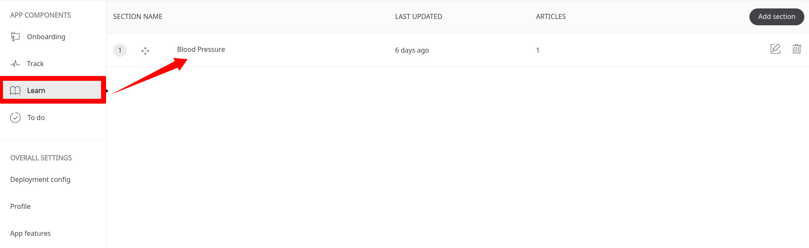
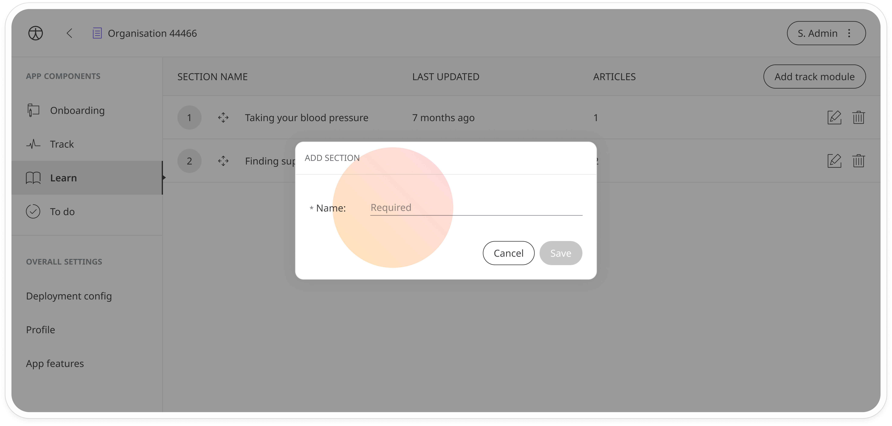
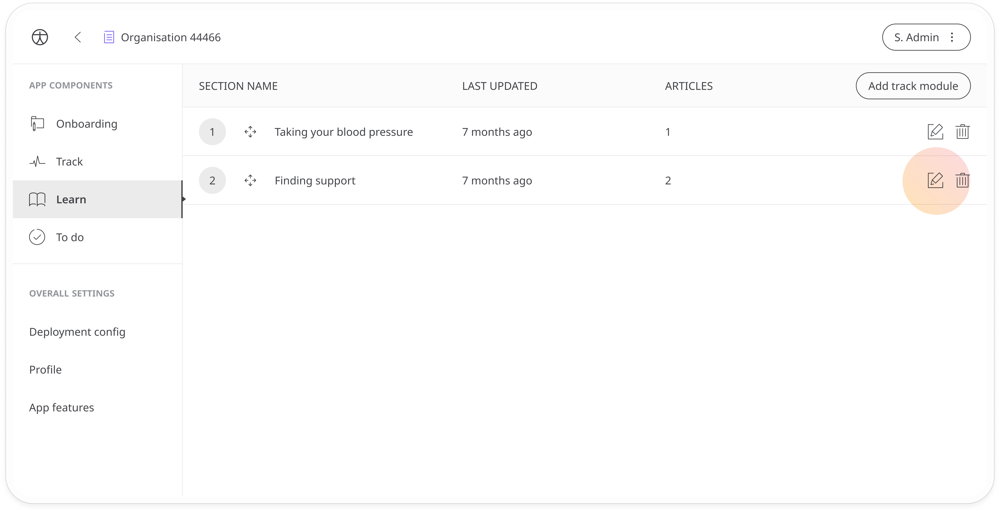
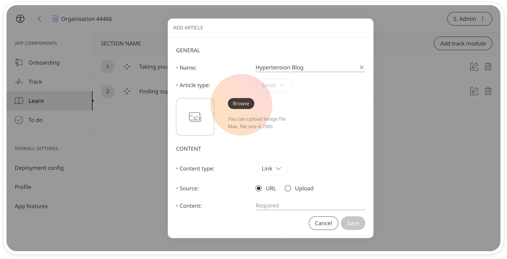
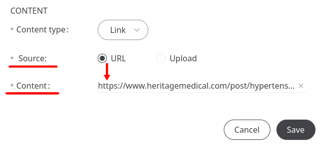

# Learn sections 
**User**: Super Admin, Huma Support, Account Manager, Organisation Owner, Organisation Editor

The Learn section provides patients with a repository of useful articles and other resources to educate and inform them so that they can better understand their symptoms or how to prepare for certain procedures, etc. You can build out your repository for each deployment with your own custom content or link out to useful content from the web.  

Individual articles can also be added to the patient’s to-do list or as related content for tracking modules and questionnaires.

## How it works
You can manage this content from the **Learn** tab.

The learn tab organises articles into **Sections**. Sections are like folders which contain articles on a particular theme. Click **Add section** to add a new section. Give it a name and click to save.

Next, you will need to add articles to the section. Click the  icon to open the edit window. 

You can edit the name of the article and add an image. The image will be shown to users in the learn library so make sure you choose something that accurately reflects the content. Just click **Browse** to select an image from your files. Recommended image specifications are 1:1 ratio; 800*800px (minimum); 2MB/image (maximum).

Next, you will need to add the content details. Select **Link** as the **Content type** and **URL** as the **Source**. Next, enter the url in the **Content** field and click **Save**. 

>
> ⚠️ **INFO**: For uploads, please request assistance from a member of the Delivery Operations team.
>

After saving, you will be able to see a list of articles. Click **Add article** to add more articles to that learn section. 

Click the learn tab to return to the **Sections** list and add more sections.

## Huma Learn articles
Huma has created the following article on [Letting go of stress and anxiety](https://humatherapeutics.atlassian.net/wiki/spaces/PRODUCT/pages/3526951098/Biobase+Coaching+Content) which can be included in the configuration of any organisation. 

## Assigning Learn sections
You will be able to find a list of your learn sections when configuring [tracking modules](./tracking-modules.md) or [questionnaires](./tracking-questionnaires.md) and will be able to select which ones you want to associate with the module.

**Related articles**: [Tracking modules](./tracking-modules.md); [Tracking questionnaires](./tracking-questionnaires.md); [Using the Learn centre](../../../huma-app/features/learn.md)
