# Tracking modules
**User**: Super Admin, Huma Support, Account Manager, Organisation Owner, Organisation Editor

The Huma app collects data from patients based on a number of purpose-built modules to track different data points or patient-reported qualitative data. 
## How it works
You can add modules from the **Track** tab of your deployment configuration. Just click **Add track module** and select from the list on the **Modules** dropdown or enter a search term to find the module you’re looking for.

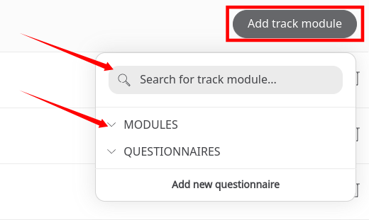

## Modules list
This is the full list of modules available for tracking health data. Configuration is similar for each module although the RAG thresholds are not available for all of them. Modules that use RAG will be labelled **Threshold** and those that do not will be labelled **Static**. The only exception to this would be the **Symptoms** module, which is explained in more detail in the **Configuration** section.

Different modules also permit different collection methods. Patients can either enter their data manually or sync the app with other tracking devices or apps to log it automatically e.g. heart rate monitors, step counters. 

Other modules require qualitative data, such as the **Photos** and **Journal** modules. Journal entries are submitted via free text from the patient and photos can be captured easily from within the app. 

The table below shows which modules have the threshold option and what data entry methods are available.

| Module Name | Thresholds | Data collection | 
|--- | --- | --- | 
| Anxiety level - GAD-7 | Yes | Manual, followed by calculated | 
| [Audio Word Recall](../../../modules/general/audio-word-recall.md) | No | Manual | 
| Awareness Training | No | Manual | 
| [BMI](../../../modules/physiological/bmi.md) | Yes | Manual, followed by calculated | 
| [Blood glucose](../../../modules/physiological/blood-glucose.md) | Yes | Manual | 
| [Blood pressure](../../../modules/physiological/blood-pressure.md) | Yes | Manual |
| [BodyMeasurement](../../../modules/physiological/body-measurement.md) | No | Manual or collect from camera (from BVI) | 
| [COVID-19 Daily Check-in](../../../modules/general/daily-check-in.md) | No | Manual |
| COVID-19 Risk Score | No | Manual; Camera (Happitech), followed by calculated | 
| [CVD Risk Score](../../../modules/risk-scores/cvd-score.md) | No | Manual; Camera (Happitech & BVI), followed by calculated |
| [ECG](../../../modules/physiological/ecg-alivecor.md) | No | Sync (from Kardia) |
| ECGHealthKit | Yes | Sync (from Kardia) | 
| Health Score | No | Manual, followed by calculated | 
| [Heart rate/ HRV](../../../modules/physiological/heart-rate.md) | Yes | Manual; Camera (from Happitech); Sync (from Apple Health, Google Fit) | 
| Height Z-Score | No | Manual, followed by calculated | 
| High-Frequency HR | No | Sync (from Apple Health, Google Fit) | 
| High-Frequency Step | No | Sync (from Apple Health, Google Fit) | 
| [Journal](../../../modules/general/journal.md) | No | Manual | 
| Medical History | No | Manual | () |
| [Medications](../../../modules/physiological/medications.md) | No | Manual | 
| Oxford Knee Score | No | Manual, followed by calculated | 
| [Oxygen saturation](../../../modules/physiological/oxygen-saturation.md) | Yes | Manual | 
| PROMIS Global Health v1.2 | No | Manual, followed by calculated | 
| [Peak flow](../../../modules/physiological/peak-flow.md) | Yes | Manual, followed by calculated | 
| [Photos](../../../modules/general/photos.md) | No | Manual |
| Pulse Oximetry | Yes | Manual | 
| Quality of life | No | Manual | 
| [Respiratory rate](../../../modules/physiological/respiratory-rate.md) | Yes | Manual |
| [Resting Breathing Rate](../../../modules/physiological/resting-breathing-rate.md) | No | Manual | 
| Resting heart rate | Yes | Camera (from Happitech) | 
| [Steps](../../../modules/general/steps.md) | No | Sync (from Apple Health or Google Fit) | 
| [Symptoms](../../../modules/general/symptoms.md) | | Manual | 
| [Temperature](../../../modules/physiological/temperature.md) | Yes | Manual |
| Waist to Height | Yes | Manual, followed by calculated | 
| [Weight](../../../modules/physiological/weight.md) | Yes | Manual | 

## Configuring the module
From the modules list, click the **edit✎** icon at the end of the row to configure the module.

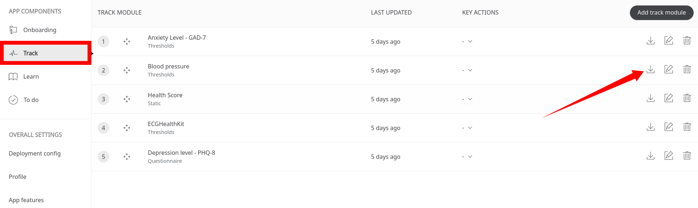

### Settings
- **Name** - You will not be able to change the default name but you can add a custom name which will appear on the module overview screen.
- **About** - This is a description of the module that the patient will see on the module overview screen.  
- **Custom unit** - Indicate the unit of measurement you want to use for this data point. These will be used as defaults but can be changed by the user:
    - **Weight**: Kilograms (kg) / Pounds (lb) / Stones (st lb)
    - **Body Measurements**: Centimeters/centimeters (cm) / Inches (in)
    - **Temperature**: Celcius (°C) / Fahrenheit (°F)
    - **Blood Glucose**: Milligrams per decilitre (mg/dL) / Millimoles per litre (mmol/L)
    - **Height**: Centimeters/centimeters (cm) / Feet and inches (ft in)

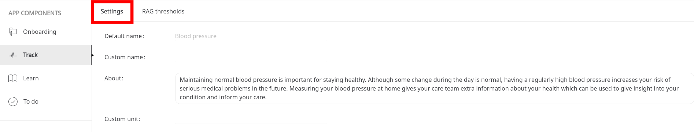

- **Schedule** - For data points that need to be collected on a regular basis, you can set a recommended schedule for the patient. Set the **ISO duration** and the **Times per duration** to indicate to users how long and how many times they will need to submit data to this module. Check the checkbox to let the patient know what times of day they need to submit their data. If you don’t select any option, the patient will be told to submit their data as needed.

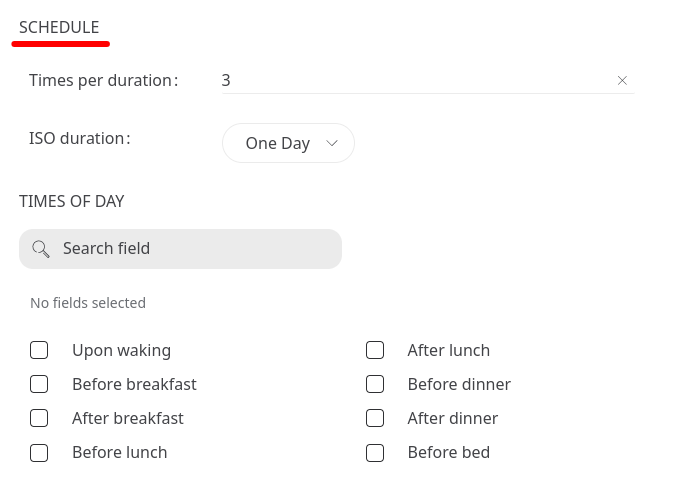

- **Device sync** - If the data point can be collected via a device or smartphone, you can indicate which collection methods are available here. For example, patients can collect their heart rate variability reading using their phone camera.
 
- **Learn** - You have the option to associate configured Learn articles to the modules. Check the box to open a list of Learn articles that you have already added to your deployment, then just select the ones that link to this module. When the patient opens this module, they will be able to access the Learn article.

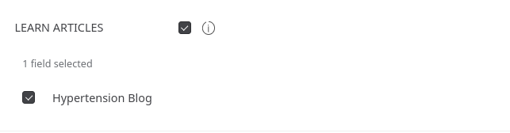

- **Push notifications** - Check the box to create your own custom push notifications for the module. Add a title and description to match the data you want to collect and remind the patient of any important information they might need at this time. This will overwrite the default notification. Patients will be able to customise the frequency and timings of the notifications.

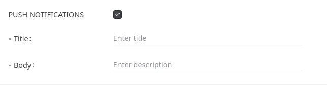

- **Footnote text** - Check the box to enter some footnote text to the module. This will appear in the module overview for the patient and can be used to remind them of any important clinical advice, disclaimers, or trademark text.

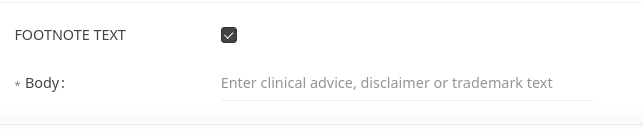

### RAG thresholds 
When the clinician is reviewing the patient data, they can be informed of potentially dangerous readings through a red-amber-green (RAG) flag system. On the **RAG thresholds** tab, you can configure the thresholds that will be used to determine the severity levels of the submitted patient data. Just select the severity level from the dropdown and enter the min and max values of the thresholds. For readings that are outside the specified thresholds, they will appear in the portal without a colour.

You can add as many thresholds as you need with the **Add threshold** link at the bottom. For example, a very high or a very low temperature reading would be considered dangerous so you would need to add thresholds for both high and low readings.

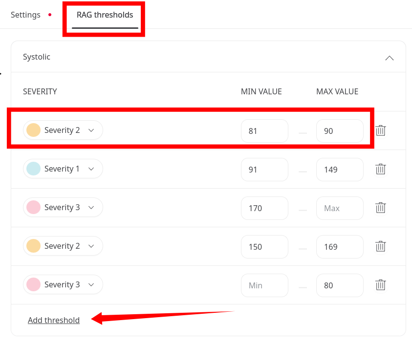

Flag notifications will only show for amber (moderate severity) and red (high severity) data points; green ones are considered acceptable and won’t be flagged. 

### Static modules
Bear in mind that not all modules will use the RAG system and patient data will have to be reviewed manually to determine whether it is dangerous or not. For example, in the case of the Steps module, the number of steps considered healthy would vary from patient to patient. 

Modules that include RAG thresholds are labelled **Thresholds** and those without are labelled **Static**. 

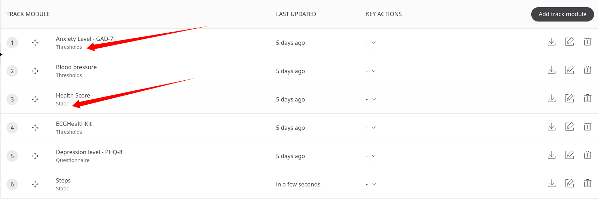

### Symptoms
The **Symptoms** module lets you track specific symptoms for different health trials that you might be running. Each deployment can be configured to track a completely different set of symptoms. The care team will be able to view the evolution of different symptoms amongst a cohort of patients e.g. muscle pain, insomnia, headaches, etc.

Go to the **Symptoms** tab and click the button **Add symptom**. To configure the symptom, just enter a name and then set the RAG thresholds.

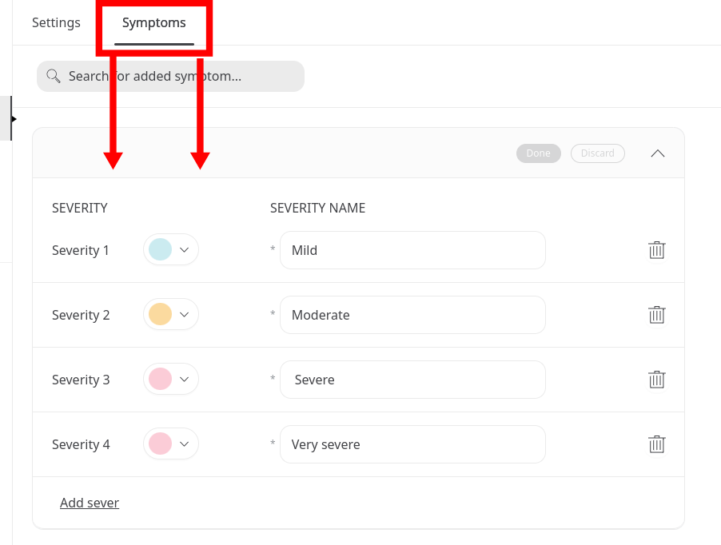

When you have finished editing the module, make sure you click **Save changes**.
If you have entered incomplete data in the **Settings** tab, you will be notified with a red dot on the tab. Go back and make sure you have included all the required information and saved your changes.

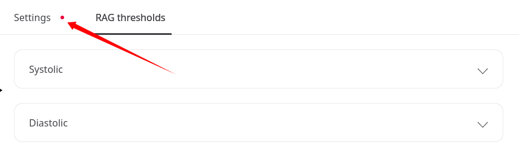

Related articles: [Tracking questionnaires](./tracking-questionnaires.md); [Preferred Units](../configuring-the-user-onboarding/preferred-units.md); [Track modules](../../../huma-app/features/track-modules.md); 
