# Tracking questionnaires and ePROs
**User**: Super Admin, Huma Support, Account Manager, Organisation Owner, Organisation Editor

One of the ways Huma allows you to collect data from patients is with Patient Reported Outcome Measures (PROs/PROMs), or validated questionnaires. Feedback from patients is key to being able to improve the care provided by the care team and this feature lets them build and collect qualitative data from patients about how they feel and tailor their treatment plan accordingly. 

## How it works
Questionnaires can be added to the deployment as a tracking module in the same way as the other tracking modules. Just click **Add track module** and select **Questionnaires** from the dropdown.

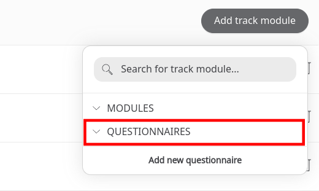

## Questionnaire list
Questionnaires fall into two categories; **Questionnaires** or **PROMs** (Patient Recorded Outcome Measures), also known as ePROs or PROs. PROMs have set questions and answer options which cannot be modified and a score assigned which can sometimes be displayed to patients. PROMs appear as a standalone module to patients and care teams whereas questionnaires are grouped under the umbrella Questionnaires module. Questionnaires can be scored but don't have to be, the scores are not shown to patients and they are fully customisable. A list of questionnaires are listed below along with their characteristics:   

| Questionnaire | Type | Scored | Score shown to patient | Can be modified |
| --- | --- | --- | --- | --- |
| [Diabetes Distress Score (DDS)](../../../epros-licensed-questionnaires/diabetes-diabetic-polyneuropathy/diabetes-distress-score.md)| PROM | Yes | Yes | No | 
| [FJS Knee](../../../epros-licensed-questionnaires/joint-surgery/fjs-knee.md) | PROM | Yes | Yes | No | 
| [FJS Hip](../../../epros-licensed-questionnaires/joint-surgery/fjs-hip.md) | PROM | Yes | Yes | No | 
| [GAD-7](../../../epros-licensed-questionnaires/mental-health/anxiety-level-gad-7.md) | PROM | Yes | Yes | No | 
| [Kansas City Cardiomyopathy Questionnaire (KCCQ)](../../../epros-licensed-questionnaires/heart-failure/kansas-city-cardiomyopathy-questionnaire.md) | PROM | Yes | Yes | No |  
| [Knee Injury and Osteoarthritis Outcome Score (KOOS/WOMAC)](../../../epros-licensed-questionnaires/joint-surgery/koos-womac.md) [English, German, Italian, Spanish] | PROM | Yes | Yes | No | 
| [Norfolk QoL-DN](../../../epros-licensed-questionnaires/diabetes-diabetic-polyneuropathy/qol-dn.md) [English, Dutch] | PROM | Yes | Yes | No | 
| [Oxford Knee Score](../../../epros-licensed-questionnaires/joint-surgery/oxford-knee-score.md) [English] | PROM | Yes | Yes | No | 
| [Oxford Hip Score](../../../epros-licensed-questionnaires/joint-surgery/oxford-hip-score.md) [English] | PROM | Yes | Yes | No | 
| [PHQ-8](../../../epros-licensed-questionnaires/mental-health/depression-level-phq-8.md) [English (UK)] | PROM | Yes | Yes | No | 
| [SF-36](../../../epros-licensed-questionnaires/quality-of-life/short-form-health-survey.md) [English, Dutch] | PROM | Yes | Yes | No | 
| [EQ-5D-5L](../../../epros-licensed-questionnaires/quality-of-life/eq-5d-5l.md) [English] | PROM | Yes | No | No |
| [Patient Activation Measure 13 (PAM 13)](../../../epros-licensed-questionnaires/patient-activation/patient-activation-measure-13.md) | PROM | Yes | No | No |
| [PROMIS CAT Pain Interference](../../../epros-licensed-questionnaires/pain/promis-cat-pain-interference.md) [English] | PROM | Yes | No | No |
| [PROMIS CAT Physical Function](../../../epros-licensed-questionnaires/mobility/promis-cat-physical-function.md) [English] | PROM | Yes | No | No |
| [PROMIS Global Health](../../../epros-licensed-questionnaires/quality-of-life/promis-global-health.md) [Catalan, French, German, Spanish, Swedish] | PROM | Yes | No | No | 
| Activity and Health Questionnaire | Questionnaire | Yes/No | No | Yes |
| Baseline COVID-19 Questionnaire [German] | Questionnaire | Yes/No | No | Yes |
| Food Security Questionnaire | Questionnaire | Yes/No | No | Yes |
| Perceived Stress Scale (PSS) | Questionnaire | Yes/No | No | Yes |

## Creating custom questionnaires
You can create a completely new questionnaire from scratch. In the **Add track module** dropdown, select **Add new questionnaire**.

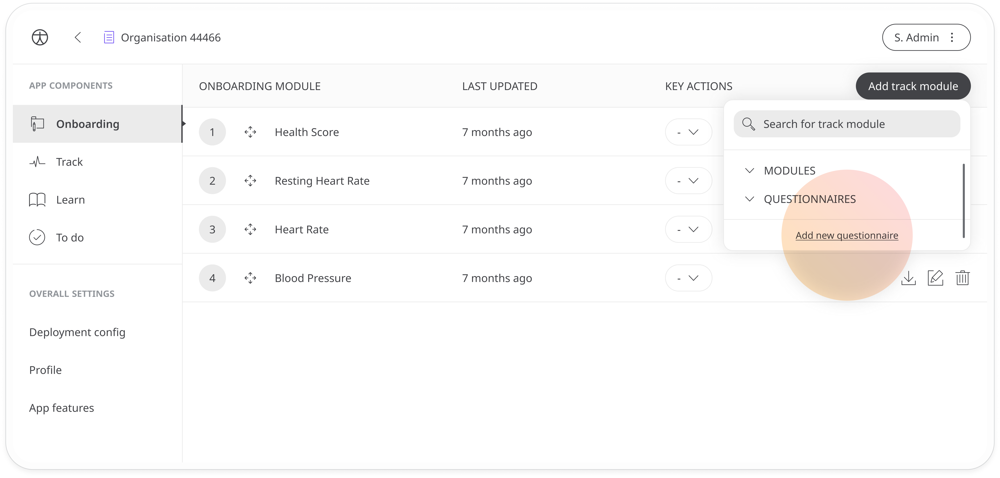

Follow these steps to create your questionnaire and it will appear on the dropdown list of questionnaires for selection.

### Settings
- In the settings, add a name and description for the questionnaire 
- The **Publisher** and **Region** fields can be left blank
- If you want the questionnaire to be part of the user onboarding, check the box **Is onboarding?**
- If you want the questionnaire to be presented in a horizontal flow, rather than vertical scrolling, check the box **Horizontal flow**

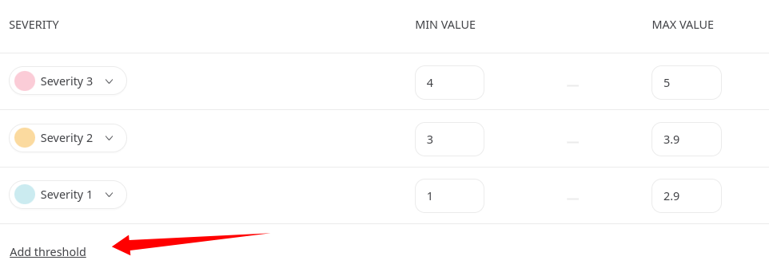

### Scoring
If you want to assign scores to the answers given to the questions in your questionnaire, you can configure the settings here.
- Check the **Score available** box and when you add your questions and answer options, there will be a space for you to enter a score. This also means RAG thresholds can be assigned and the questionnaire will have its own module on the patient track and clinician portal with its own graph, schedule, reminders and contextual Learn article.
- By checking **Calculated score**, the module will add together the scores of all selected multiple choice options on submission of the questionnaire to give you a total. You can also enter a maximum score (Maxscore) to establish a maximum threshold if, for example, the available points are above what you want to establish as the maximum score. 

- If you want to add RAG thresholds to the score so that the care team will be notified via flags when a result is concerning, just check the **RAG Thresholds** box and set the min and max values in the chart below. Add more thresholds as needed with the **Add threshold** link.

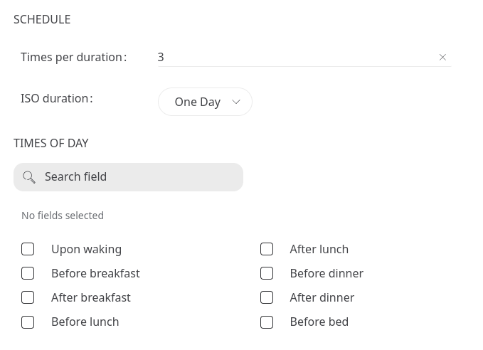

### Schedule
If your questionnaire is requesting data that needs to be collected on a regular basis, you can set a schedule. 
- Set the **ISO duration** to determine how long you want to track the data and the **Times per duration** to set how many times during that period you want to collect the data. For example, if the duration is one month and the times per duration is 3, the schedule is 3 times per month. 

> 💡 **TIP**: If there is no specific schedule, set **Times per duration** to as needed and leave the **ISO Duration** field blank.

- Check the checkbox to let the patient know what **times of day** they need to submit their data. If no option is selected, the patient will be informed to submit the questionnaire at the same time of day each time.

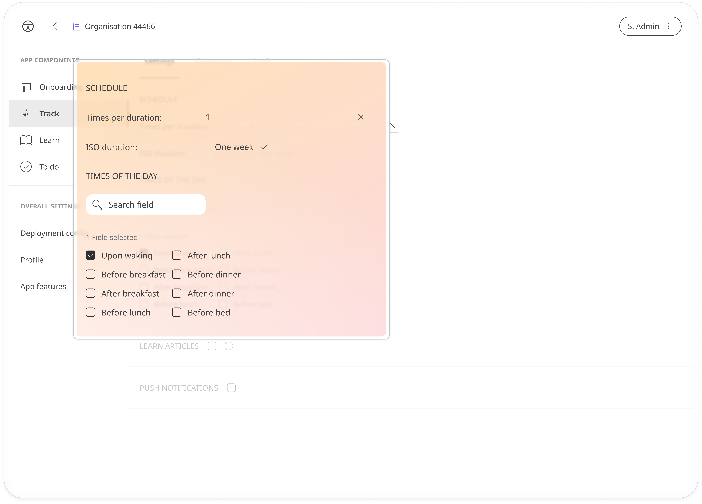

### Other settings
You have the option to add **Learn** articles to some modules. 
- Check the **Learn articles** checkbox to open a list of Learn content then just select the ones that link to this questionnaire. When associated with a scored questionnaire, the patient will be able to access the Learn article.

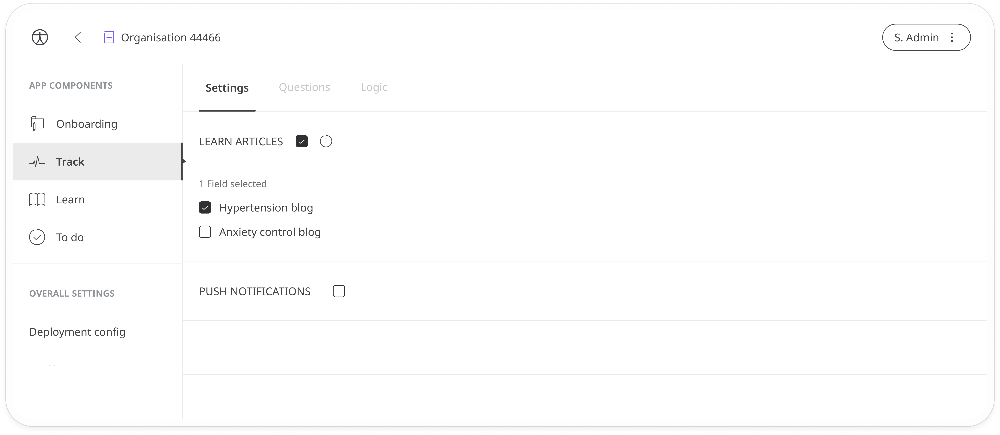

Check the **Push notifications** checkbox to activate push notifications for the questionnaire. 
- Customise the **title** and **body** to match the data you want to collect and remind the patient of any important information they might need at this time. Patients can set their own custom reminders for completing certain tasks, and this is the text they will see in the notification.

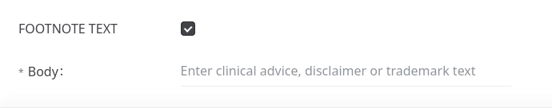

Some questionnaires also allow **Footnote text**.

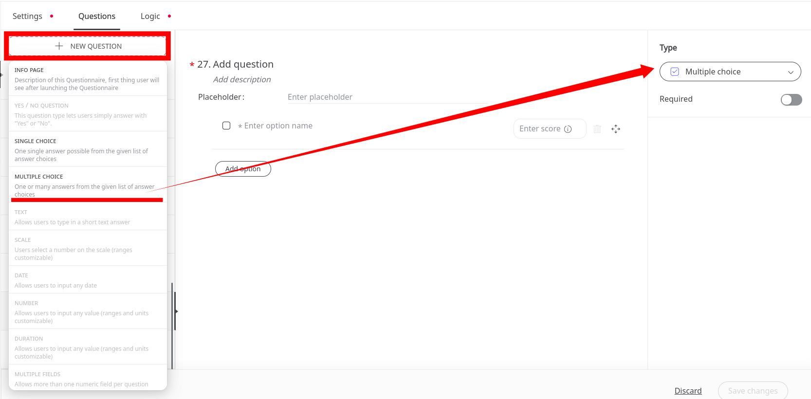

### Adding questions
Add new questions using the **+ New question** button at the top. You will be asked to choose a question type. 

> ⚠️ **INFO**: If you have checked the box **Score available**, you will only be able to choose from **Multiple Choice** and **Single Choice** question types. 

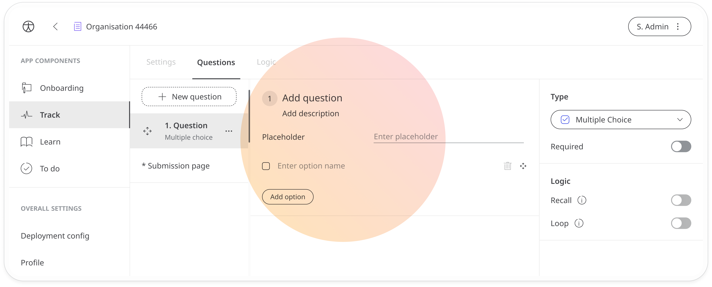

Next, enter your question. Make sure it fits the question type you have selected. 
In addition to the question, you can enter a description to give the patient some more details. 

The **placeholder text** can be useful for questions that are text based, to give users an example of the type of information they need to input, or instructions on how to answer. It will appear in the answer field for the end user. (see [Huma App view](https://www.figma.com/file/2B0Y7wKLBeY37XTO5JF6cx/Configuration-template-visual-guide?node-id=180%3A890498))

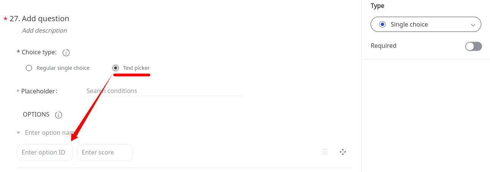

For multiple choice questions, you’ll need to enter all the answer options. Click **Add options** to add more options. 

Single choice questions let you choose between **regular** or **text picker**. The text picker variation lets you include an **ID** with the answer options. This is useful with countries, for example. 

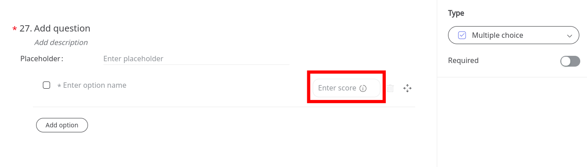

If you are creating a scored questionnaire (make sure **Score available** is checked in the questionnaire settings), add your answer options and assign a score in the **Enter score** box.

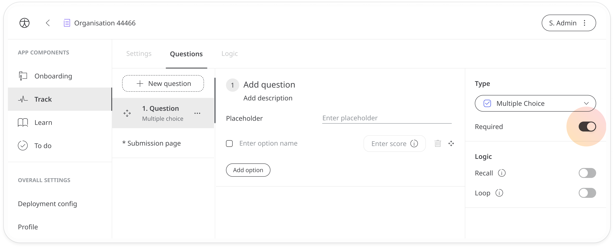

You can make the question mandatory by enabling the **Required** toggle. 

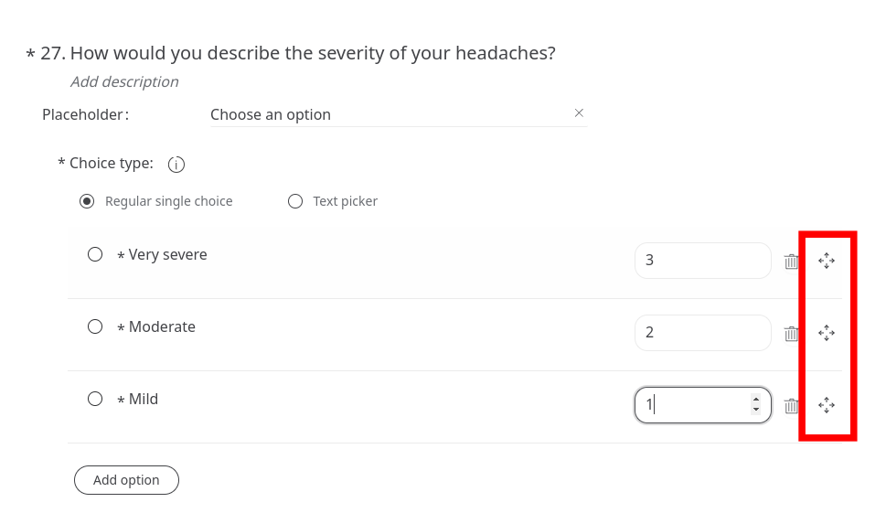

You can change the order of the answer options using the **arrows🕂** icon at the end of the rows. 

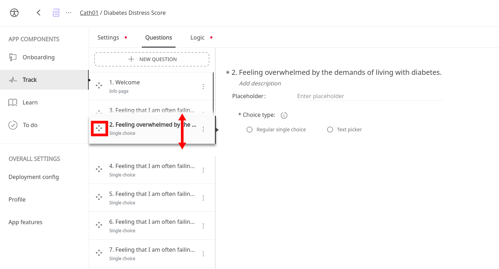

Once you have added your question and answer options, save your changes and the question will be added to your questions list. Note that you will always have to include an **Info** and **Submission** page before you can save your questionnaire.

### Reordering or deleting questions 
Questions appear in the order they will appear in the questionnaire, with the Welcome page at the start and the Submission page at the end. Use the arrows🕂 icon to reorder the questions in the list. 

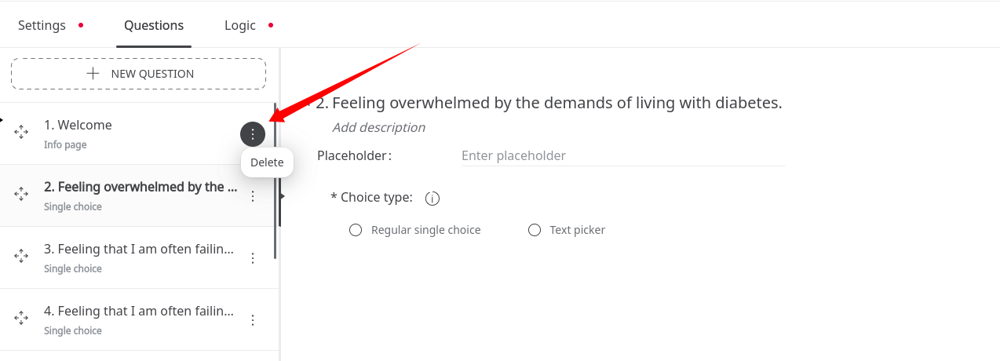

Click the three dots on the question tab then click **Delete** to delete the question.

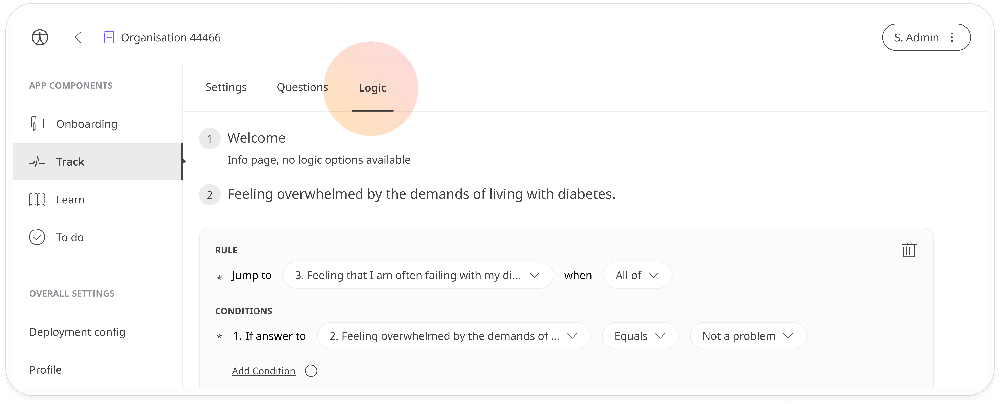

### Question types
The question types you should select depends on the kind of information you are collecting and what you intend to do with it afterwards. Click the **Type** dropdown and select from the options available:
- **Multiple Choice** - Users have a list of options to choose from and can pick more than one. 
- **Single choice** - Similar to multiple-choice questions but users can only choose one. With this option, you can choose between **Regular single choice** and **Text picker**. The text picker option allows you to add IDs to the answer options.
- **Yes / No** - For questions that only have a “yes” or “no” response. Similarly, “true" or “false” can be used as alternatives.
- **Text** - Users can enter free text, for example their name or email address. You can also use them to ask more open questions although answers need to be quite short.
- **Number** - Similar to text input but users must enter a number. Useful when you are asking for a data point or measurement.
- **Text / Number** - The patient is given a carrousel of options to choose from. This is similar to a multiple choice in terms of functionality but works better with a long list of options that the user doesn’t need to see all presented at the same time e.g. countries.
- **Date** - The user selects a date, month, and year from a carousel of options. Use this option when asking for the patient’s date of birth or the dates of specific medical interventions.
- **Duration** - The user selects from a carrousel of options to choose a time or a period of time/duration.
- **Photo** - The user can upload a photo or a file in response to a question.
- **Phone number** - The user is asked to select the country code and enter their phone number. Make sure to use this option instead of **Text input** when asking for a phone number as the app can verify it is valid based on the area code. 
- **Scale** - The scale option is useful if you want the patient to choose a value within a minimum and maximum range. They simply position the slider on a scale.
- **Info page / Submission page** - These cards are already formatted to be used at the beginning and end of the questionnaire and don’t require any input from the patient, they are just there to inform.

[See how the different question types](https://www.figma.com/file/2B0Y7wKLBeY37XTO5JF6cx/Configuration-template-visual-guide?node-id=180%3A890497) appear to patients in the Huma App.

### Adding Logic
The **Logic** tab is where you can manage what happens when a user gives a particular response to one of your questions. For example, if they answer that they have a history of a certain condition, you may send them to a different part of the questionnaire compared to those who answer “no” to the same question.

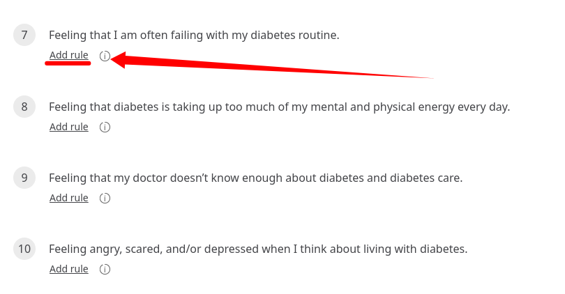

>
>  ⚠️ **INFO**: If no logic is added, the user will move through each of the questions in order.
>  

The **Logic** section lists all the questions on your questionnaire with a link to **Add rule**. 

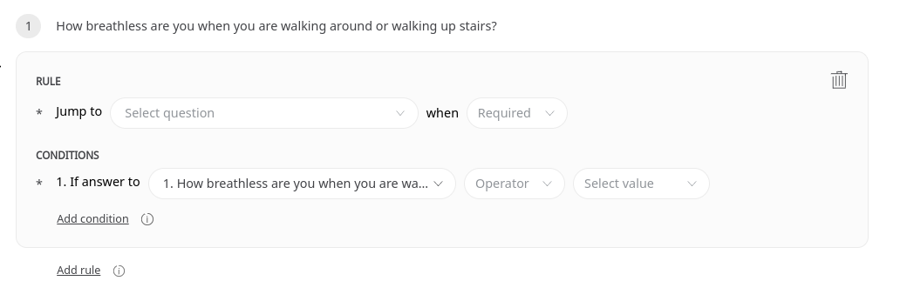

Click the link to add your rule and a condition. The **Rule** defines what will happen as a result of a certain action. The user will be sent directly to another part of the questionnaire when the condition or conditions are met. 

Click the **Jump to** dropdown to select the question you want to send the user to. Then, select **Any of** or **All of** from the **when** dropdown to define whether a number of conditions need to be met or just one. If you only have one condition, you can choose either option here. 

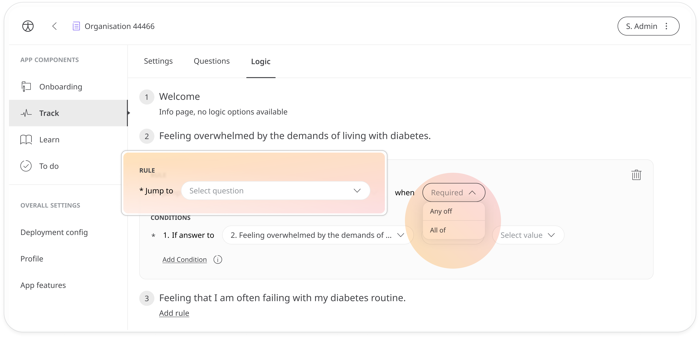

In the **Conditions** section, select the question that will trigger your rule and the answer options that will enforce it. The answer options will appear in the final dropdown. The **Operator** dropdown in between lets you define when the condition is met: if the answer *is equal to, not equal to, greater than, equal or greater than, less than, equal or less than*. 

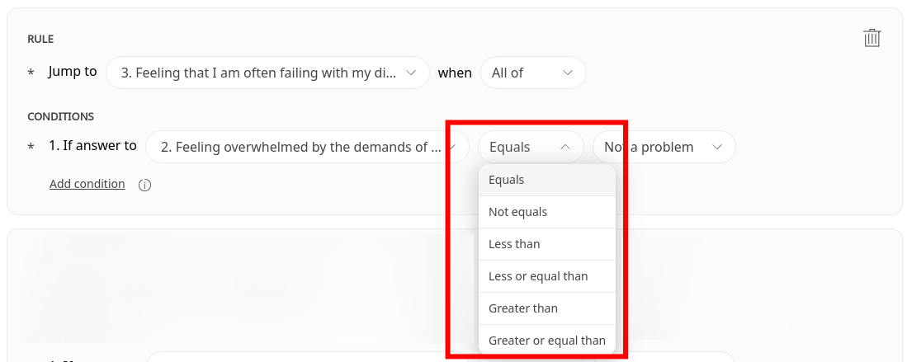

Add more conditions if you want more than one condition to be met in order to trigger the rule (**All of**) or if you want different conditions to be able to trigger the rule (**Any of**).

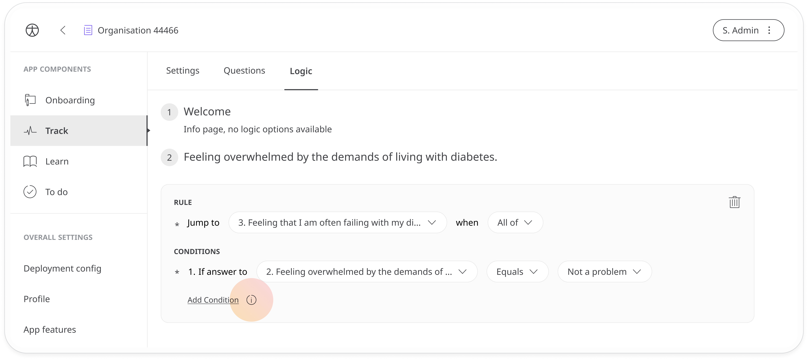

You can also add multiple rules to the same question if you want different outcomes for different responses. Just click the **Add rule** link.
You can add or delete any existing rules as needed. 

## Editing existing questionnaires
Some questionnaires can be edited and modified, including changing the scoring and thresholds. It is also possible to edit questions, including changing the response options, deleting or adding new questions, and changing the order and the logic. Just click any of the questions to edit them. 

>
>  ⚠️ **INFO**: For licenced questionnaires, you cannot change anything except the custom thresholds.
>  

Remember to save any changes you make.

**Related articles**: [Tracking modules](./tracking-modules.md); [Reviewing questionnaires](../../../clinician-portal/managing-health-data/questionnaires.md)
