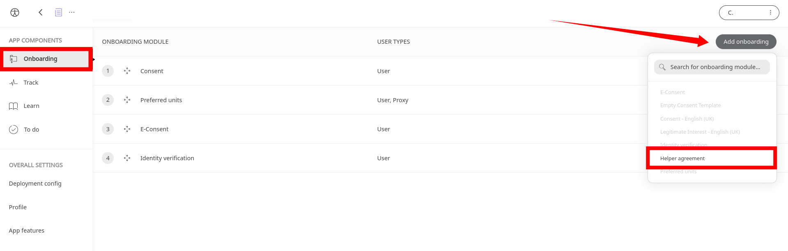
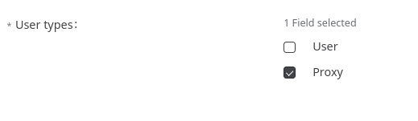

# Helper agreement
**User**: Super Admin, Huma Support, Account Manager, Organisation Owner, Organisation Editor

In some cases, patients may need assistance to manage data entry in the Huma App. The Helper role exists to allow other users to access the app as a proxy for the patient to enter data on their behalf.
## How it works​
As part of the onboarding configuration of a new deployment, add the **Helper Agreement** module.

Check the **Proxy** checkbox to ensure they receive the Helper Agreement module. Only proxy users would be expected to complete the Helper Agreement, not the main user.

By including this module, the user’s proxy will be able to read and agree to it as part of their  onboarding. In the [eConsent](data-collection/admin-portal/managing-deployments/configuring-the-user-onboarding/econsent.md) module, you can specify separately whether helpers also need to sign data consent forms as part of their onboarding.
Helpers can be invited by the patient from the Huma App. 

Link to [Helper experience](https://www.figma.com/file/6AJeEs7bfU6ITVhJRWJ7SQ/Huma1---App?node-id=3169%3A134023).

**Related articles**: [eConsent](data-collection/admin-portal/managing-deployments/configuring-the-user-onboarding/econsent.md)
