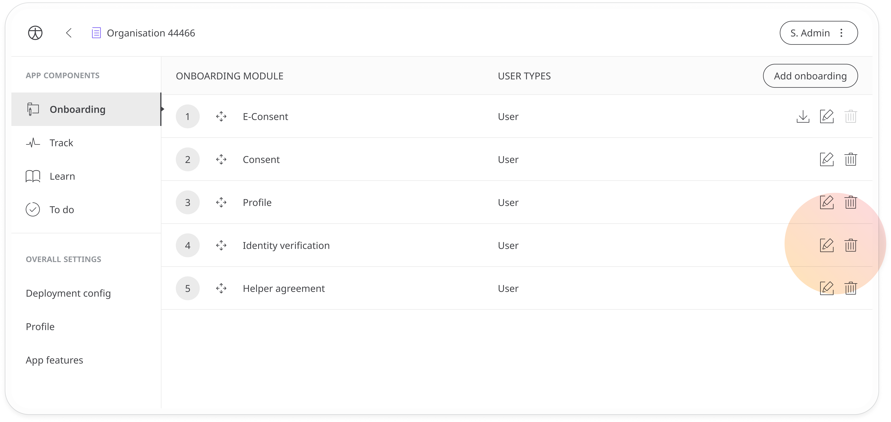
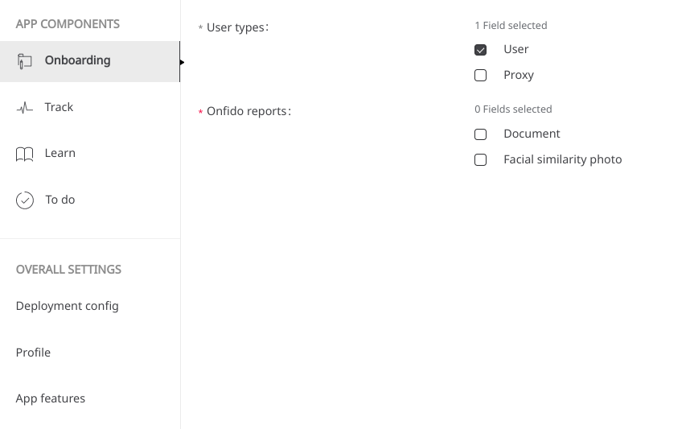
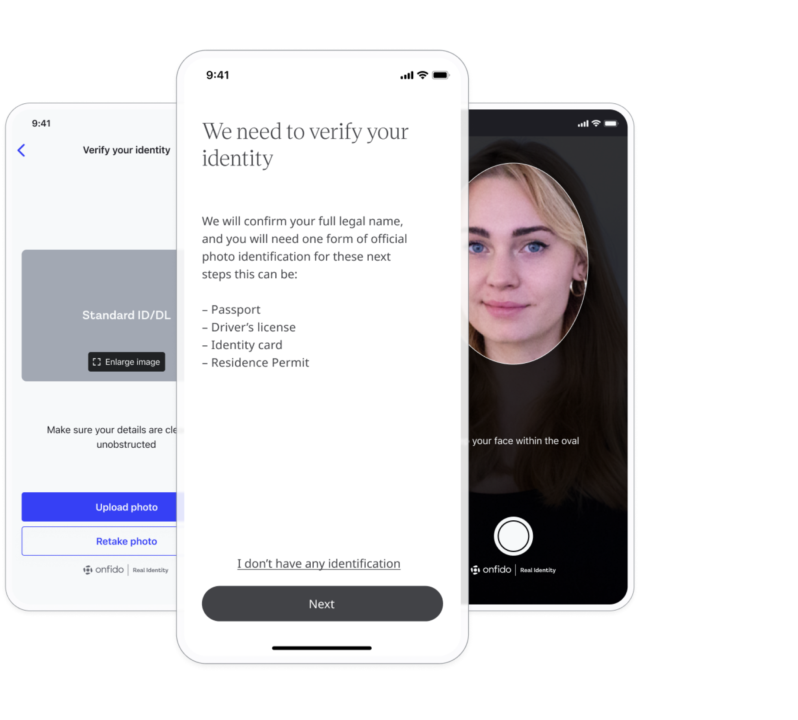

## Identity verification
**User**: Super Admin, Huma Support, Account Manager, Organisation Owner, Organisation Editor

When collecting personal health data for clinical trials in a digital environment and requesting consent on how data is used, it is a regulatory requirement to ensure the participant is who they say they are. Electronic ID verification is possible through the Huma App onboarding process.
## How it works​
As part of a new deployment, Admin users can add the **Identity verification** module as part of the user onboarding. 

Click the **Edit✎** icon at the end of the row to configure the module.

- **User types** - If your deployment allows user proxies to help patients input their data, they should be required to identify themselves, just as the patient. Check **User** to require identification from the patient and check **Proxy** to require it from their helper.

>
>  ⚠️ If **Proxy** is selected here, you must ensure the proxy field is also checked in the **App Features**
>  

- **Onfido reports** - In this section you can choose how you want the user to verify their identity. Check **Document**, if you require they verify using an official form of ID documentation, and check **Facial similarity photo** if you want them to verify identity by taking a photograph of their face. For the most secure identification, you should require both.

## Patient experience 
Patient identification takes place quite seamlessly as part of their onboarding experience. Using the camera on their device, users will be able to take a photo of their identity document and then take a photo of themselves. It will take around 60 seconds for them to be verified in the app and then they can continue to the next step of their onboarding.

**Related articles**: [eConsent](./econsent.md); [Helper Agreement](./helper-agreement.md)
