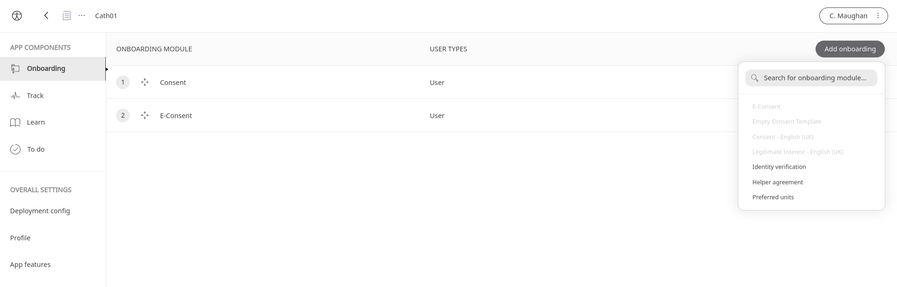
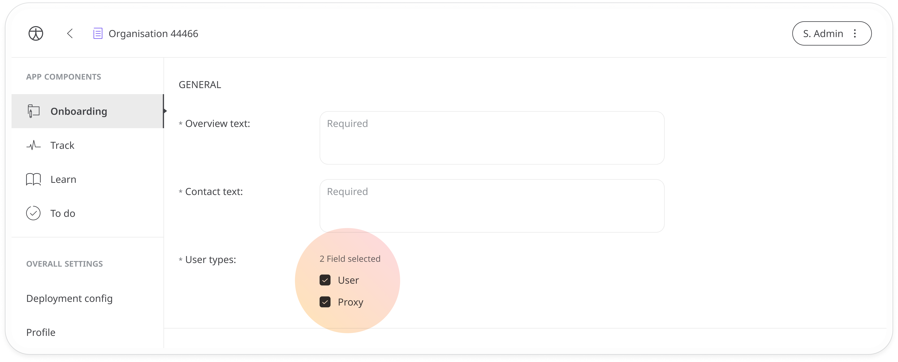

# Preferred units
**User**: Super Admin, Huma Support, Account Manager, Organisation Owner, Organisation Editor

When entering data points for different modules, users in different territories are accustomed to using different measurement units. For example ºF or ºC for temperature, feet and inches or cm for height, etc. As part of the onboarding process, both patients and their proxies can choose their preferred measurement units.
## How it works​
As part of the onboarding configuration of a new deployment, add the **Preferred Units** module.

Check both **User** and **Proxy** to ensure both parties get to select the type of units they prefer to use. You’ll need to ensure the [Helper agreement](./helper-agreement.md) is also added as an onboarding module if you have checked the **Proxy** box.

View the [Helper experience screens](https://www.figma.com/file/6AJeEs7bfU6ITVhJRWJ7SQ/Huma1---App?node-id=3169%3A134023).

**Related articles**: [Helper Agreement](./helper-agreement.md) 
