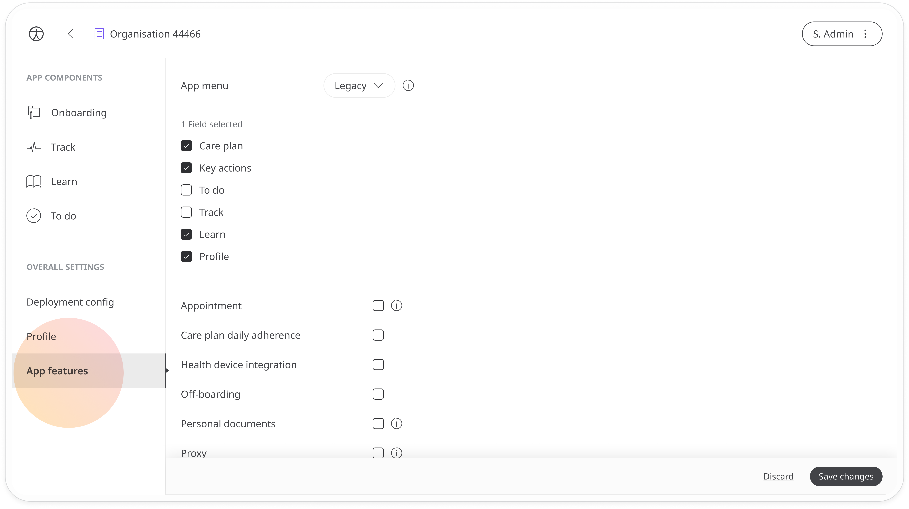
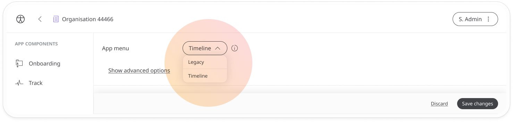
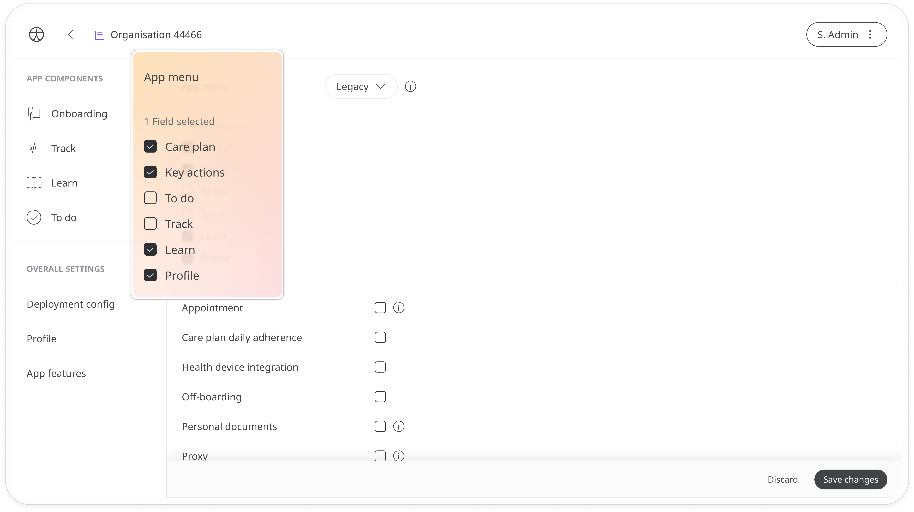
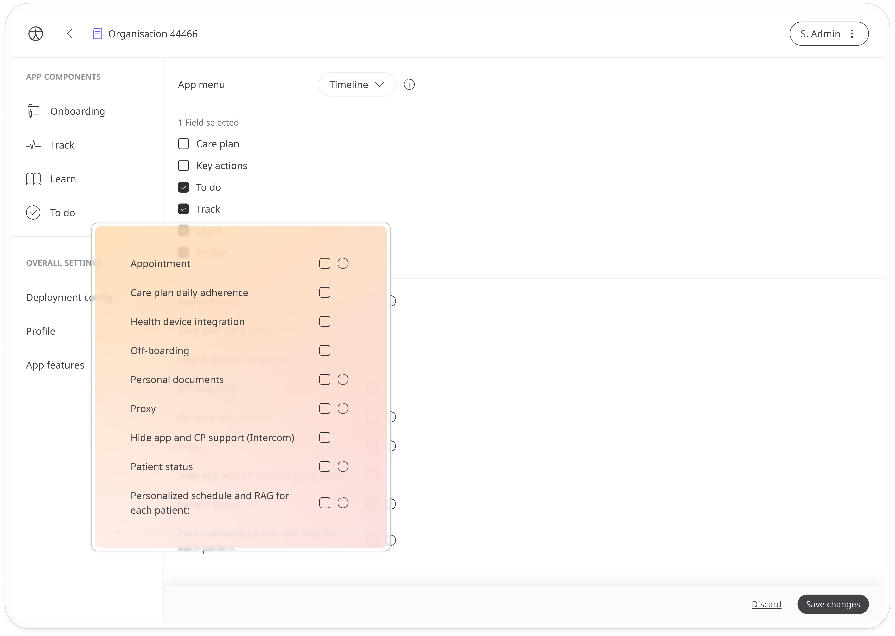

# App features
**User**: Super Admin, Huma Support, Account Manager, Organisation Owner, Organisation Editor

Huma is designed principally for either Decentralised Clinical Trials (DCT) or Remote Patient Monitoring (RPM). The Huma App features that are delivered to patients can vary depending on the specific needs of their program. 
## How it works​
From the **Admin Portal**, go to the **App features** tab, under **Overall Settings**.

### App menu
You can choose which tabs appear in the Huma App. There are two pre-configured options that you can select from the dropdown: **Legacy** or **Timeline**. If you click the **Show advanced options** link, you can see the menu items for each configuration. 

The legacy option includes **Care plan, Key actions, Learn**, and **Profile**.

The timeline option includes **To do, Track, Learn**, and **Profile**.

### App features
Check the features on the list that you want to include for your users:
- **Appointment** - This feature lets clinicians schedule appointments with their patients or call them directly using the in-app telemedicine video or audio call functionality.
- **Care plan daily adherence**[^1] - This lets patients see a progress bar on the modules to track their task compliance.
- **Health device integration**[^2] - Allows the user to sync other health devices such as heart monitors with their account.
- **Off-boarding** - Allows manual offboarding of patients from the Clinician Portal.
- **Personal documents** - Allows both patients and care teams to upload documents to a user's account.
- **Proxy** - Lets patients nominate helpers to enter health data on their behalf. If any [onboarding modules](../configuring-the-user-onboarding/onboarding-setup.md) are configured with proxy users, this must be checked.
- **Hide app support (Intercom)** - This hides access to the support centre from the [Profile](../../../huma-app/getting-started/personal-information-account-settings.md) page of the app.  
- **Patient status** - This lets care teams see the patient status in the Patient List

[^1]: Soon to be removed.
[^2]: Functionality not currently active.

**Related articles**: [Navigating the App](../../../huma-app/getting-started/navigating-the-app.md)
