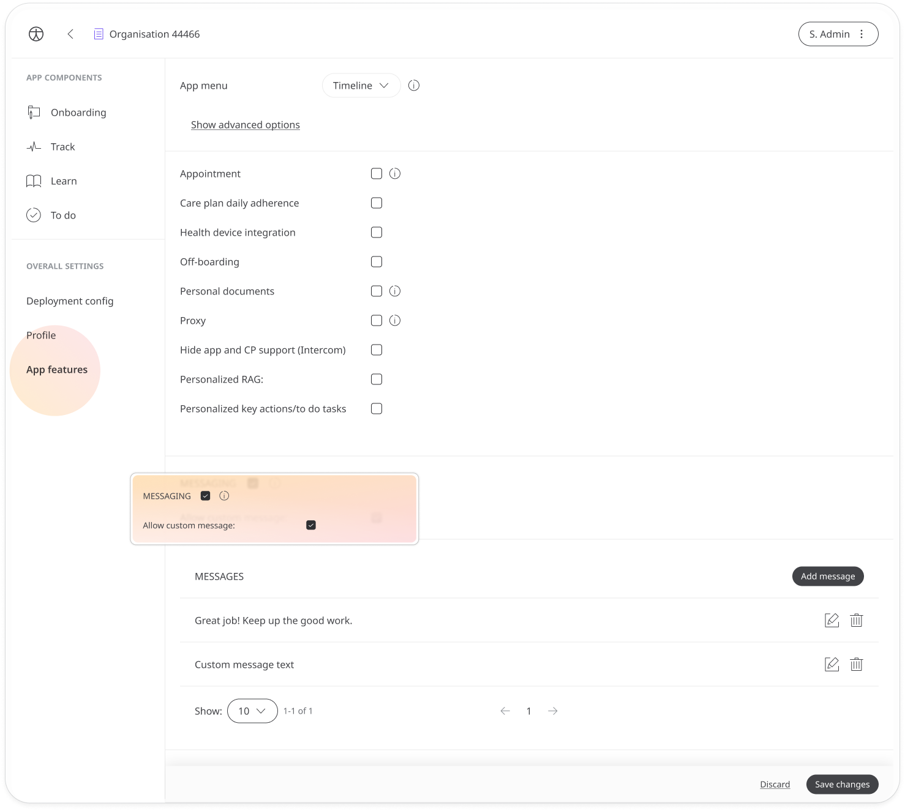
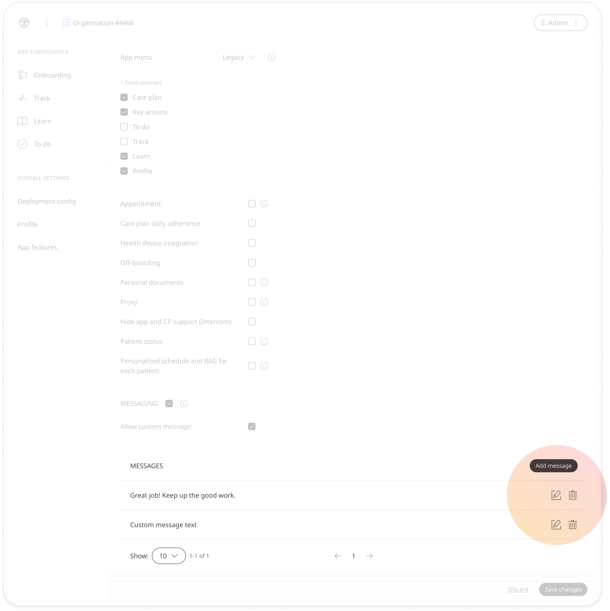
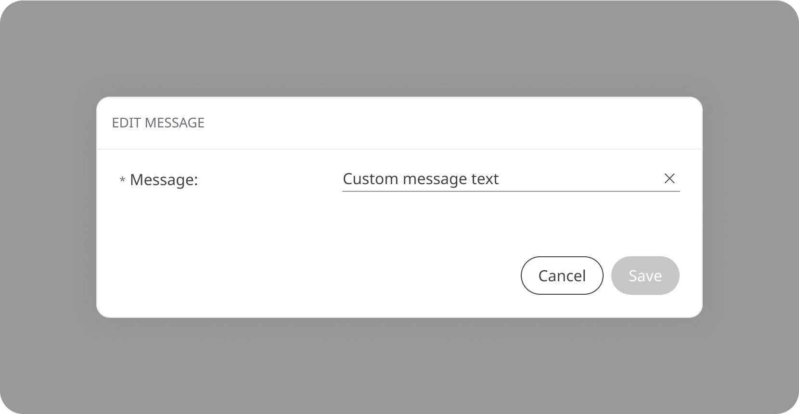

# Configuring messages
**User**: Super Admin, Huma Support, Account Manager, Organisation Owner, Organisation Editor

Excellent clinician-patient communication is paramount at Huma. Messages are configured in the deployment so that care teams can send out pre-built messages designed to address specific issues quickly. In addition to this, care teams can write their own personalised messages to patients.
## How it works​
When configuring your Deployment, in the **App features**, check the **Messaging** checkbox to enable messaging and **Allow custom message** to allow care teams to compose their own messages.

You can add some standard messages for clinicians to use. Click the **Add message** button to create a new one or the edit button to edit a current message.

Enter your message content in the edit window and click **Save**.

Clinician Portal users will be able to select from your list of custom messages to communicate important information to patients.

**Related articles**: [Messaging patients](../../../clinician-portal/telemedicine/messaging-patients.md); [Checking messages](../../../huma-app/features/messages.md);
