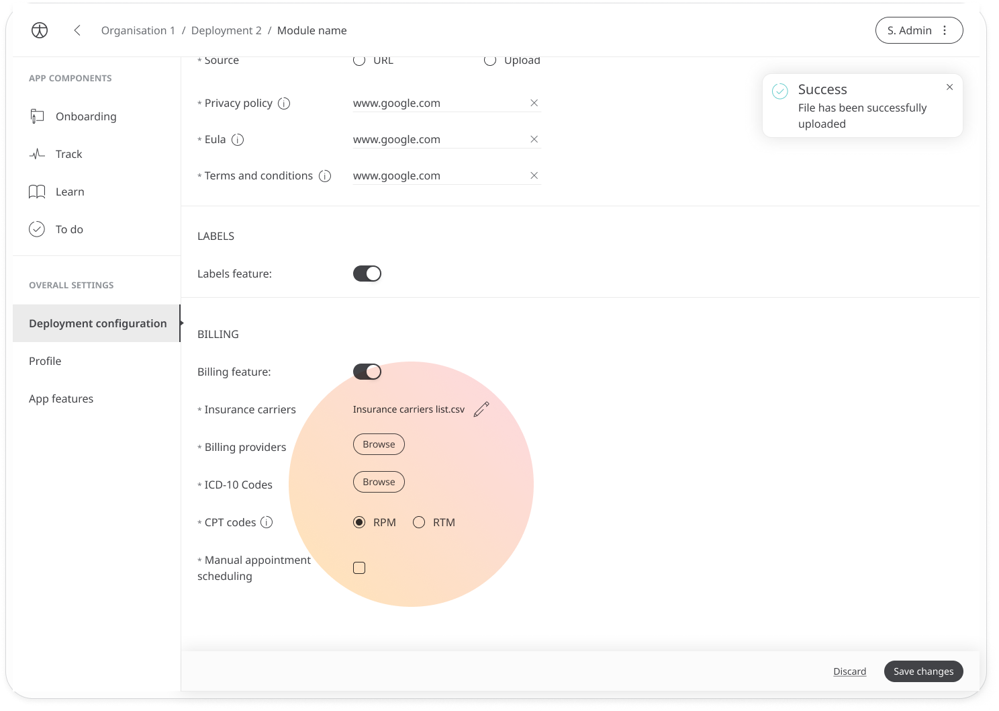

# Configuring the billing

**User**: Super Admin, Huma Support, Account Manager, Organisation Owner, Organisation Editor.

Some clients require billing data in order to claim reimbursement from insurance providers. The deployment can be configured so that patients can be enrolled in billing and so that billing data can be exported.

## How it works

In the **Deployment config** tab, go to **Billing** and enable the **Billing features** toggle to configure the billing.

As part of the billing configuration, you will need to add the following information:
- Names of the insurance carriers, billing providers, and ICD-10 codes (uploaded as csv files)
- Whether you are tracking according to RPM or RTM codes 
- Whether you want to enable manual appointment scheduling (so you can track appointments that happen offline and count these towards remote patient monitoring time)
Once you have finished the configuration, click **Save changes**.

**Related articles**: [Billing and Reimbursement](../../clinician-portal/managing-patients/billing-and-reimbursement.md)
