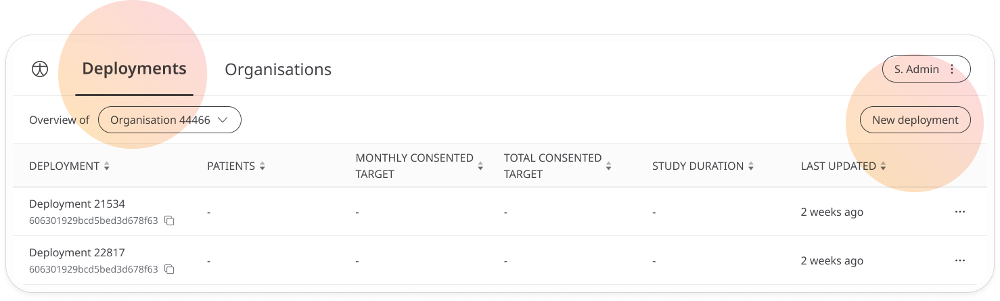
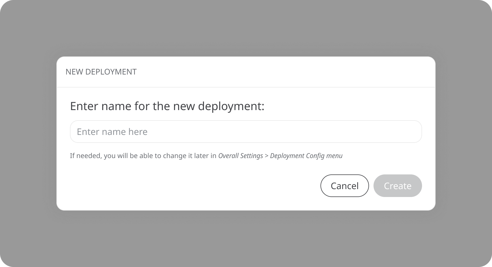
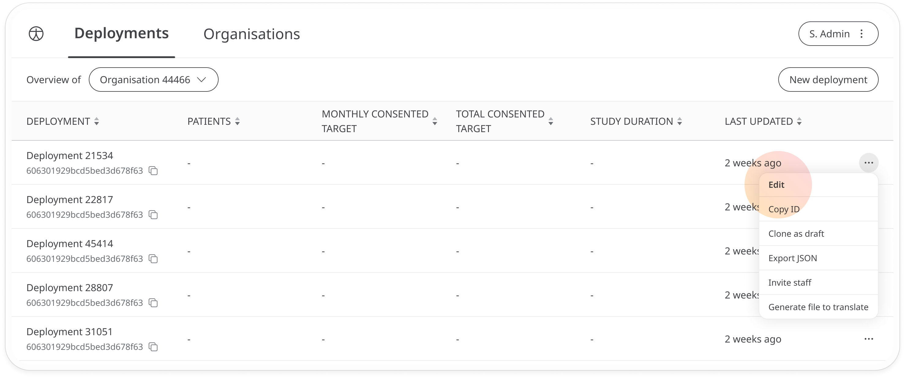
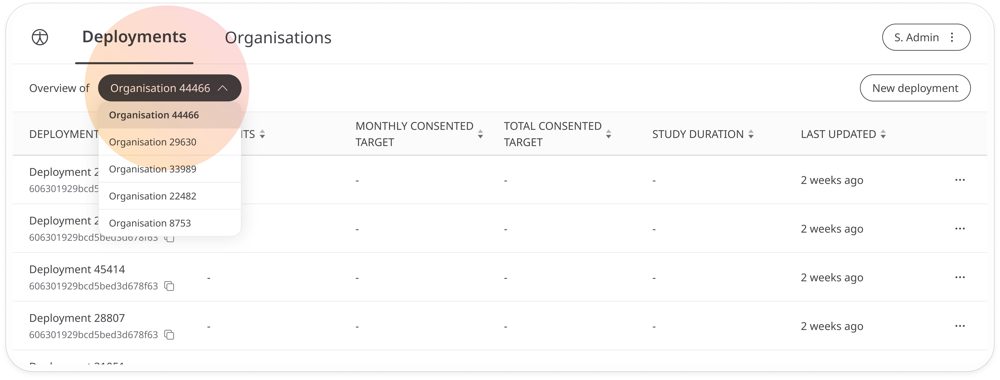

# Creating a new Deployment
**User**: Super Admin, Huma Support, Account Manager, Organisation Owner, Organisation Editor.

Once you have set up your Organisation, you can create as many Deployments as you need within the Admin Portal. Each Deployment will create a version of the Clinician Portal and Huma App with its own distinct characteristics. 
## How it works​
To configure a new Deployment, go to the **Deployments** tab in the Admin Portal and click **New Deployment**.

In the edit window, enter a name for the Deployment.

Your new Deployment will now appear on the list. Open the dropdown menu at the right of the row and click **Edit**, or just click on the row to open and start editing.

If you have more than one Organisation on your list, you can switch between them using the dropdown menu so that you only see Deployments belonging to a particular Organisation.

 
You can configure the look and feel and functionality of the Deployment to your requirements and then [invite admin users](../tools-and-navigation/inviting-deployment-admins.md) to manage it.

**Related articles**: [Creating a new Organisation](../../managing-organisations/creating-a-new-organisation.md); [Inviting staff (Organisation level)](../../managing-organisations/inviting-staff-to-an-organisation.md); [Inviting Deployment Admins](../tools-and-navigation/inviting-deployment-admins.md)
