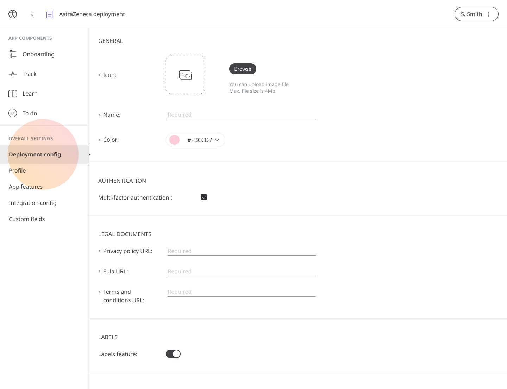
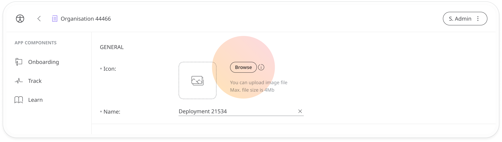
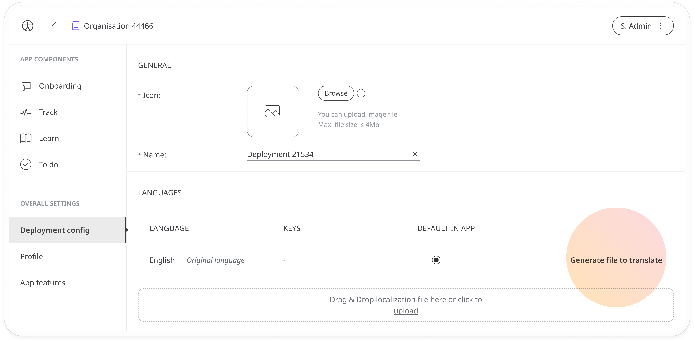
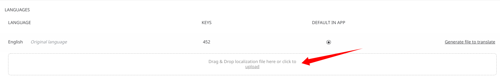
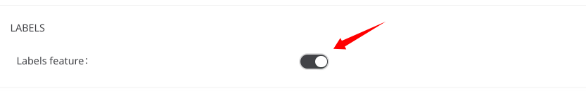

# Icon, language and labels
**User**: Super Admin, Huma Support, Account Manager, Organisation Owner, Organisation Editor

When setting up multiple Deployments for different user groups, the Huma platform makes it possible to differentiate each deployment, not only by customising the features, but also by adding specific branding and language configurations and enabling the labels features.
## How it works​
In the **Deployment config** tab, you can configure each individual deployment’s look and feel.

## General
- **Icon** - You can upload an icon for your Deployment. This will appear on the Huma App home screen (Timeline/To do). Just click **Browse** and select the file you want to upload.

> ⚠️ **INFO**: Use a high resolution client logo with transparent background.
> - Recommended min size: 800x800px
> - Recommended format: png

- **Name** - Give your Deployment a name to differentiate it from other Deployments in the same Organisation
## Languages
The Languages section will list the different language configurations available in your Deployment. 

Click the **Generate file to translate** link to generate a json file with all the code from your Deployment. 

To add a new language, you will need to translate all the text into the new language and then upload the localization file by clicking the **upload** link.

> 🛑 **IMPORTANT**: Once you have downloaded the localisation file, your Deployment configuration will be locked and you won’t be able to make any changes. For the full procedure, please refer to [this documentation](https://humatherapeutics.atlassian.net/wiki/spaces/DO/pages/3298689083/How-To+Log+a+Translation+Request).

## Labels
At the bottom of the **Deployment config** page, you can find the **Labels** toggle. Enable this feature to assign labels to patients in the [Patient List](../../../clinician-portal/managing-patients/patient-list.md) which you will also be able to use for filtering.

**Related articles**: [Exporting the configuration or translation files](../tools-and-navigation/exporting-config-or-localization-files.md); Filtering the Patient List; Patient Labels;
