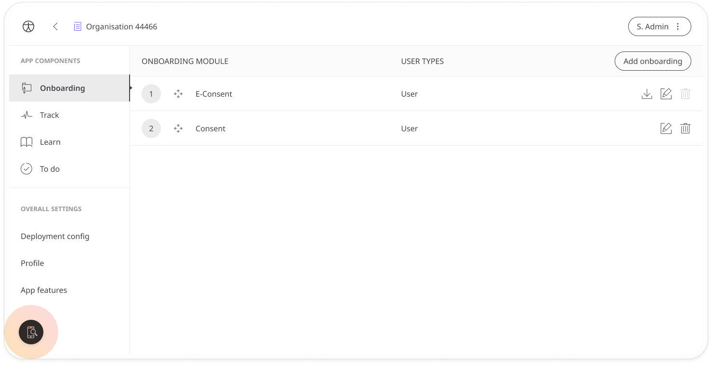
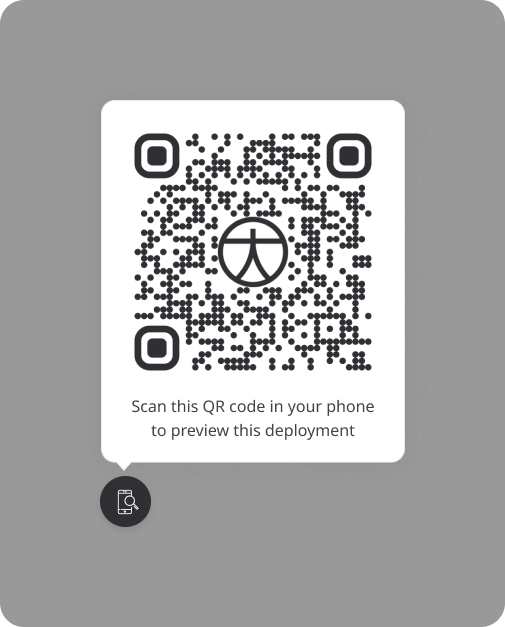

# Deployment preview
**User**: Super Admin, Huma Support, Account Manager, Organisation Owner, Organisation Editor

The Huma Admin Portal is the place where individual Organisations and Deployments are configured and managed. Once a new deployment has been created, you can preview it before you start inviting patients and clinicians to check you have your configuration set up right.
This can be done both for the Huma App and the Clinician Portal. 
## How it works
### Previewing the Huma App​
In the Admin Portal, go to the Deployment you want to preview. You’ll see a **phone icon** at the bottom right of the screen. You can find this on any page within the deployment management screens.

Click the icon and a QR code will appear for you to scan with your phone. Make sure you already have the [demo version of the app](https://humatherapeutics.atlassian.net/wiki/spaces/HUM/pages/2155413529/.RPM+-+Patient+App+and+Clinician+Portal+Demo) installed and that you are signed out of the app.

Click the link that appears on your phone when you scan the QR, this will take you to the sign up screen. The process is the same as when you sign up using a link.
Review the onboarding process and the rest of the experience and make any changes to the configuration as needed.
### Previewing the Clinician Portal
To preview how the Clinician Portal looks for your deployment, just [invite yourself as an Admin](data-collection/admin-portal/managing-deployments/tools-and-navigation/inviting-deployment-admins.md) or [Access Controller (Organization)](data-collection/admin-portal/managing-organisations/inviting-staff-to-an-organisation.md). 

**Related articles**: [Creating a new Deployment](data-collection/admin-portal/managing-deployments/general-settings/creating-a-new-deployment.md); [Inviting Deployment Admin](data-collection/admin-portal/managing-deployments/tools-and-navigation/inviting-deployment-admins.md)
