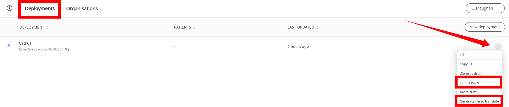

# Exporting the configuration or localisation files
**User**: Super Admin, Huma Support, Account Manager, Organisation Owner, Organisation Editor

Once you have configured a new deployment, you can export a JSON file of the full configuration so that you can recreate it in the future or in order to integrate it with another tool. 
You can also export a different JSON containing all the copy from your deployment so that you can translate it. 
## How it works
In the Admin Portal, find your list of deployments on the **Deployments** tab. Open the dropdown menu at the end of the row and select **Export JSON** or **Generate file to translate** depending on whether you want the full code for the deployment or just the content to be translated.

A file will be downloaded to your device in JSON. The localisation file can be reuploaded in the [Languages section of the **App Configuration**](data-collection/admin-portal/managing-deployments/general-settings/icon-language-and-labels.md).
>
> 🛑 **IMPORTANT**: In the case of the localisation file, please note that once you have downloaded it, your deployment configuration will be locked and you won’t be able to make any changes. For the full procedure, please refer to [this documentation](https://humatherapeutics.atlassian.net/wiki/spaces/DO/pages/3298689083/How-To+Log+a+Translation+Request).

**Related articles**: [Exporting and archiving an Organisation](data-collection/admin-portal/managing-organisations/exporting-and-archiving-an-organisation.md); [Icons, Language and Labels](data-collection/admin-portal/managing-deployments/general-settings/icon-language-and-labels.md);
