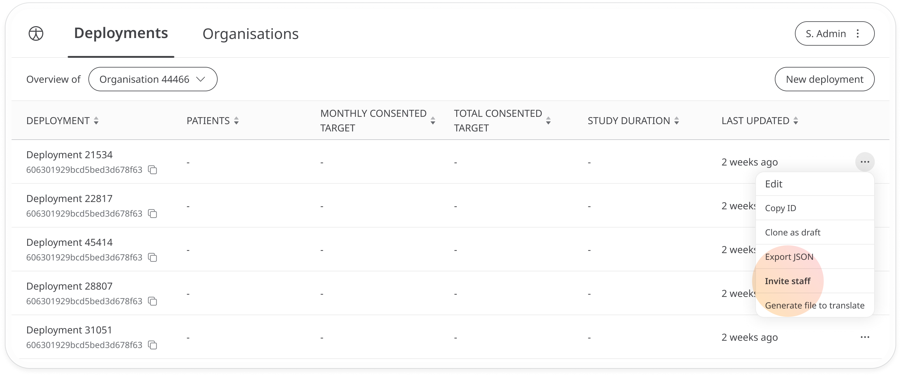
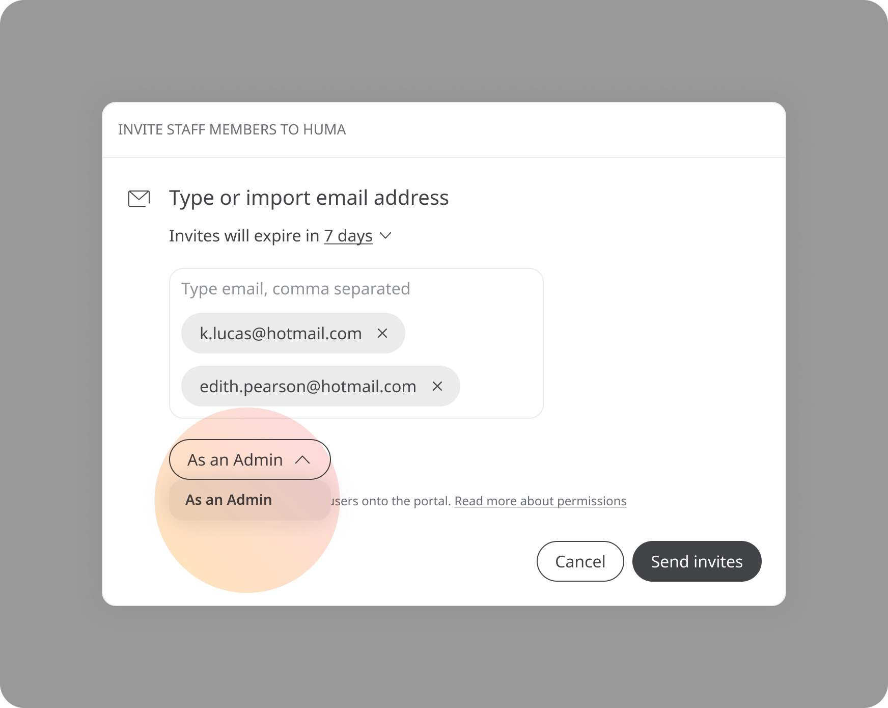
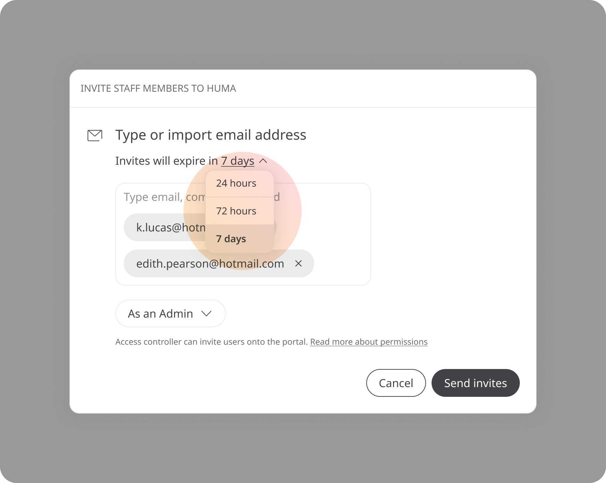

# Inviting Deployment Admins
**User**: Super Admin, Huma Support, Account Manager, Organisation Owner, Organisation Editor

The Huma Admin Portal is the place where individual Organisations and Deployments are configured and managed. Once a new deployment has been created, an Admin user can invite staff to the Clinician Portal to manage that deployment and invite or remove other staff members. 
## How it works​
In the Admin Portal, go to the **Deployments** tab and open the dropdown menu at the end of the deployment row that you want to invite staff to.

Click **Invite staff** and a pop-out window will appear where you can add the email addresses of the people you want to invite. Make sure you hit Enter so the **Send invites** button is activated.

Select the Admin role from the dropdown.

Finally, you can decide the window of time that you will give staff to use your invite before it expires. Click the link to open the dropdown and choose from **24 hours, 72 hours** or **7 days**.

Click **Send invites** and the user will receive an email with the link that will let them set a password and access the Clinician Portal. 

If you want to give them access to more than one deployment within your organisation, you will need to [invite them at an Organisation level](../../managing-organisations/inviting-staff-to-an-organisation.md).

**Related articles**: [Creating a new Deployment](../general-settings/creating-a-new-deployment.md); [Inviting staff (Organisations)](../../managing-organisations/inviting-staff-to-an-organisation.md)
