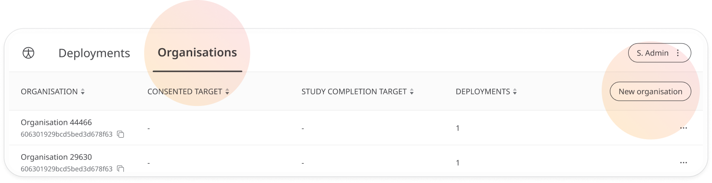
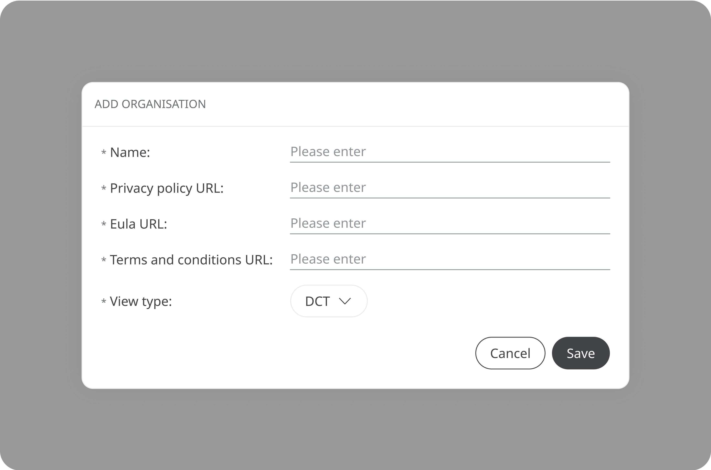
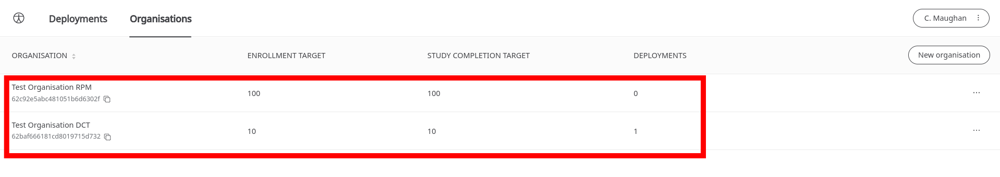
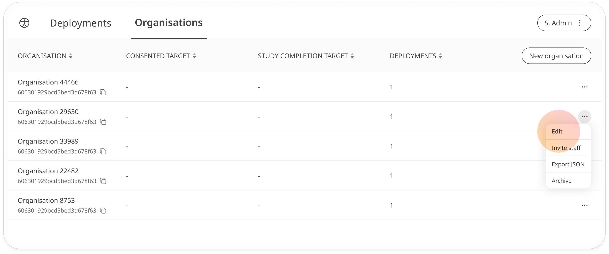
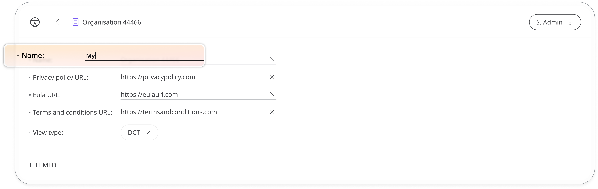

# Creating a new Organisation
**User**: Account Manager, Super Admin

The first step for any new client is to create an Organisation. New organisations must define their key activity; either clinical trials or remote patient monitoring and include their terms and conditions. 

## How it works​
In the Admin Portal, go to the **Organisations** tab and click **New organisation**.

In the pop-out window, enter a name for your Organisation, select a **View type** and add links to your **privacy policy**, **EULA** (software agreement), and **terms and conditions** (just use the same link if this is the same as the EULA).

For DCT deployments, you can also optionally choose to set a **Study completion target** and **Enrollment target**. Study completion target is the number of patients needed to complete the trial and will be displayed on the deployment list view in the Clinician Portal. Enrollment target is the number of patients that should be recruited to ensure the study completion target is met.

Once you have completed these details, click **Save** and your Organisation will be listed on the **Organisations** tab. On the list, you can see the organisation name, enrollment target, study completion target and the number of deployments associated with it.

To make any changes, open the dropdown menu at the end of the row and select **Edit**. 

You can edit any of the fields and delete any associated deployments.

**Related articles**: [Creating a new Deployment](../managing-deployments/general-settings/creating-a-new-deployment.md)
