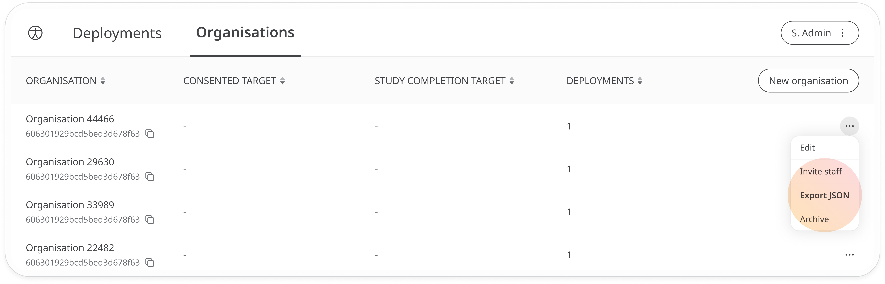
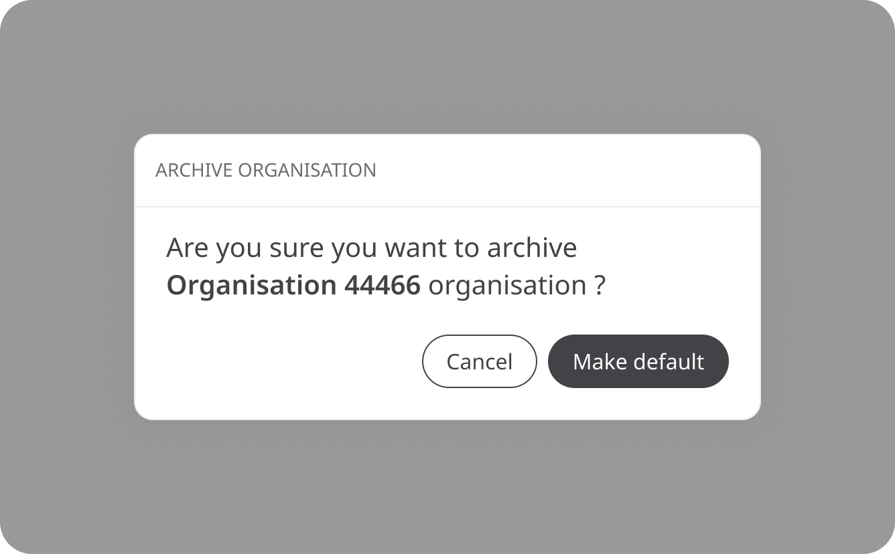

# Exporting and archiving an Organisation
**User**: Organisation Owner, Account Manager, Super Admin

Once a client has reached the end of their Huma journey, you may want to archive the Organisation. If you think you may need to reestablish the Organisation at some point in the future, you can export it as a JSON file so that none of your configuration is lost. It’s a good idea to do this with any of the associated Deployments as well.

## How it works
In the **Admin Portal**, find your list of Organisations on the **Organisations** tab. Open the dropdown menu at the end of the row and select **Export JSON**. 

A file will be downloaded to your device containing all the code for your Organisation's configuration in JSON. 

To archive the file, open the menu again and select **Archive**. You will be asked to confirm the action. 

Once your Organisation has been archived, you will no longer be able to see it on your portal. However, if you need to retrieve the data at a later date, please contact a super admin who will be able to restore it.

**Related articles**: [Creating a new Organisation](./creating-a-new-organisation.md); [Exporting the configuration or localisation files](../managing-deployments/tools-and-navigation/exporting-config-or-localization-files.md)
