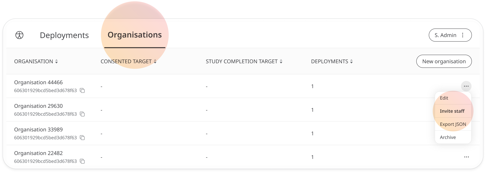
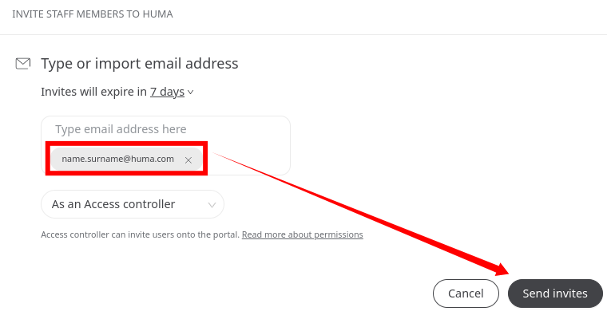
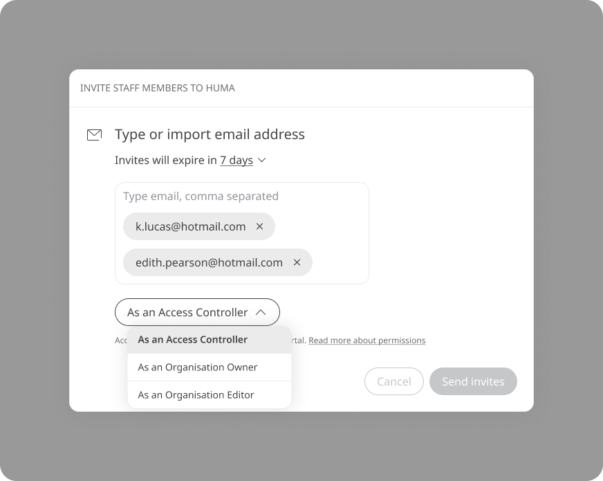
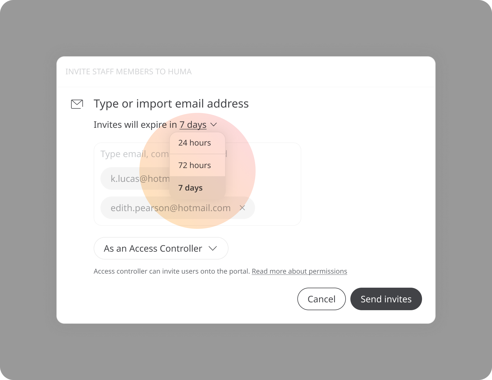
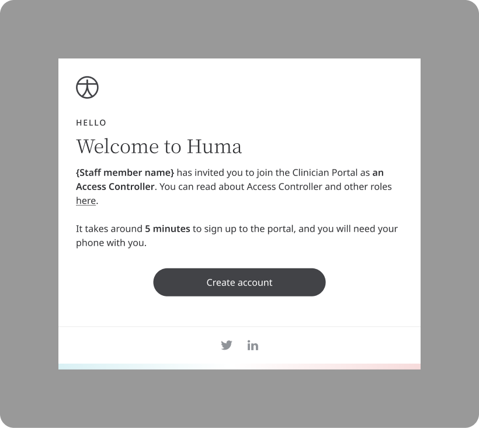

# Inviting staff to an organisation
**User**: Super Admin, Huma Support, Account Manager, Organisation Owner, Organisation Editor
 
Once a new organisation has been created, other users can be assigned to manage or edit the organisation and invite other users.

## How it works​
In the Admin Portal, go to the **Organisations** tab and open the dropdown menu on the row that you want to invite users to and click **Invite staff**.

A pop-out window will appear where you can add the email addresses of the people you want to invite. Make sure you hit enter so the **Send invites** button is activated.

Select the type of role you want to assign from the dropdown.
- **Organisation Controller** – this Admin Portal user can create and edit deployments within this organisation and invite other staff members
- **Organisation Owner** – this Admin Portal user can do everything an Organisation Controller can do and can also delete the organisation
- **Access controller** – this role is specifically for adding and removing organisation staff members and managing roles in the Clinician Portal
For more information on roles and permissions, see the article on Roles and permissions.

Finally, you can decide the window of time that you will give staff to use your invite before it expires. Click the link to open the dropdown and choose from 24 hours, 72 hours or 7 days.

Click **Send invites** and the user will receive an email with the link that will let them set a password and access the Clinician Portal. 

**Related articles**: [Creating a new Organisation](data-collection/admin-portal/managing-organisations/creating-a-new-organisation.md); [Inviting Deployment Admins](data-collection/admin-portal/managing-deployments/tools-and-navigation/inviting-deployment-admins.md)
