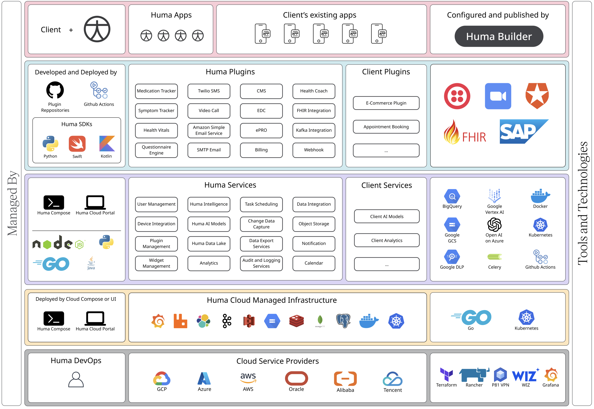

# Introduction to the Workspace Architecture

The platform is designed to provide a robust foundation for developing and scaling digital health solutions. It integrates a wide array of services, plugins, and infrastructure components to support a large number of initiatives. Below, we detail the high-level architecture and core functionalities of the platform, explaining how these components work together to deliver a comprehensive solution.

  
  

