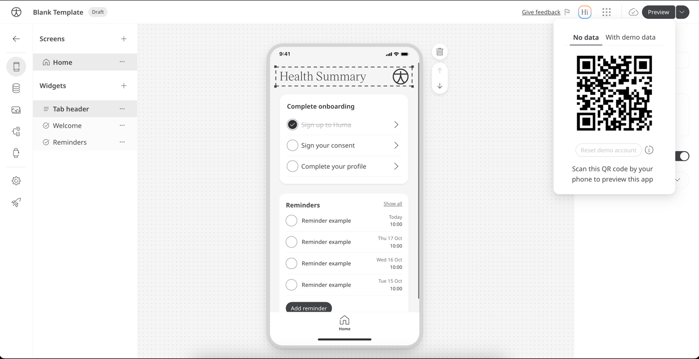

You can preview your app at any time during the editing process to see how it will look and function for your users.

#### To preview your app:

1. Select the app you want to preview from your list of apps.
2. Click the "Preview" button. This is located in the top right corner of the screen.
3. Scan the QR code with your mobile phone to preview your app.

   You have the option to preview the data for two kinds of users
    1. **No data**: As the name suggests no data is mocked for this user and it's similar to user that is just signed
       up, the data you input will be kept, and you have the option to "Reset demo Account" to reset all the changes
       you've made to that user
    2. **With demo data**: this data is mocked by Huma to mimic an active user

If you haven't downloaded the app from the App Store or Google Play yet, you'll be prompted to do so first. Once the
Huma App is installed on your phone, you can preview your customized app.

:::info
Preview mode is only available when you are editing a draft version of your app. If you see an "Edit" button instead of
a "Preview" button, you are likely viewing the published version. To access Preview mode, switch to the draft version of
your app first.
:::