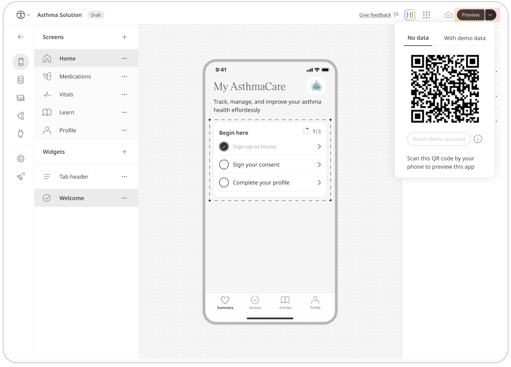

You can preview your app at any time during the editing process to see how it will look and function for your users.

#### To preview your app:

1. Select the app you want to preview from your list of apps.
2. Click the "Preview" button. This is located in the top right corner of the screen.
3. Scan the QR code with your mobile phone to preview your app.

If you haven't downloaded the app from the App Store or Google Play yet, you'll be prompted to do so first. Once the Huma App is installed on your phone, you can preview your customised app.

  <strong>Important:</strong> 
  Preview mode is only available when you are editing a draft version of your app. If you see an "Edit" button instead of a "Preview" button, you are likely viewing the published version.  To access Preview mode, switch to the draft version of your app first.

