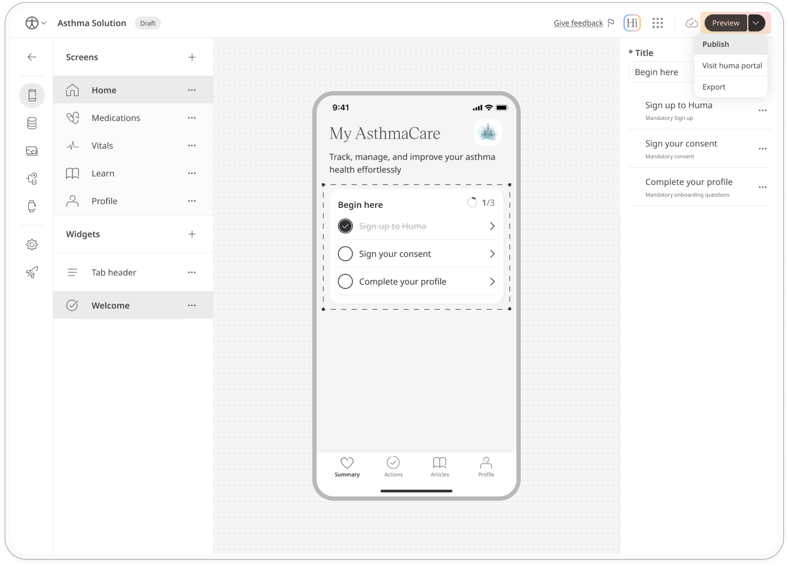
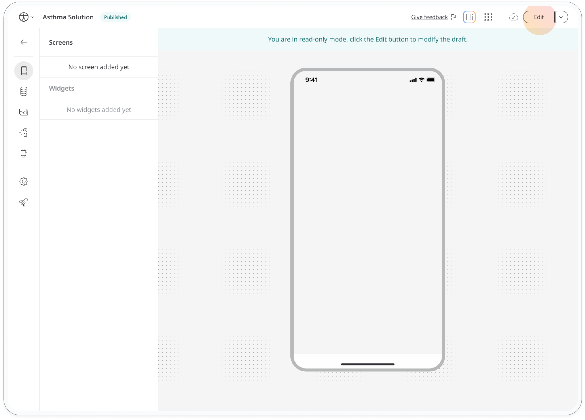

# Publish the app

Once you've configured and previewed your app, you're ready to launch it on the Huma platform.
The launch process differs slightly for Software as a Medical Device (SaMD) apps and non-SaMD apps.

## SaMD apps
Since SaMD apps are regulated, they must undergo a review process before they can be launched. This process involves the following:

1. **Submit your app to Huma for review:** Email Huma with a link to your app to request a review.
2. **Huma's internal review:** Huma will review your app to ensure it meets all regulatory requirements.
3. **Approval and launch:** Once your app has been reviewed and approved, it can be launched on the Huma platform.

## Non-SaMD Apps

Non-SaMD apps don't require regulatory approval.
Once you've configured and previewed your app, you can launch it immediately by:

1. Going to your app.
2. Selecting the dropdown menu in the top right corner.
3. Clicking Publish.

You'll see a confirmation message. Change the version name if needed, agree to the terms, and click Confirm to complete the publishing process.

After the above steps, your app will be live on the Huma platform.
You can invite staff members to collaborate on the app, and make any necessary updates.
You can also start inviting users to download and use your app.

## Updating Your App

After publishing your app, you'll see a "Published" label next to its name in the header. This indicates you're viewing the live version. To make further edits:

1. **Enable "Edit" mode.** on the top right of the screen. This creates a new draft of your app.
2. **Make the necessary changes to the draft.**
3. **Publish the updated draft.**  The publishing process is the same as for the initial launch.

  <strong>Quick tip</strong> 
  Remember that any changes you make to the draft won't affect the live version until you publish the updated version.

