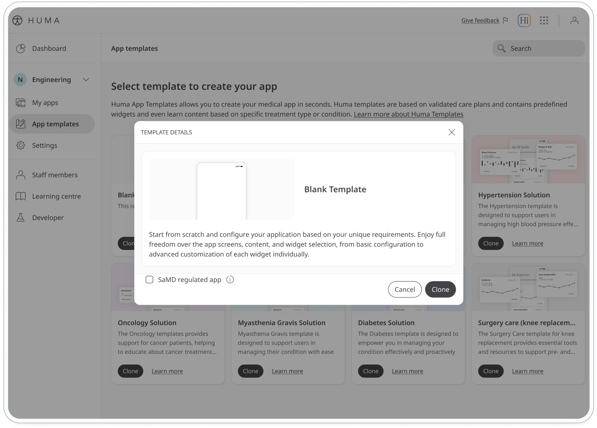

Huma Studio's templates streamline app creation from the start, regardless of the type of app you're building. Choose from a variety of pre-built templates that are easily customizable. Simply select a template and edit the existing components and app interface.
To get a head start on building your first app, follow these steps:

1. Navigate to App templates in the Huma Studio's side panel.
2. Select the template that best suits your needs from the available options.
3. If you're creating a Software as a Medical Device (SaMD) app, check the SaMD checkbox.
4. Click the Clone button to begin editing the template. 

You can also start with a blank template, providing a canvas for your creativity. Add tabs, widgets, and features to build a completely custom app.

For detailed instructions on adding and customizing these elements, see "Step 2: Design the app interface" below.

  <strong>Tip: Preview the app template on your phone</strong> 
  Have a quick look at your app to get a sense of the look and feel. To preview your app at any time during editing, refer to the "Preview your app" section.

