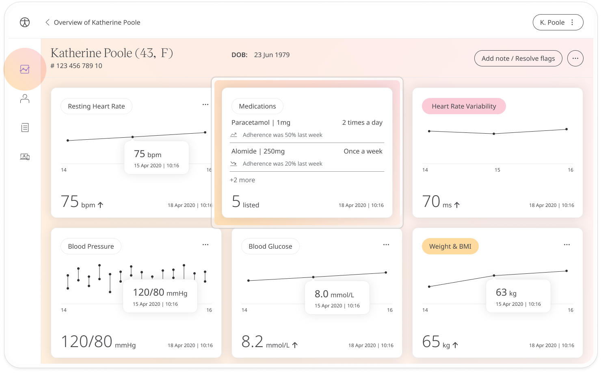
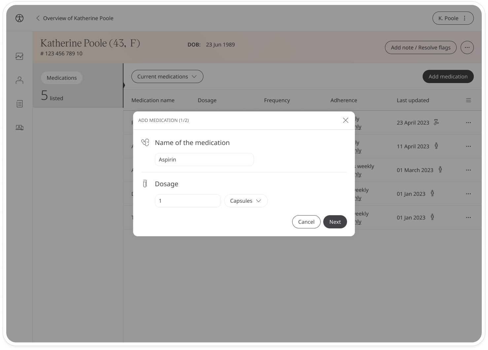
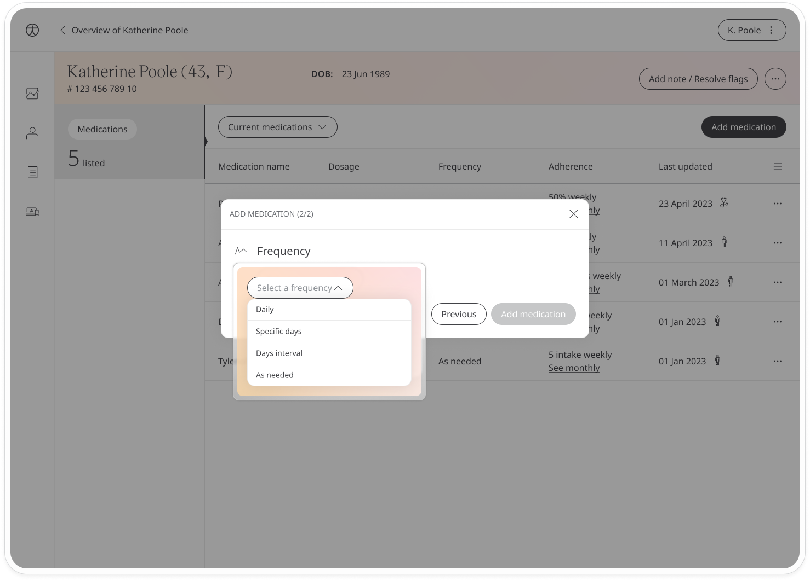
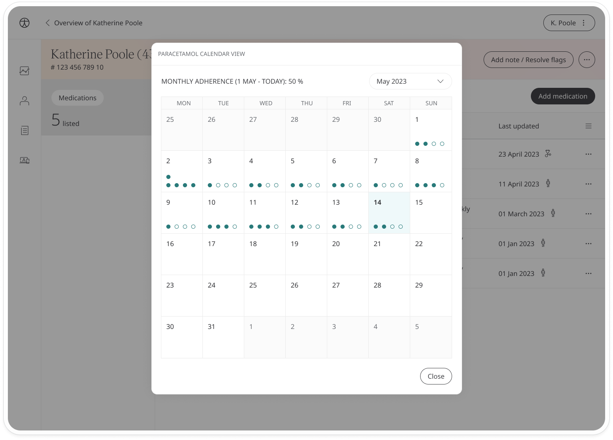
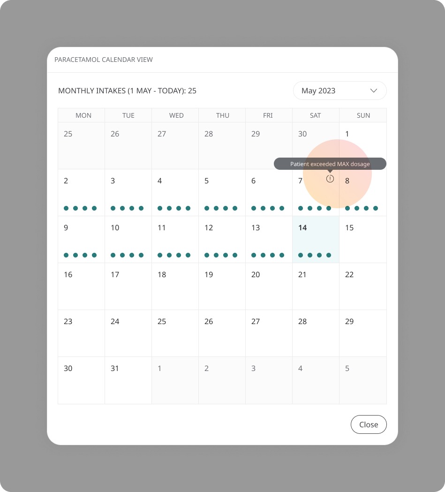

# Adding patient medication
**User**: Admin; Deployment staff; Organisation staff

From the Patient Dashboard, it’s possible to add medications on behalf of the patient so that they can keep track of what they are taking. Care teams can ensure patients have an up-to-date log of what they are taking and can set notifications to remind them of their schedule.

Adding medications should be used for tracking and not prescribing. Typically, it’s useful when patients have trouble keeping track of their different medications or for making a note of changes in dosage, frequency, etc.

## How it works
From the **Patient Dashboard**, click the **Medications** module from the side navigation.

This will show a list of patient’s medications in table form alongside their dosage, frequency (hover over the frequency to see the schedule), their adherence % and the date of the last update. The icon next to the last update date shows whether this update was made by the patient or the clinician. If made by a clinician, you can see any notes related to the update by clicking the three dots at the end of the line.

To add a new medication, click the **Add medication** button at the top right of the table.

First, add the medication name and dosage. Start typing in the name field to see suggested options. Enter a number for the dosage and choose the unit type from the dropdown.

For the next step, select the frequency:

 - **Daily frequency** - Select the time
 - **Specific days** - Select one or more days of the week and the time 
 - **Days interval** - Select the frequency e.g. every 2 days, 3 days, etc and the time
 - **As needed** - You are leaving the frequency up to the condition of the patient e.g. in the case of pain medication. If you want, you can add a maximum daily limit for the patient

Once you have configured the medication, click **Add medication** and it will be added to the patient’s **Current medications** list.

## Deleting or editing medications
To delete medications from the list, click the three dots at the end of the line and select **Delete** from the menu.

You will need to leave a note to log why the medication is being removed e.g. Change in patient condition, Different medication prescribed, etc. Click to **Confirm**. 

Deleted medications will appear on the **Deleted medications** list. Use the dropdown to switch between current and deleted medications. 

You can edit medication details, including the dosage and frequency, by selecting the **Edit** option from the same menu. Make any modifications then click to **Save changes**. You will need to leave a note to log why the dosage or frequency is being changed e.g. Change in patient care plan, Medication not effective in previous dosage, etc. When you are done, click to **Confirm**.  

You can check notes by clicking the three dots at the end of the line and clicking **Notes** from the menu. 

## Checking patient adherence

You can check your patient’s compliance with their medication schedule from the **Adherence** column. Click the **See monthly** link to open the calendar. 

Green circles indicate when the patient should be taking their medication. A filled circle indicates they took it as scheduled, an empty circle indicates they missed it. This gives you an easy visual idea of how well the patient is adhering to their schedule. At the top of the calendar, you will see either an adherence %, based on when patients cleared their reminders. 

In the case of  ‘as needed’ schedules, you will see a number which represents the total medications taken. Where you see a ! icon, this means the patient exceeded their daily recommended dosage.

**Related articles**: [Medications module](../../modules/general/medications.md)
