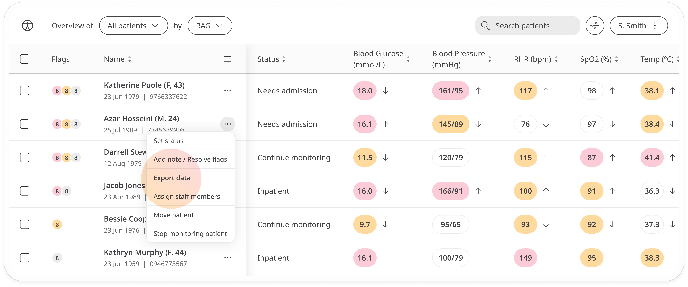
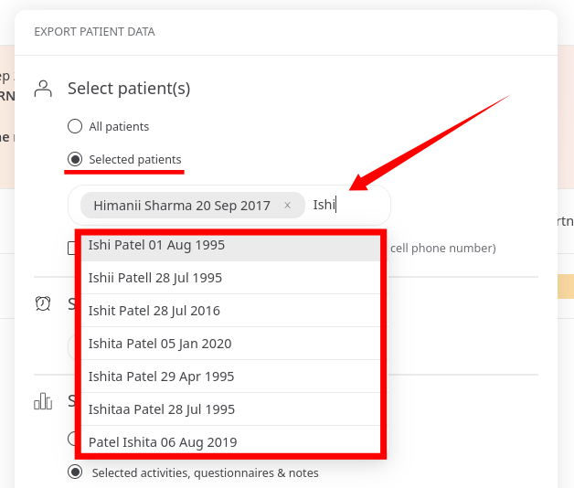
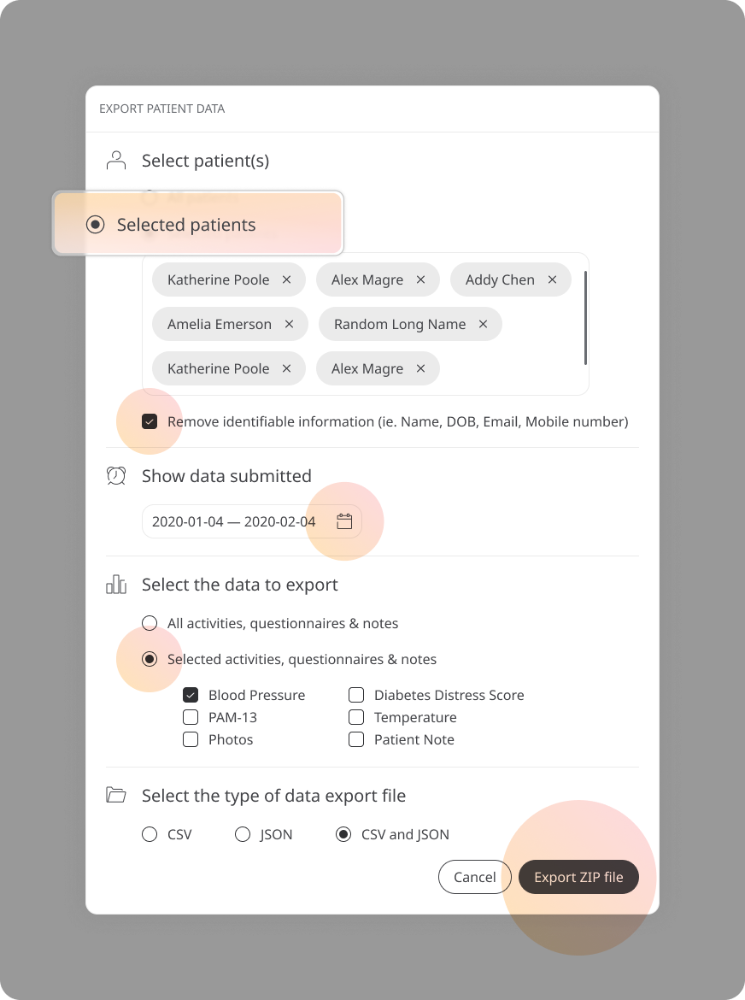
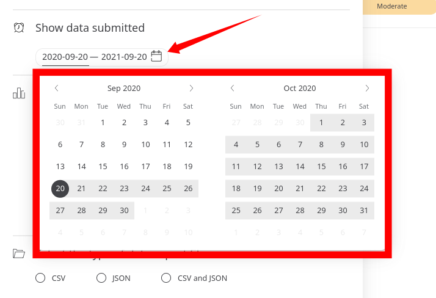

# Exporting patient data
**User**: Admin; Deployment Staff; Organisation staff

Patient data can be exported from the Clinician Portal and used to show results, for reports, etc.

## How it works​
On the **Patient Overview** screen, open the menu at the top right and select **Export data**.

### Select patient(s)
In the edit window you can select the patient that you currently have open, add other patients, or select **All patients**. 

To add another patient, just start typing the patient name or email address then select the patient you want to add.

Check the box **Remove identifiable information** if you want to export only the data points and protect the patient identity. If you don’t have permission to view identifiable information, this box will be checked by default and will not be editable.

### Show data submitted
Select the dates for which you would like to export the data. For example select only data submitted in the past week if you are creating weekly reports, or select the start of the trial if you want to include data for the full trial.

Next, select the data you want to include in the report. You can choose to include all modules, questionnaires and notes or choose selected modules, questionnaires and associated notes.

Finally, choose the file format you want to export the data in and click **Export ZIP file**.

**Related articles**: [Patient Dashboard](./patient-dashboard.md)
