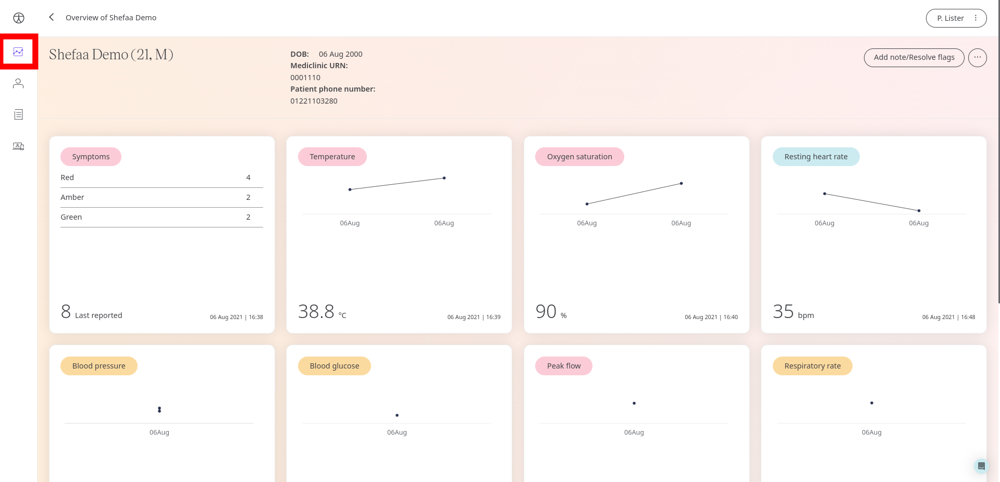
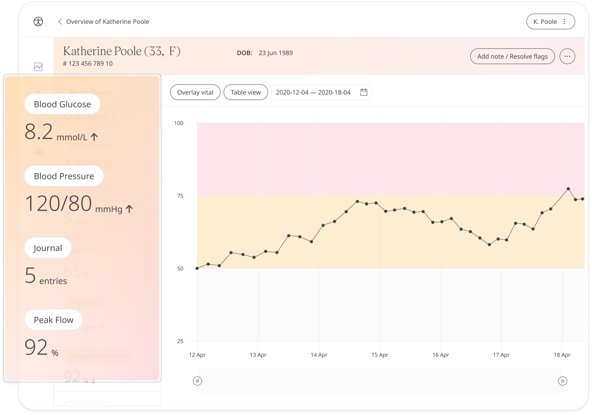
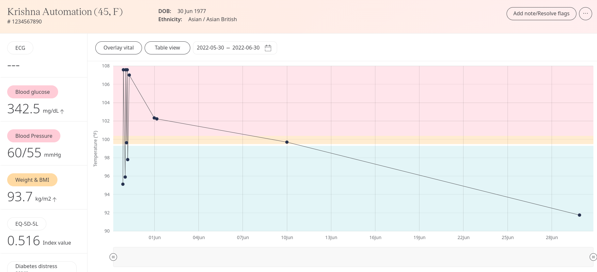
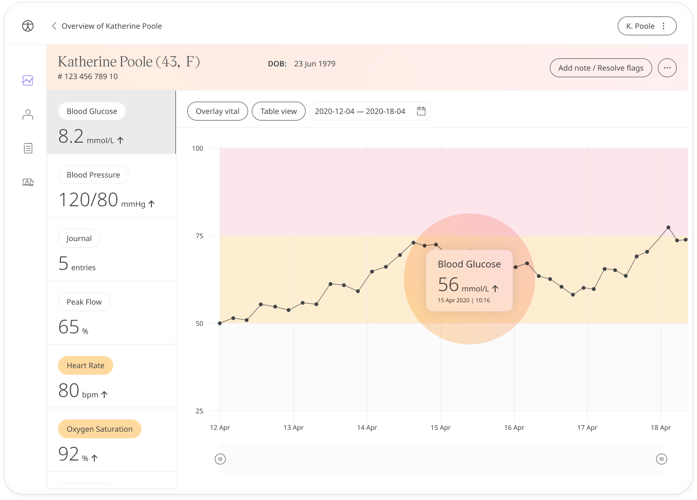
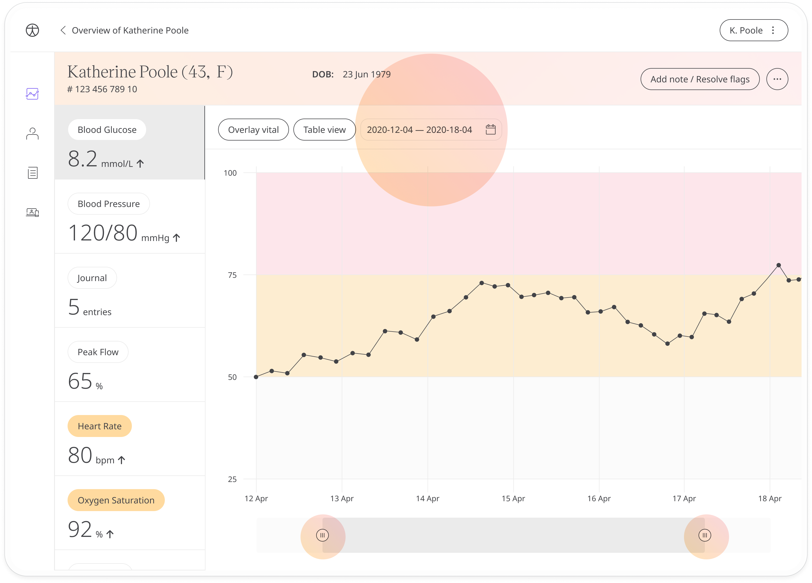
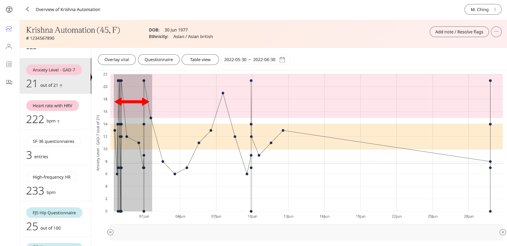
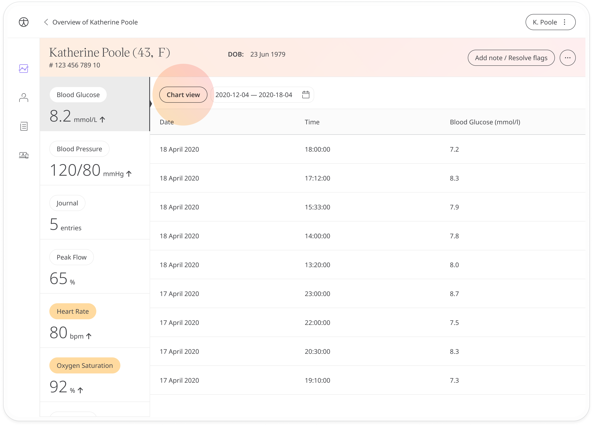
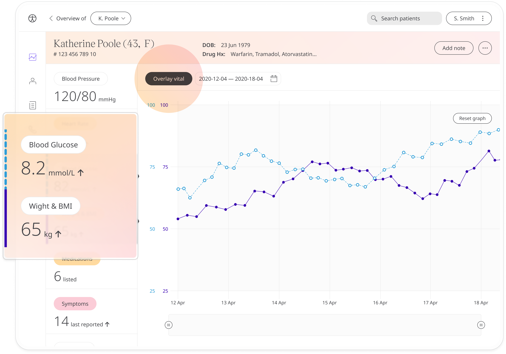

# Reviewing module data
**User**: Admin; Deployment staff; Organisation staff

The Patient Dashboard shows all the data points collected for a specific patient by modules. Care teams can track patient vitals and compare it next to other data to get a global understanding of how their patient is doing.

## How it works​
On the Patient Dashboard, you can see the patient’s individual modules and their most recent health records. When you click on the module, you will be taken to a more detailed graph.

From this view you can browse the list of all modules and questionnaires down the left hand side and click to see a graph showing previous entries in either table or graph format.

## Viewing patient data points 
Modules with data in the red or yellow range will be flagged in the left-hand column to help you prioritise. In addition, the graph will also show danger thresholds in the red or yellow.

Hovering over the data point will let you see the value.

You can also adjust the time frame using the date picker or the slider at the bottom of the graph.

An even quicker way to zoom in on a specific timeframe is to **click** anywhere on the graph and **drag** to select the area you want to focus on.

Click the **Table view** button at the top to see the data points listed along with the dates. Click **Chart view** to return to the graph.

### Comparing data points
To compare different data points side by side, click the **Overlay vital** button. This lets you pick a second data point to overlay onto the graph so that you can compare them side by side. The colour of the line will match the colour on the module tab on the left. Click on a different module to overlay that vital.

**Related articles**: [Inviting patients](../roles-and-permissions/inviting-patients.md); [Patient Dashboard](./patient-dashboard.md); [Questionnaires](./questionnaires.md); [Tracking Symptoms](./symptoms.md)  
