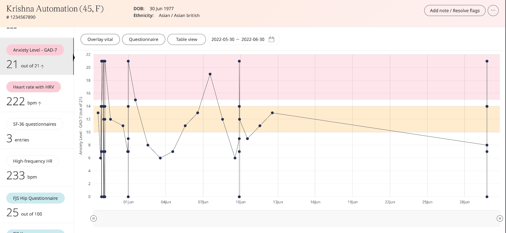

# Reviewing questionnaires
**User**: Admin; Deployment staff; Organisation staff

The Patient Dashboard includes questionnaires which have been responded to by the patient, either as specific modules (in the case of scored questionnaires) or under the Questionnaires umbrella module (for non-scored questionnaires). Clinicians can review patient responses and use them to make informed decisions about the patient’s care plan.

## How it works​
On the **Patient Dashboard**, select a questionnaire to see the individual patient responses. The module tile will show you whether the questionnaire has already been completed and the results (if applicable). 

The **Questionnaires** module contains all non-scored questionnaires. On this tile, you will find a list of the questionnaires included and their scores (if applicable).

Click the tile to see the list of questionnaires and their completion date.

Click the questionnaire to view the patient responses. 

If you have multiple submissions of the same questionnaire, you can see all the different submissions of the same question in a panel on the right, along with a timestamp of the answer.

In the case of scored questionnaires, you can choose **Chart view** to see a graph tracking the patient scores over time. 

**Related articles**: [Inviting patients](https://github.com/huma-engineering/huma-docs/blob/6a4b3cd6f400d779dbfdf7846a86270a8f3d3f50/data-collection/Clinician%20Portal/Roles%20and%20Permissions/Inviting%20patients.md); [Patient Dashboard](https://github.com/huma-engineering/huma-docs/blob/da1cf432dfdb7adf7c6954e29226ccac1f237992/data-collection/Clinician%20Portal/Managing%20Health%20Data/Patient%20dashboard.md); [Tracking Symptoms](https://github.com/huma-engineering/huma-docs/blob/da1cf432dfdb7adf7c6954e29226ccac1f237992/data-collection/Clinician%20Portal/Managing%20Health%20Data/Symptoms.md)  
