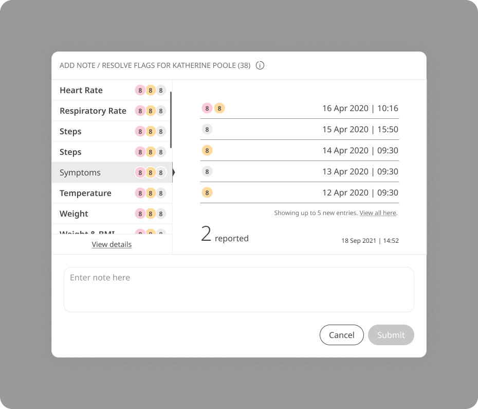

# Tracking symptoms
**User**: Admin; Deployment Staff; Organisation Staff

As well as data points from tracking modules, Huma also collects symptoms reported by the patient and tracks them with time/date stamps and severity grading. Symptoms can be set up from the Admin Portal and customised to the needs of the specific Deployment.
## How it works​
On the Patient Dashboard, look for the **Symptoms** module. TThe module tile shows a list of the most recent symptom submissions. If the full list of symptoms doesn’t fit on the line, just hover over the link to view the full list. 

Click the module to see the patient’s symptoms in table form, listed with the most recent first and showing the date and time each symptom was experienced along with its severity. 

Where you see a message icon, it means questions have been submitted along with the symptom. Click the icon to see the questions and responses.

Click the Graph view tab at the top to see the evolution of the symptoms over time. Use the slider at the bottom to select the time period you want to review or the calendar at the top right to select specific dates. The default view will show data for the last 10 days.

You can choose which symptoms you want to see from the symptoms list. Open it by clicking the three lines that appear to the left of the calendar then check or uncheck the options on the list.

To resolve the red flags, simply click the **Add note / Resolve flags** button and add a note once all the flagged symptoms have been reviewed.

**Related articles**: [Inviting patients](../roles-and-permissions/inviting-patients.md); [Patient Dashboard](./patient-dashboard.md); [Questionnaires](./questionnaires.md); [Modules](./modules.md)
