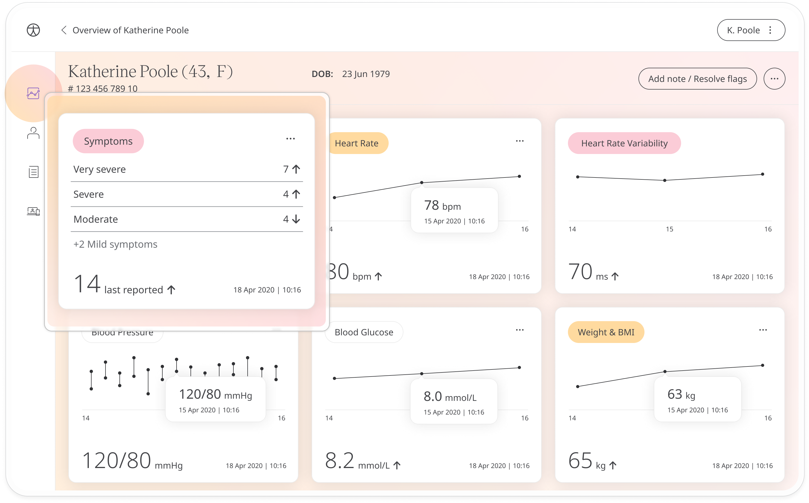
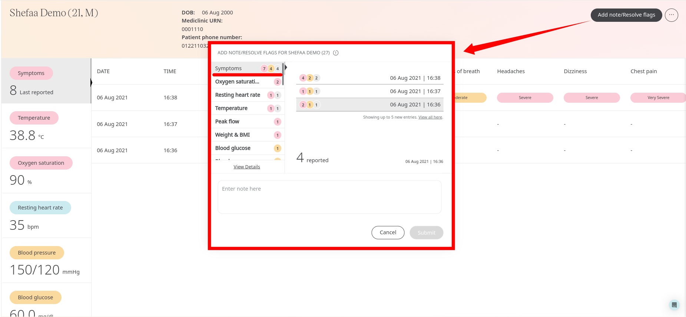

# Tracking Symptoms
**User**: Admin; Deployment staff; Organisation staff

As well as data points from tracking modules, Huma also collects symptoms reported by the patient and tracks them with time/date stamps and severity grading. Symptoms can be set up from the Admin Portal so that these can be customised to the needs of the specific deployment.
## How it works​
On the **Patient Dashboard**, look for the Symptoms module. The module tile shows the total symptoms which have been recorded in each of the RAG thresholds. 

Click the module to see the patient’s symptoms in table form, listed with the most recent first and showing the date and time each symptom was experienced along with its severity. Scroll down the table to see the evolution of each individual symptom over time.

To resolve the red flags, simply click the **Add note / Resolve flags** button and add a note once all the flagged symptoms have been reviewed.

**Related articles**: [Inviting patients](../roles-and-permissions/inviting-patients.md); [Patient Dashboard](./patient-dashboard.md); [Questionnaires](./questionnaires.md)  
