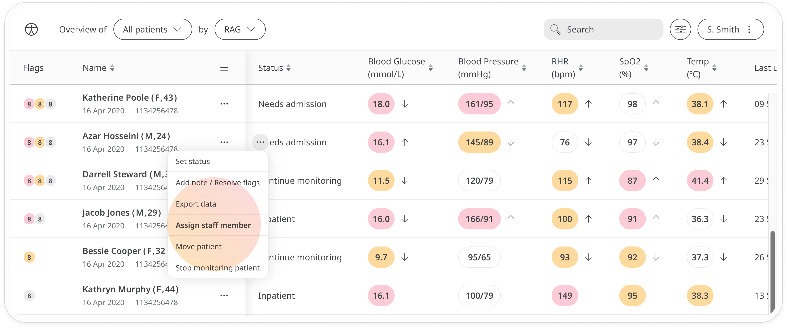
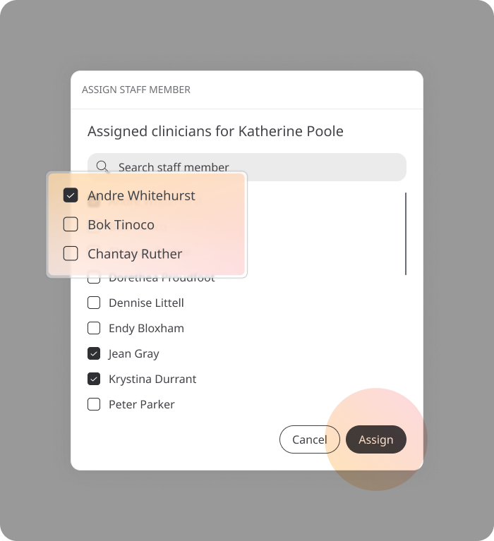

# Assigning a clinician to a patient
**User**: Admin; Deployment Staff; 

The Huma experience connects clinician and patients so that patient data can be tracked and monitored. When a clinician connects to the portal they can find a list of the patients they are monitoring but it’s up to the Deployment staff to assign patients to clinicians so that they can be tracked.
## How it works​
On the **Patient List**, open the menu at the end of the row select **Assign clinicians**.

In the pop-out window, search for the clinicians you want to assign and check the box to select them. You can select as many as you need for your care team.
 

Click the **Assign Clinicians** button and the assignment is complete.

**Related articles**: [Inviting patients](data-collection/clinician-portal/roles-and-permissions/inviting-patients.md)
