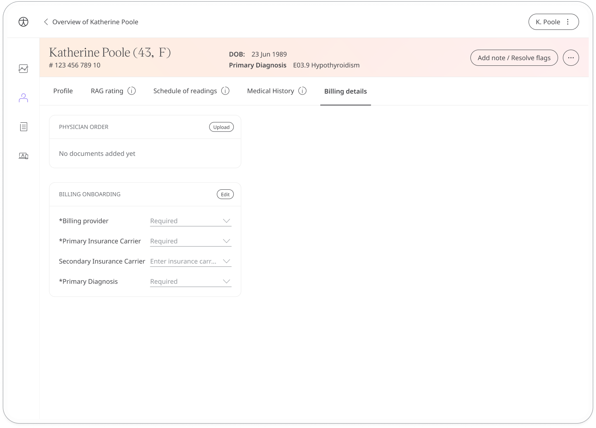
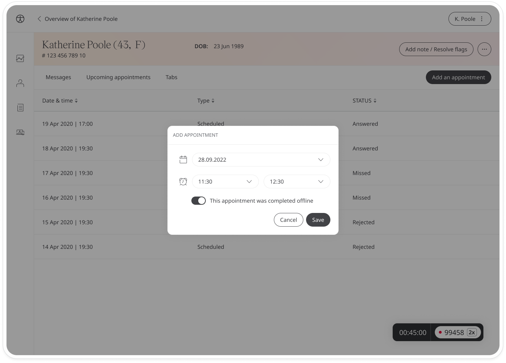
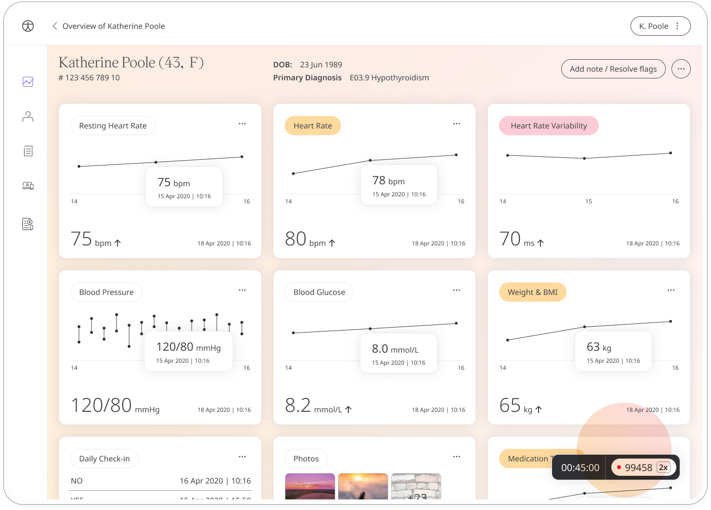
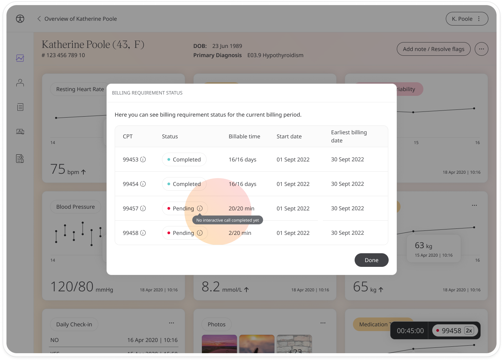
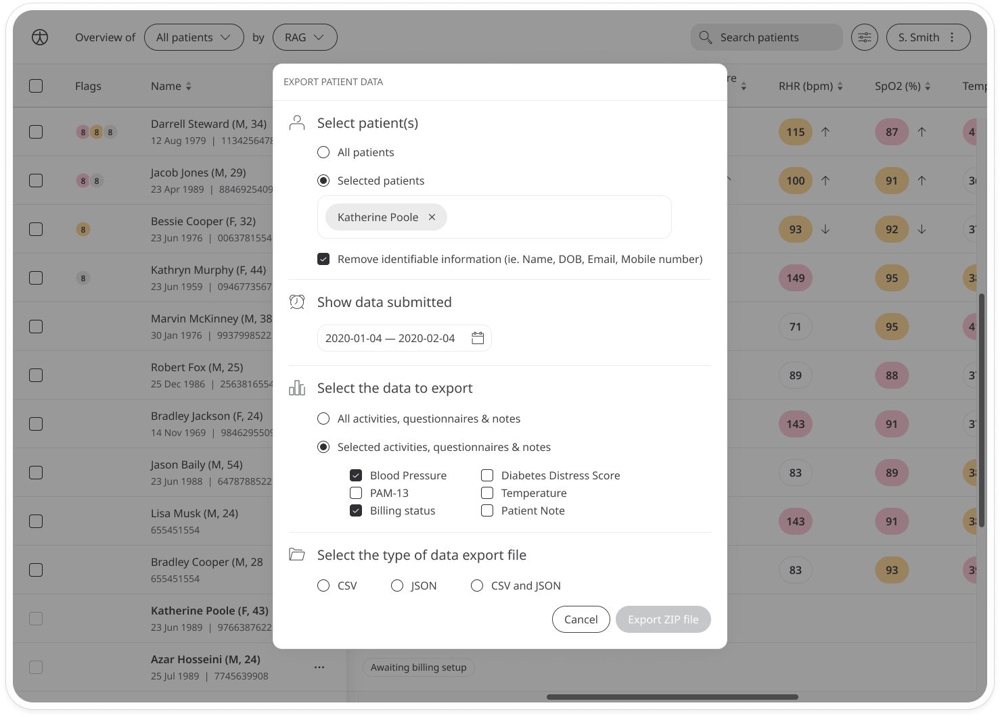

# Billing and reimbursement
**User**: Admin; Access Controller; Deployment Staff; Contributor; Organisation Staff

The billing module enables medical service providers to invoice remote patient interactions. Clinicians can onboard patients, record a timestamp on their dashboard, track services provided against RTM and RPM codes, and export patient clinical summary data with billing information. 

This module is available for US clients only.

## How it works

On the **Patient List**, find the patient you want to onboard, open the menu and click **Enroll for billing**. In the billing details window, enter the insurance carrier(s), the billing provider and the primary diagnosis.

You can access and edit the patient billing information from the patient profile. Navigate to the **Billing details** tab and find the details you want to edit. Click the **Edit** button to modify the billing provider, insurance carriers or diagnosis. 

The **Billing details** area also allows you to upload documents related to the billing details. Click the **Upload** button to upload a pdf of the physician order or patient consent. 

Once the patient has been onboarded, the time the clinician spends monitoring that patient can be tracked against RPM and RTM codes. There are specific conditions that must be met for reimbursement. These include interactive calls and patient monitoring, such as taking notes, resolving flags, or updating patient details. 

You can filter the patient list for those patients awaiting onboarding for billing. In the filters menu, select this under the **Patient type**.

## Billing status list

Use the dropdown at the top of the patient list and select **Billing status**. This view let’s you see all the billing details for those patients onboarded for billing including their insurance status, CPT codes, their dates of service and of the last claim, and the other general billing details. 

Patients appear on the list once they have fulfilled certain eligibility criteria: These include readings taken on at least 16 days and a total of 20 minutes of care management captured by the clinician. Patients with codes 99453+999454 (CPT) or 98975+98976 (RTM) will receive a billing status 16 days after activation, and those with codes 99457+99458 (CPT) or 98980+98981 (RPM) will get it on the last day of the month.

All fields on the billing status list are populated automatically apart from the **Statement balance** column. You can edit this manually by clicking the three dots at the end of the line and selecting **Fill** or **Edit statement balance**.

You can search for specific patients on the list by using the search field or using the filters. Click the icon next to the search field to open the filters window. You can filter by **Dates of service**, **Insurance carrier**, or **Insurance status**.

## Tracking appointments and leaving notes

From the appointments page of the patient dashboard, clinicians can track the time spent monitoring a patient. All past appointments are listed along with their duration. A cumulative timestamp for that calendar month appears at the bottom-right.

Click the timestamp to view the billing requirement status for the current time period. For codes that are still pending, hover over the status to see what activities are still pending.

You can add notes to a past appointment. The time spent adding notes is also tracking for billing purposes. At the end of the line, click the three dots and select **Add note**.

Enter your notes about the appointment and click **Submit** to save the note. If you want to complete the note details later, you can save as a draft.
 

To add notes during a patient call, just click **Add note / Resolve flags** at the top of the patient dashboard and enter your note. If you have the video call on full screen, you will see an **Add note** button at the top-right of the screen.

Once your note has been submitted, you will be able to view it but not edit it. You can add addendums to the existing note if you have more information to add.

You can also add notes manually, for example, in the case of offline appointments. From the appointments list, click **Add an appointment**. In the edit window, add the time and date of the call and enable the toggle that says **This appointment was completed offline**.  

## Exporting patient billing information

Each patient’s billing information can be exported in order to provide a statement for the purpose of billing or reimbursement.

From the patient dashboard menu, select **Export data**. Then, in the export window, select the patient or patients you would like to export the data for. Under the selected activities, questionnaires and notes, make sure **Billing status** is checked along with any clinical data you would like to export. Choose the type of file you want to download and click **Export to ZIP file**.

Related articles: [Configuring the billing](../../admin-portal/managing-deployments/general-settings/configuring-the-billing.md)
