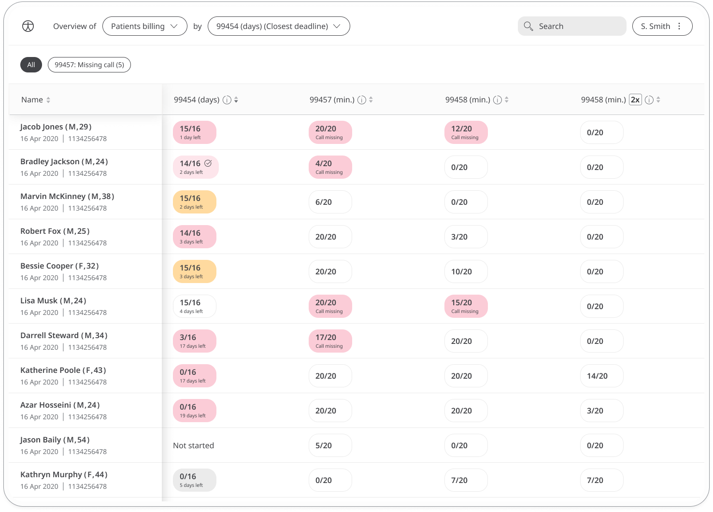

# Billing and reimbursement
**User**: Admin; Access Controller; Deployment Staff; Contributor; Organisation Staff

The billing module enables medical service providers to invoice remote patient interactions. Clinicians can onboard patients, record a timestamp on their dashboard, track services provided against RTM and RPM codes, and export patient clinical summary data with billing information. 

This module is available for US clients only.

## How it works

Onboarding patients for billing ensures that all relevant billing details are shown in the billing export. On the **Patient List**, find the patient you want to onboard, open the menu and click **Enroll for billing**. 

In the billing details window, enter the insurance carrier(s), the billing provider and the primary diagnosis.

You can also access and edit the patient billing information from the patient profile. Navigate to the **Billing details** tab and find the details you want to edit. Click the **Edit** button to modify the billing provider, insurance carriers or diagnosis. 

The **Billing details** area also allows you to upload documents related to the billing details. Click the **Upload** button to upload a pdf of the physician order. 

Once the patient has been onboarded to the Huma platform, the time the clinician spends monitoring that patient is being tracked. These times can be tracked against RPM and RTM codes in order to see whether conditions for reimbursement are being met. These include interactive calls and patient monitoring, such as taking notes, resolving flags, or updating patient details.   

You can filter the patient list for those patients awaiting onboarding for billing. In the filters menu, select this under the **Patient type**.

### Adding appointments and tracking compliance

From the appointments page of the patient dashboard, clinicians can schedule calls. These calls are a key requirement for CPT codes 99457 and 99458 and the cumulative timestamp for that calendar month appears at the bottom-right, across all patient specific pages.

Click the timestamp to view the billing requirement status for the current time period.

For codes with a pending status, hover over the information icon to see what activities are still pending.

From the patient list, you can monitor billing compliance for all patients. Select Patients billing from the filters at the top to see a list of all patients along with their status for the different billing codes. Colour-coded alerts let you see quickly which patients are not complying with billing requirements and which elements they are missing i.e. calls or number of days.

You can use the second filter to choose the CPT code that you want to prioritise. Patients are automatically prioritised by proximity of deadline. Code 99454 has a double sorting logic where first patients are sorted by proximity to the deadline and then by the number of missing readings. You can also see the overall number of missing calls at a glance at the top left of the list.

### Exporting billing information

Billing information can be exported in an aggregated report in order to provide a statement for the purpose of billing or reimbursement. 

From the patient list menu, select Export data. Then, in the export window, select the patient or patients you would like to export the data for. If selecting **All patients**, remember that this only includes those patients who have been onboarded for billing. 

Under the selected activities, questionnaires and notes, make sure **Billing status** is checked along with any clinical data you would like to export. Choose the type of file you want to download and click **Export ZIP file**.
 

Related articles: [Configuring the billing](../../admin-portal/managing-deployments/general-settings/configuring-the-billing.md)
