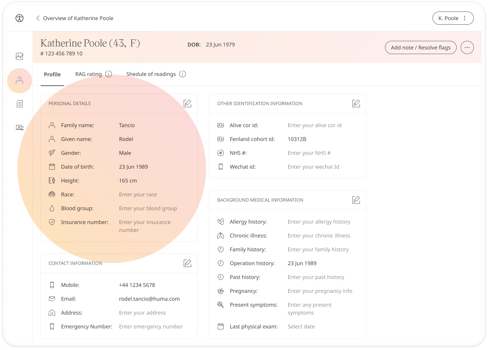
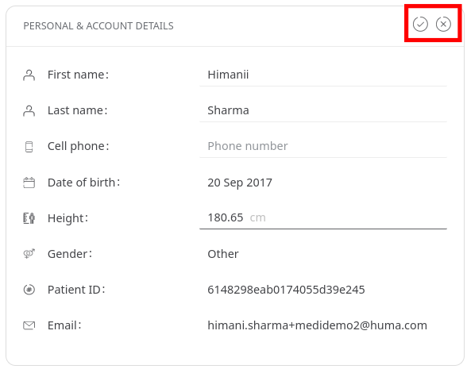

# Patient profile
**User**: Admin; Deployment staff
Users with permissions can view patient profile information and may also be able to edit that information.
## How it works​
On the **Patient Overview**, select the **Profile** tab.

The patient profile can be [configured from the Admin Portal](data-collection/admin-portal/managing-deployments/configuring-the-user-profile/user-profile-details.md) and this will determine what fields appear in the profile. Some of the default information includes personal and account details and identification information. Other fields, such as medical history, surgeries or medication can be included as needed and managed here.

If your role allows it, click the **Edit✎** button to edit the patient details. When you have made changes, click the **check✓** icon to save or the **cross⨯** to revert back.

**Related articles**: [Inviting patients](data-collection/clinician-portal/roles-and-permissions/inviting-patients.md)
