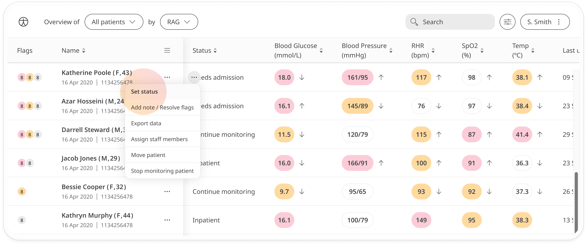
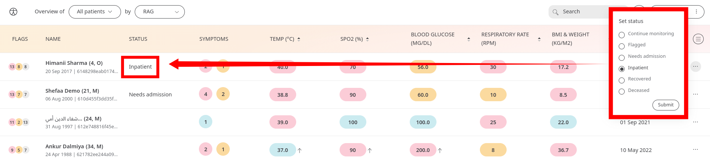
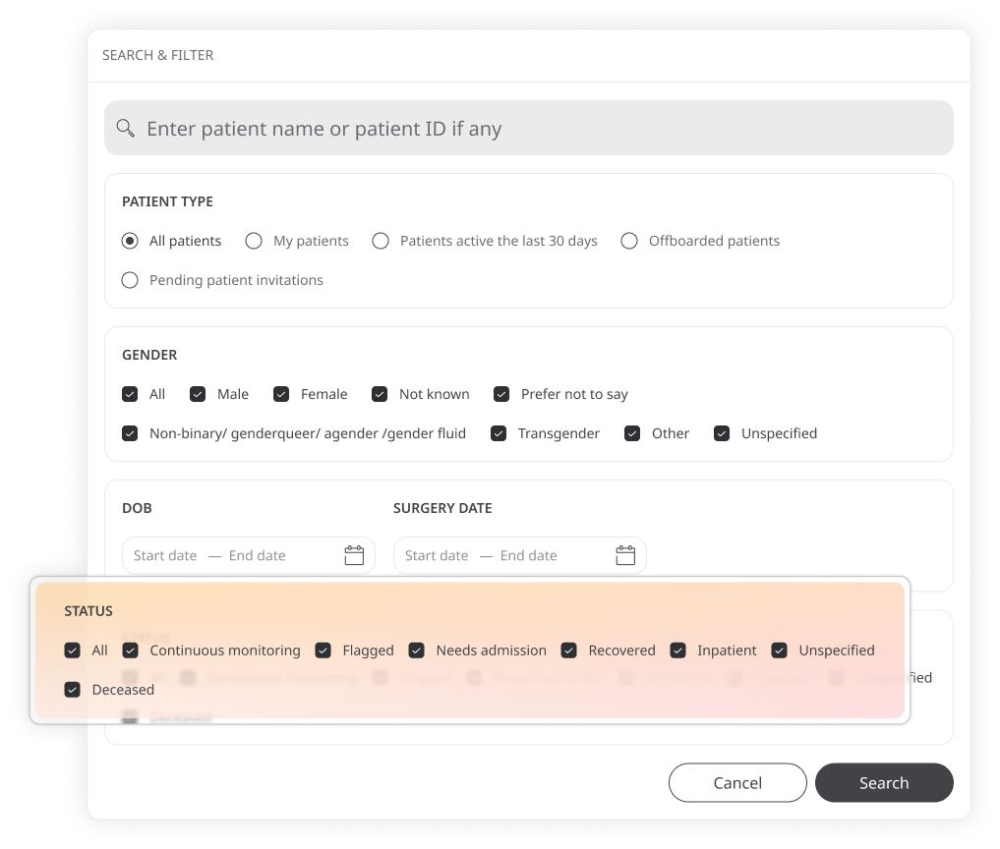

# Patient status
**User**: Admin; Access Controller; Deployment Staff; 

Patient status is a useful metric to add to help different members of the care team see what is happening with specific patients.
## How it works​
Patient status can be added manually. Just search for the patient on the Patient List, then open the menu at the end of the row and select **Set status**.

A checkbox list will open where you can select a status. Choose from: **Continue monitoring, Flagged, Needs admission, Inpatient, Recovered, Deceased**. Click **Submit** to save the new status.

Other users can now use the patient status for filtering in order to find specific groups of patients.

**Related articles**: [Filters and sorting the patient list](data-collection/clinician-portal/managing-patients/patient-list.md) 

