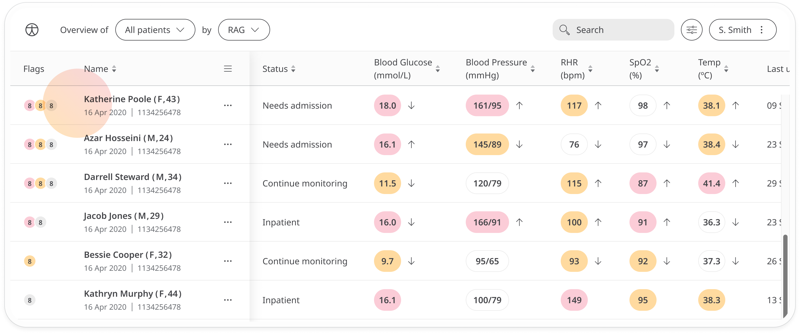
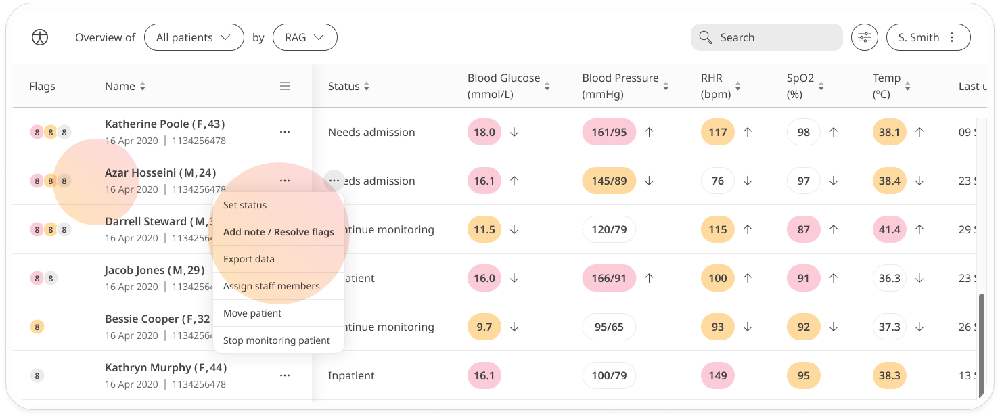
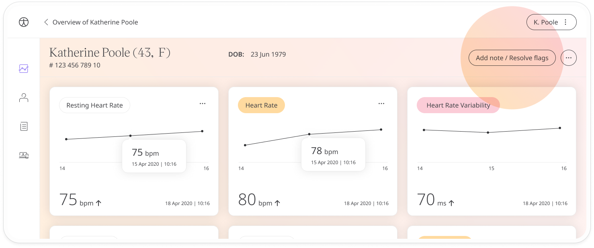
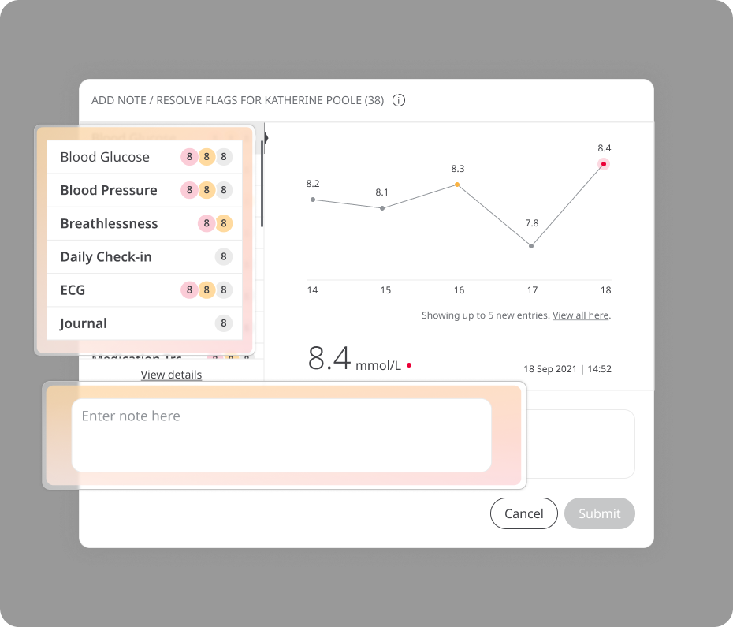
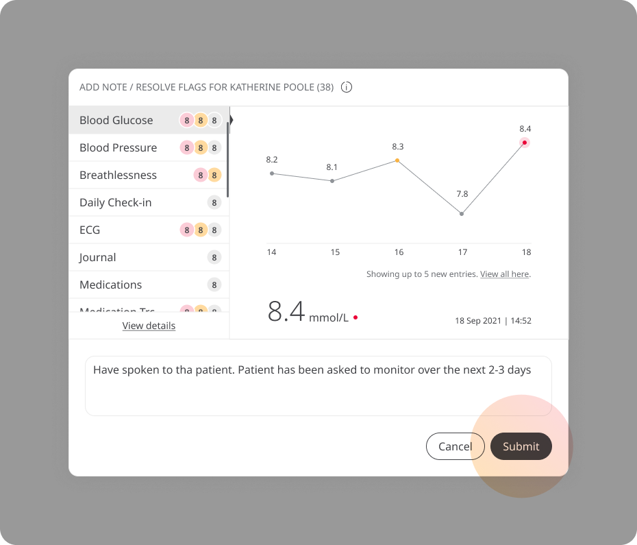
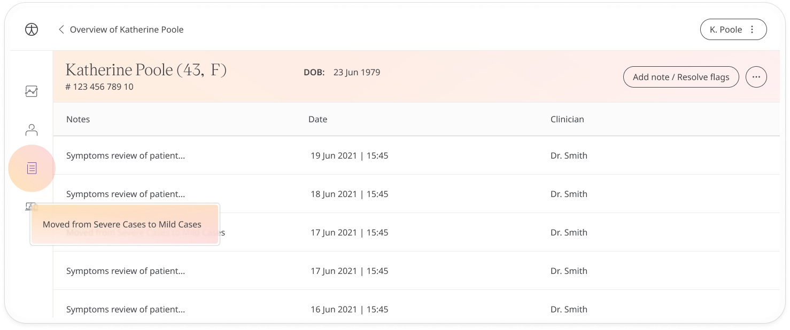

# Resolving flags and adding notes
**User**: Admin; Access Controller; Deployment Staff; Organisation Staff

The Clinician Portal uses flags to indicate to the care team vitals that fall outside the RAG thresholds that have been configured as acceptable. Adding a note confirms that you have reviewed that flagged information and it will be logged as resolved.

The flag system allows clinicians to easilly view which patients have amber and red vital signs and help direct their care. 
## How it works​
On the **Patient List**, the first column shows flags for each patient. 

Flags are shown in order of patients with the most Red and Amber ratings; with red flags first, then amber flags, then grey flags. The Patient List is ordered by default to show the patient with the most red flags first. When there are no red flags, patients are ordered by the most amber flags, then by the most grey flags.
- **Red flags** - These indicate metrics that are deemed Red as assigned by the care team.
- **Amber flags** - These indicate metrics that are deemed Amber as assigned by the care team.
- **Grey flags** - These indicate any new data that has been submitted, including green values or entries coming from static modules i.e. those which don’t have any RAG thresholds set.

You can see which of the data points are causing the flags by looking in the columns. Data in the red range will be shown in red, data in the amber range will show in amber, etc.

## Resolving flags
It’s important to review flags regularly and resolve them so that you are always informed of the most recent changes.  To resolve them, just click on the flags in the **Flags** column on the left. Alternatively, open the menu at the end of the patient row and select **Add notes / Resolve flags**.

You can also resolve flags from the **Patient Overview** screen. Click the **Add note/Resolve flags** button at the top right.

Click any of the vitals and see the entries and the dates they were made. To resolve them and remove the flag, add a note in the text box at the bottom to say you have seen the flags and any other information you want to add.

Once all red and amber flags have been reviewed and a note has been left, press **Submit** to resolve the flags for this patient.

Patients will be notified that you have seen their data and they will no longer appear at the top of your list of patients.

Your note will be saved with your initials and a time stamp. You can find a record in the **Notes** tab of the [Patient Dashboard](../managing-health-data/patient-dashboard.md).

**Related articles**: [Patient Dashboard](../managing-health-data/patient-dashboard.md); [App Features](../../admin-portal/managing-deployments/general-settings/app-features.md) 
