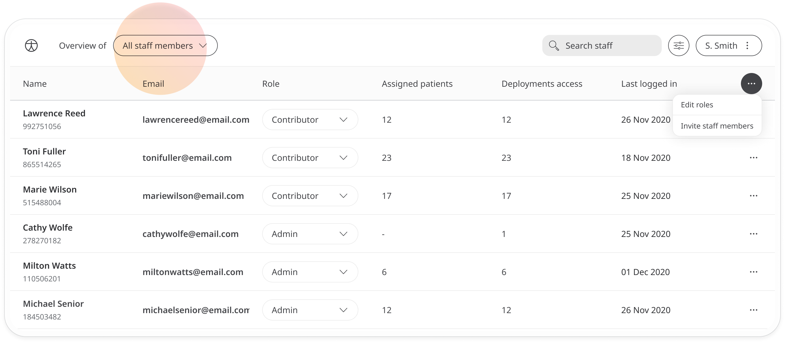
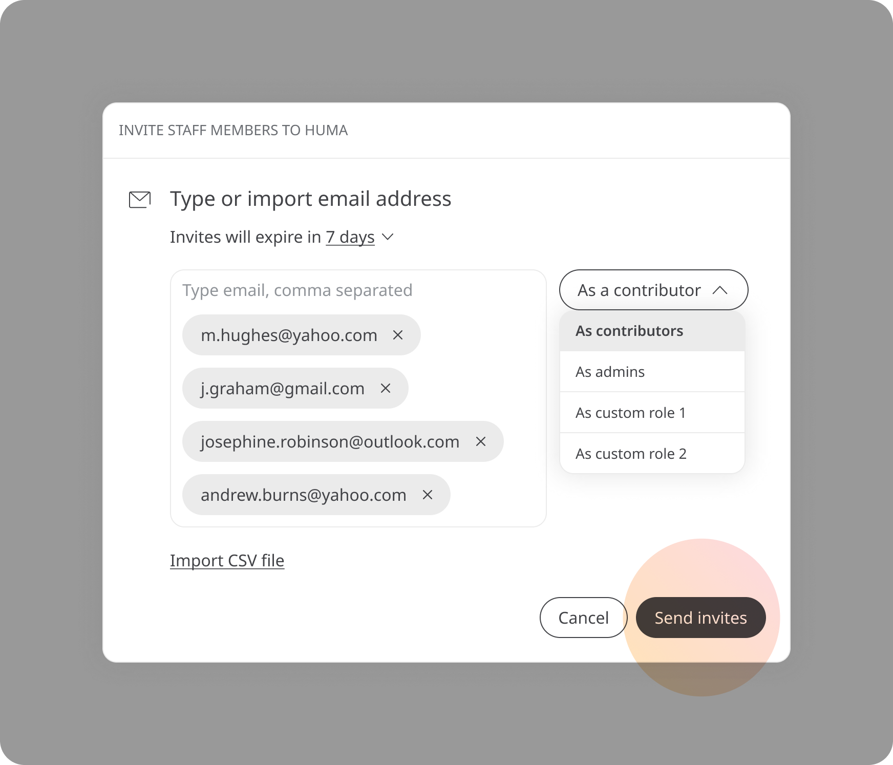
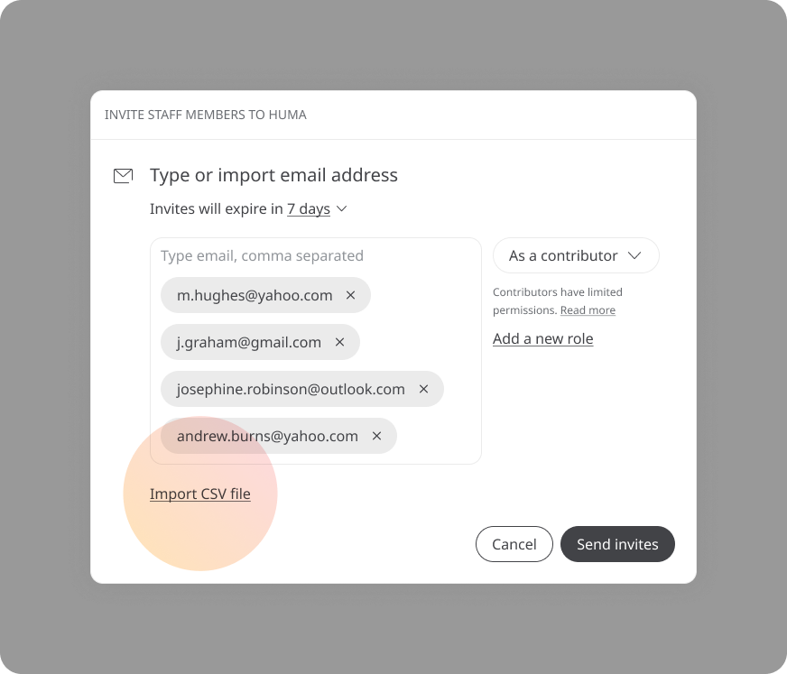
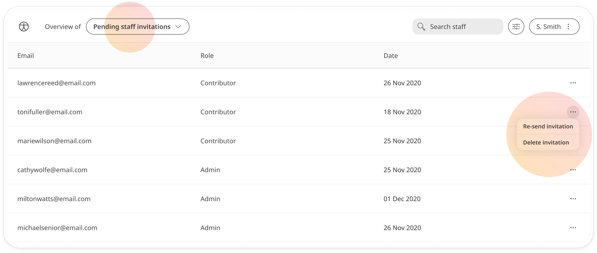
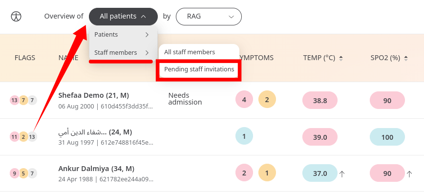
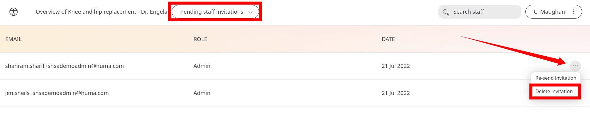

# Inviting staff and assigning roles
**User**: Admin; Access Controller

The Clinician Portal is one easy-to-use interface for all Care Team and administrative users to easily view and track patient data, contact patients and/or to manage other users and their roles. The portal has a number of different user roles available so that users can only access or edit what they need to. 

> ⚠️ **INFO**: If you have a default role assigned, you must be an Administrator or Access Controller to be able to invite staff to the Clinician Portal. If you have a custom role assigned, this must include the invite staff members permission.

## How it works​
Open the dropdown menu next to your name at the top-right of the portal and select **Invite staff members**.

In the edit window, enter the email addresses of the users you want to invite, select the role you want to assign from the dropdown and click **Send invites**.

An email will be sent to the user with a link to create their account.

### Importing staff emails by csv
You can use the csv import feature to invite staff in bulk. Make sure you have a csv file with the email addresses of all the staff members you want to invite listed in the first column, then click the **Import csv file** link and select the file. 

Once you have imported your contacts, they will appear in the emails field. Review them to check there are no errors and then click to **Send invites**. 

If you want to invite different users to different roles, just repeat the process and select a different user from the dropdown.
### Reviewing pending invitations
To see which staff have not yet responded to invitations, use the **Overview** filters at the top of the Patient list and select **Staff members >> Pending staff invitations**.

You will see all staff members who have not yet clicked the link in their invitation.

### Resending or deleting invitations
If you want to send out a reminder to staff who have not yet set up their account or whose invitations have expired, you can easily resend the invitation. On the **pending staff invitations list**, open the menu at the end of the row and select **Resend invitation**.

On the same menu, you can choose to delete the invitation. This means the link will no longer work.

**Related articles**: [Default roles and permissions](data-collection/clinician-portal/roles-and-permissions/default-roles-and-permissions.md); [Creating custom roles](data-collection/clinician-portal/roles-and-permissions/creating-custom-roles.md)
