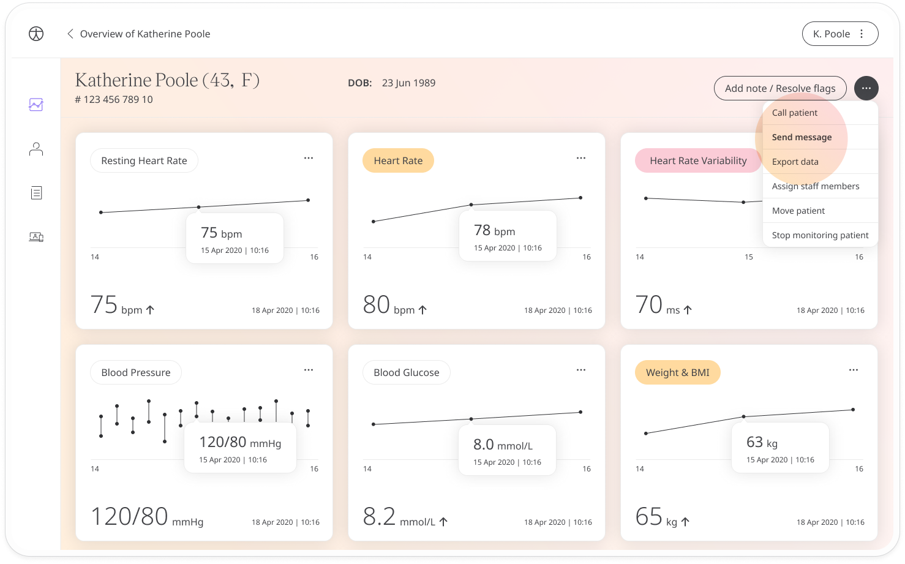
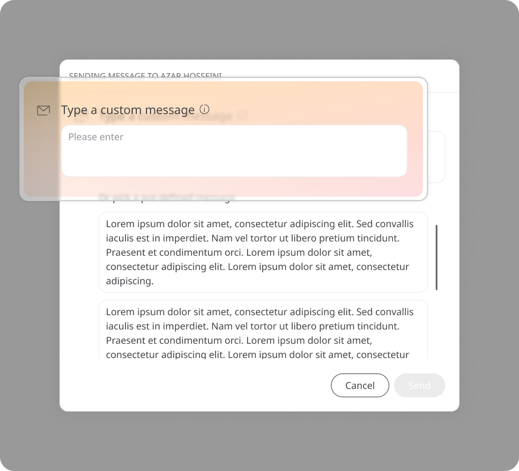
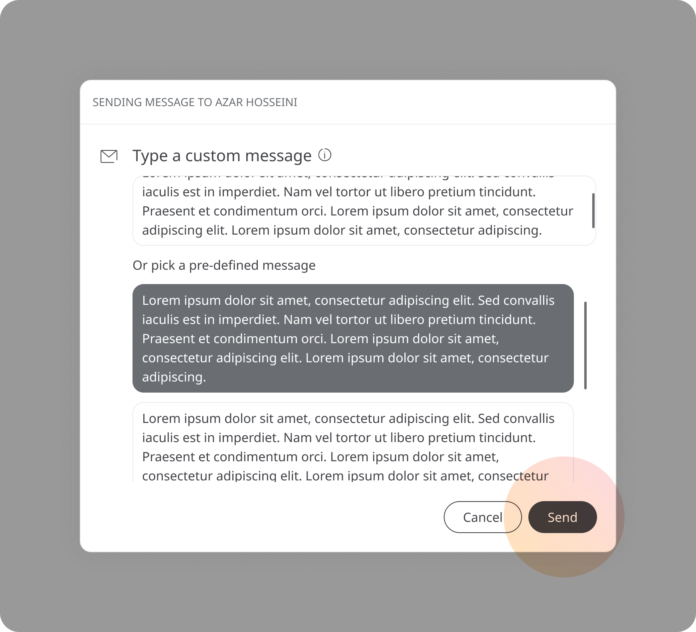
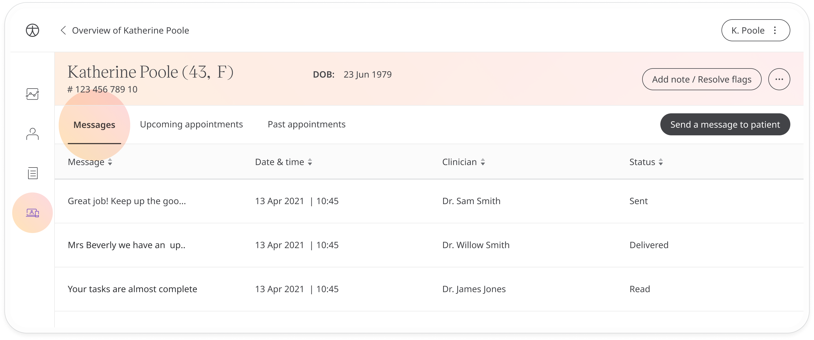

# Messaging patients
**User**: Admin; Deployment Staff; 

The Huma experience connects clinician and patients through the portal. Clinicians can choose to message their patients with important information and the portal makes this easy by giving them the choice of composing their own message or selecting from a library of pre-built messages.

## How it works​
From the Patient Dashboard, open the patient dropdown menu and select **Send message**.

If you have custom messaging enabled, you will be able to write a custom message to the patient. 

Otherwise, you can select from a set of pre-configured messages. Click the message you want to send and it will populate the text field at the top. Confirm this is the message you want to send and click **Send**.

> 🛑 **IMPORTANT**: Patients will not be able to respond to any messages you send. With this in mind, if you are composing your own custom message, try to keep your instructions clear and simple as the patient will not be able to ask you any follow-up questions.

You can find a list of your sent messages in the **Telemedicine** tab. You will see information about the sender, the date when it was sent and whether the message has been delivered and if it has been read.

**Related articles**: [Configuring messages](data-collection/admin-portal/managing-deployments/general-settings/configuring-messages.md); [Scheduling appointments](data-collection/clinician-portal/telemedicine/scheduling-appointments.md); [Calling patients](data-collection/clinician-portal/telemedicine/calling-patients.md)
