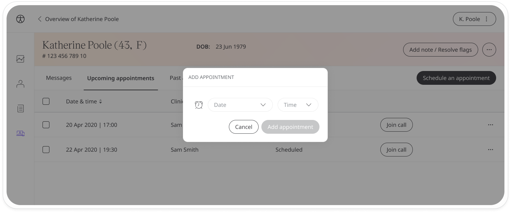

# Scheduling appointments
**User**: Admin; Deployment Staff; 

The Huma experience connects clinician and patient through the portal’s telemedicine functionality. Options include calling or messaging the patient from within the portal or scheduling appointments.
## How it works​
On the **Patient Overview** page, click the **Telemedicine** tab and select either **Upcoming Appointments** or **Past Appointments**. 

Click **Schedule an appointment** to open the scheduling window.

Select a day and time for your appointment and click **Add appointment**.

Patients will receive a notification and will need to accept or reject your appointment. The scheduled appointment will show up in the **Upcoming appointments** tab with the status **Pending confirmation** until the patient has accepted it.

Once accepted, the status will change to **Scheduled** and you will see a **Join call** button. Use this button to call the patient any time before the scheduled appointment.

 
If you want to reschedule or delete the appointment, open the menu at the end of the row.

To reschedule, just select a new time and click **Reschedule**.

Patients will be notified of scheduled appointments in the app and can either accept or reject them.

**Related articles**: [Messaging patients](data-collection/clinician-portal/telemedicine/messaging-patients.md); [Calling patients](data-collection/clinician-portal/telemedicine/calling-patients.md);
