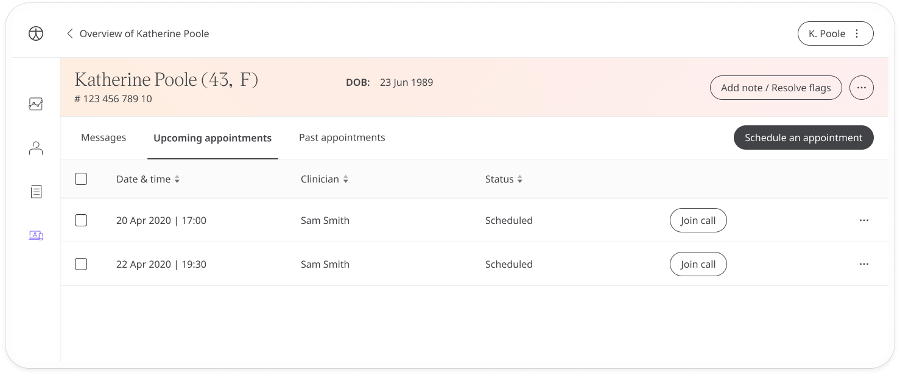
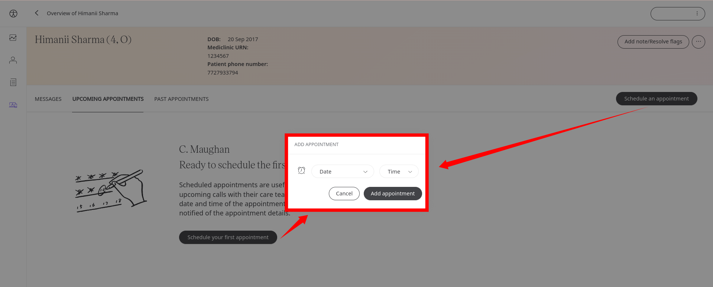
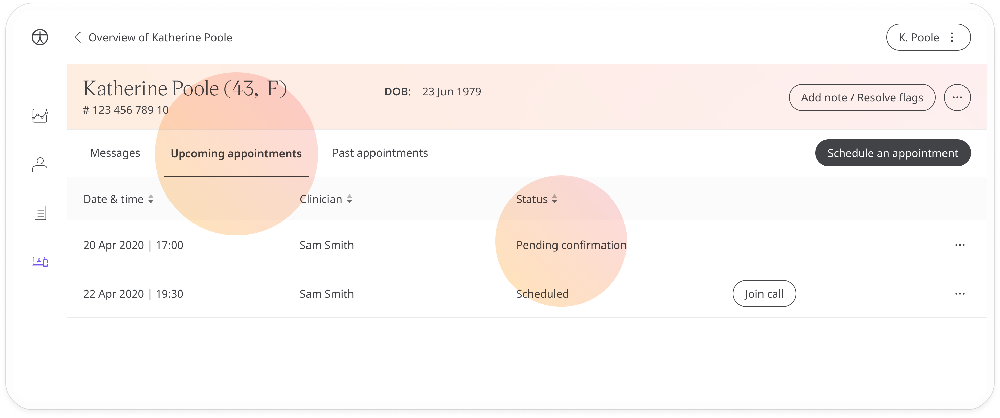
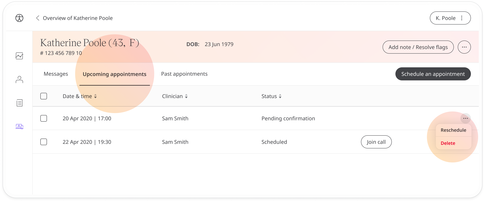

# Scheduling appointments
**User**: Admin; Deployment Staff; 

The Huma experience connects care teams and patients through the portal’s telemedicine functionality. Options include calling or messaging the patient from within the portal or scheduling appointments.
## How it works​

Scheduling an appointment in the Clinician Portal is simple. From the Patient Dashboard, click the  tab and select either **Upcoming Appointments** or **Past Appointments**. Next, click the **Schedule an appointment** button to open the scheduling window. 

You will select a day and time then click **Add appointment**. A notification will be sent to the patient who will be able to accept or reject your appointment.

Appointments will show up in the **Upcoming appointments** tab with the status **Pending confirmation** until the patient has accepted it.

Once accepted, the status will change to **Scheduled** and you will see a **Join call** button. Use this button to call the patient any time before the scheduled appointment.
 
If you want to reschedule or delete the appointment, open the menu at the end of the row.

To reschedule, just select a new time and click **Reschedule**.

**Related articles**: [Messaging patients](./messaging-patients.md); [Calling patients](./calling-patients.md);
