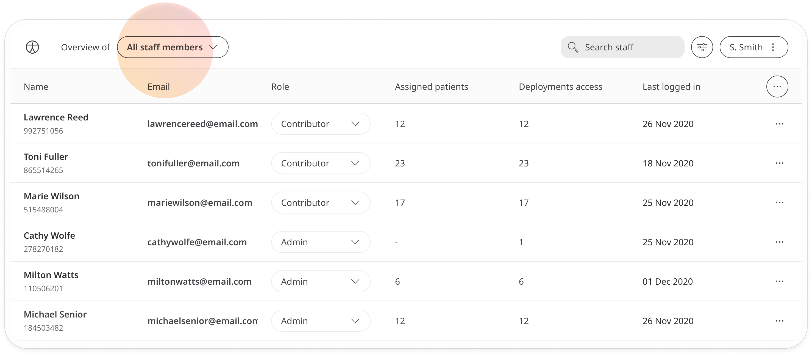
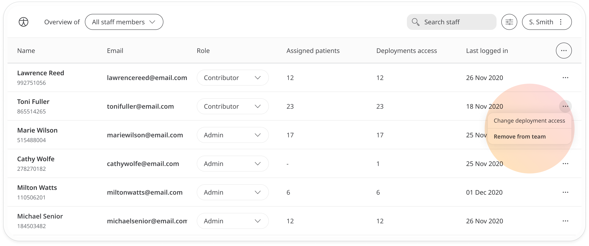
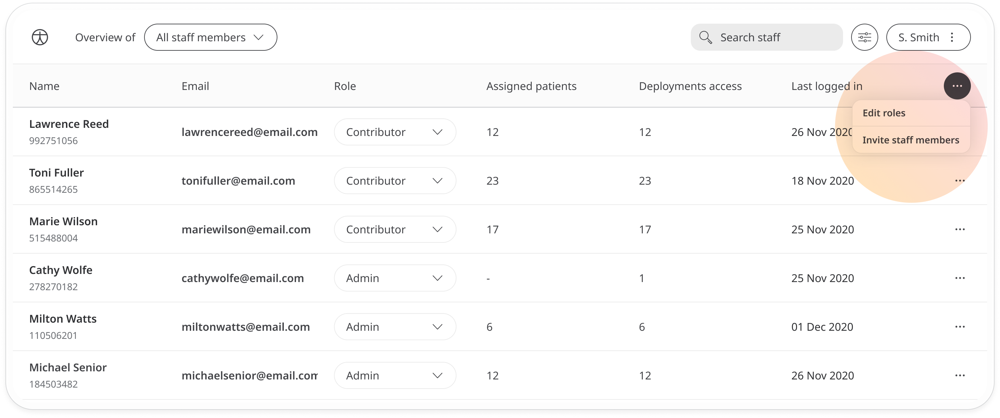
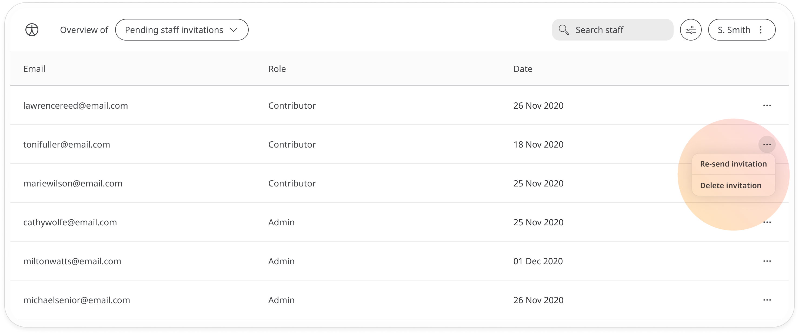
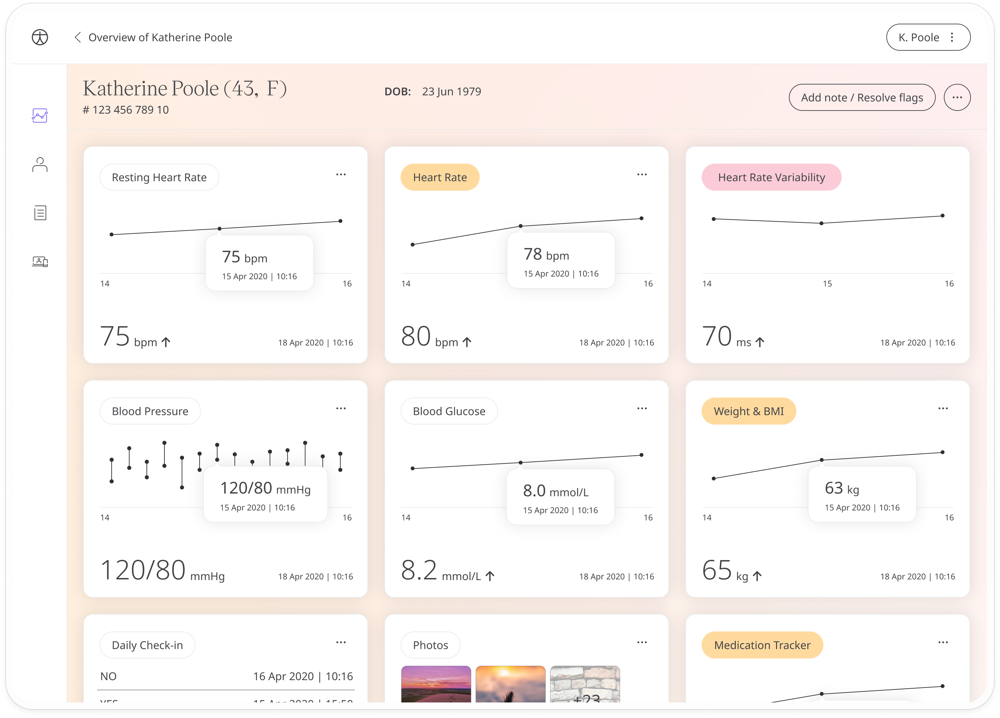
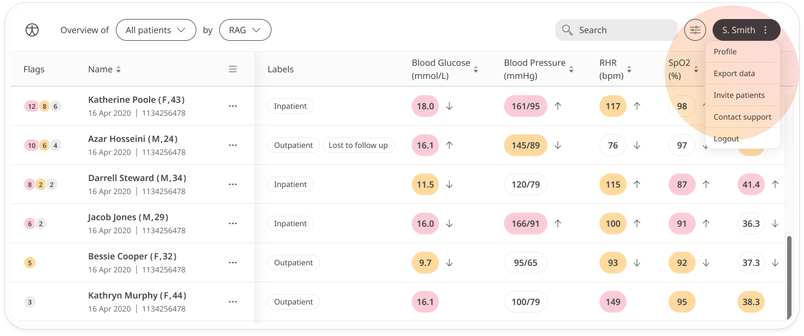
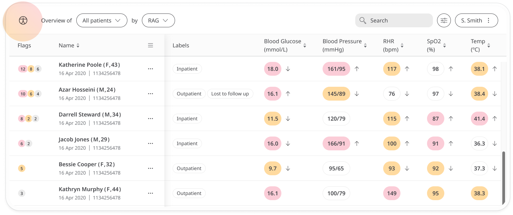

# Navigating the Portal
**User**: Admin, Access Controller, Deployment Staff

The Care Portal is one easy-to-use interface for all care team and administrative users to easily view and track patient data, contact patients and/or to manage other users and their roles.

Portal layout is different depending on whether you have an Organisation-level role or a Deployment-level role as permissions are different for each. This guide will help you find your way around the portal no matter which view you have.

## Organisation-level navigation
If your role is at the Organisation level, it is likely you are managing multiple Deployments. Your homepage immediately lets you see a list of your Deployments along with the overall number of patients and Deployments.

Click on any of the Deployments and you will go to the [Patient List](../managing-patients/patient-list.md), where you will be able to access all the navigation tools of a regular Deployment-level role.

Click the Huma icon at the top left to return to the Deployments list at any time. 

You can use the filter at the top to switch between the **My Deployments**, **All staff members**, or **Pending staff invitations**.

### Staff members list
On the staff members list, you will see all staff who have been invited to the portal along with their role.

You can easily change their role by clicking the dropdown and selecting a different one.

Remove a staff member by opening the menu at the end of the row and clicking on **Remove from team**.

You can also [invite staff and edit roles](../roles-and-permissions/inviting-staff-and-assigning-roles.md) from the main menu at the top-right of the table.

### Pending staff invitations list
Select **Pending staff invitations** to see any staff members who have not yet created their account since receiving their invitation. 

You can **resend** or **delete** invitations using the dropdown menu at the end of the row.

## Deployment-level navigation
### Patient List
If you have a Deployment-level role on the Care Portal, you will land on the **Patient List** screen when you log into the platform, which gives you an overview of all your patients. 

### Patient Overview
Navigate to the **Patient Overview** by simply clicking on any patient row in the table.

From here, you manage all your patient information including **Track data**; **Patient Profile**; **Notes**; **Telemedicine**. These areas can be accessed from the side navigation menu.

### Patient tools
Within the patient interface, you also have a tools menu that lets you access some of the functionality directly, such as [messaging](../telemedicine/messaging-patients.md) or [calling the patient](../telemedicine/calling-patients.md). The **Add note / Resolve flags** button can also be accessed from anywhere in the patient UI.

### Profile and user management
You can access the tools menu from the three dots next to your name in the button at the top right. This lets you access [your Profile](./your-profile.md) and manage users, roles and permissions.

### Return to Home
You can navigate back to the Patient List screen at any time by clicking the Huma logo at the top-left of the screen.

**Related articles**: [Logging into the Portal](./logging-into-the-portal.md); [Patient List](../managing-patients/patient-list.md); [Inviting staff and assigning roles](../roles-and-permissions/inviting-staff-and-assigning-roles.md); [Your Profile](./your-profile.md); [Inviting staff (Organisations)](../../admin-portal/managing-organisations/inviting-staff-to-an-organisation.md); [Inviting staff (Deployments)](../../admin-portal/managing-deployments/tools-and-navigation/inviting-deployment-admins.md); 
