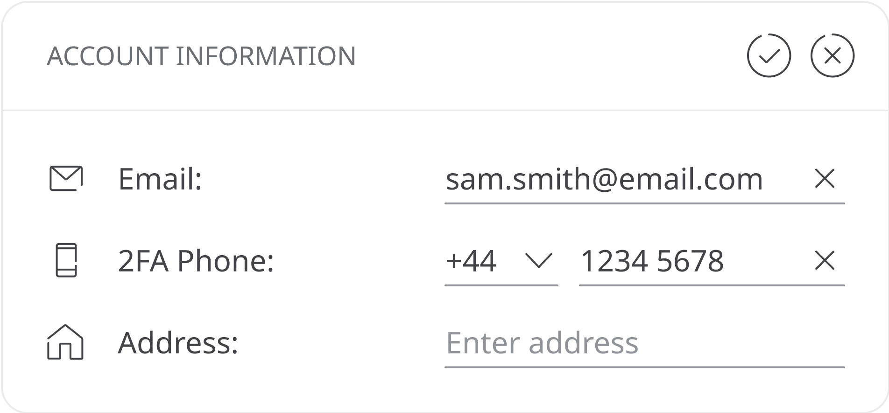
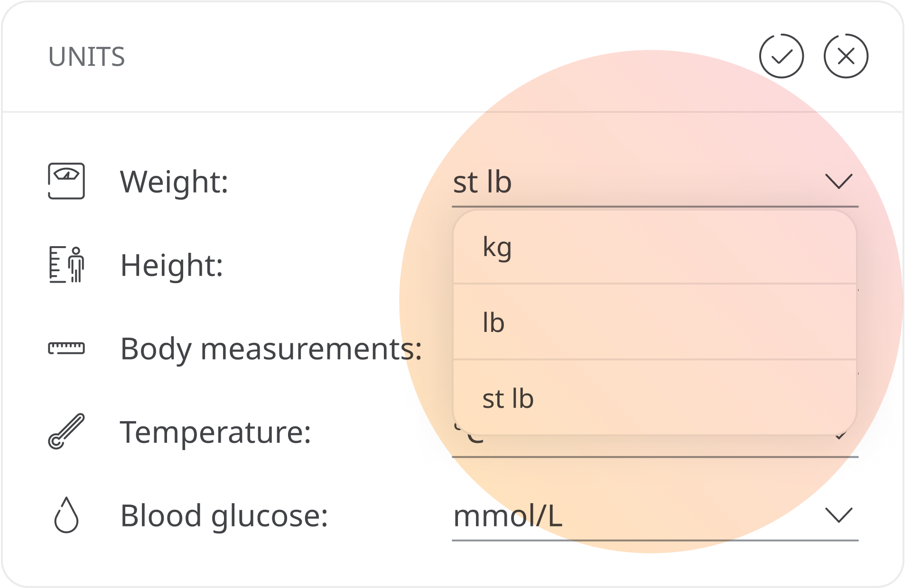
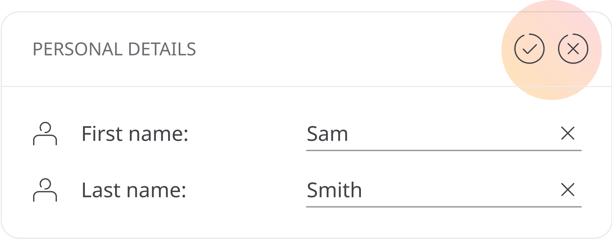
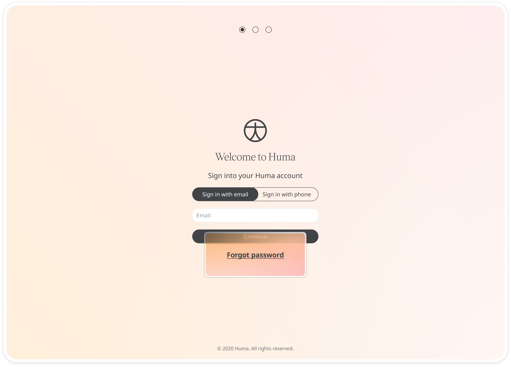

# Your Profile
**User**: Admin; Deployment Staff; Organisation Staff;

Once you have created an account in the Huma Portal, Huma lets you manage your personal data, change your password, edit units of measurement used in the portal and access terms and conditions documents.
## How it works​
Click the button with your name on it at the top right and select **Profile** from the dropdown menu. 

The page is divided into sections: **Personal details**, **Contact information**, **Units and Password**. Just click the  icon to switch to the edit view and change any of the details. 

### Personal Details
Edit the name as it is shown on the interface to colleagues and patients.

### Contact Information
You can edit your mobile number that is used as part of the 2-factor authentication process. Don’t forget to include the area code in your phone number. Your email is set as your username so that cannot be modified.

### Units
Each user on the Huma Portal can decide the unit of measurement that is used to show the patient data for **blood glucose**, **temperature**, **height** and **weight**. Just click the down arrow at the end of each line to see a list of other options.

Available options are as follows:
- **Blood Glucose**
  - mmol/L
  - mg/dL
  - Height
  - cm
  - ft in
- **Temperature**
  - ºC
  - ºF
- **Weight**
  - kg
  - lb
  - st lb

The units you choose will only apply to your portal, independent of the preferences of your patients or other colleagues.
### Password
You can reset your password from here. Click to edit and you will be asked to enter your current password, then enter your new password twice. Passwords are hidden here for security purposes. 

When you have made your edits, click the  icon to save or the  to revert back.

### Forgotten password
If you ever forget your password, just click the **Forgot Password** link on the login screen and you will be sent a reset password link to the email you have in your contact details. 

### Privacy policy and licence agreement
At the bottom of your Profile page details, you can find links to licensing and privacy policy documentation. These links are set up in the Deployment configuration and describe the terms of your user agreement.

**Related articles**: [Logging into the Portal](./logging-into-the-portal.md)
