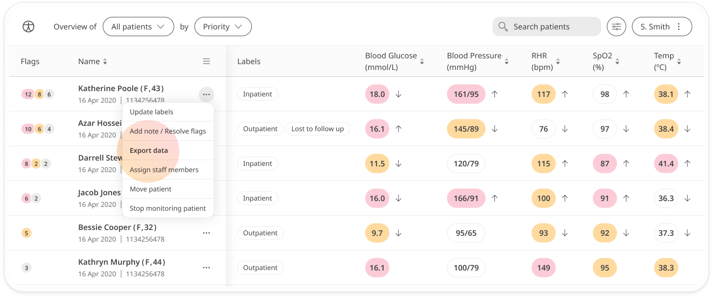
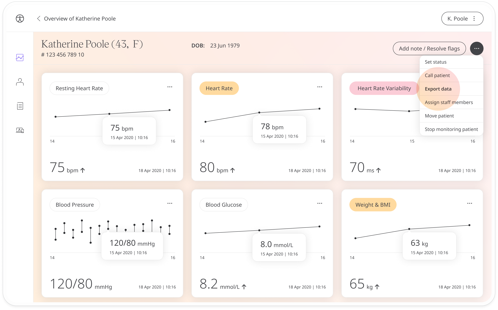

# Exporting patient data
**User**: Admin; Deployment Staff; Organisation Staff

Patient data can be exported from the Care Portal and used to show results, for reports, etc..

## How it works​
You can export patient data from one of two places; the first is the patient menu on the **Patient List** screen. Just select **Export data** from the menu.

The second place to export data is from the menu on the **Patient Dashboard**.

An **Export patient data** edit window will open:
 - Either select the patient that you currently have open, add other patients, or select all patients. To add another patient, just start typing the patient name or email address then select the patient you want to add.
 - Check the box **Remove identifiable information** if you want to export only the data points and protect the patient identity. If you don’t have permission to view identifiable information, this box will be checked by default and will not be editable.
 - Select the dates for which you would like to export the data. For example, select only data submitted in the past week if you are creating weekly reports.
 - Next, select the data you want to include in the report. You can choose to include all modules, questionnaires and notes or choose selected modules, questionnaires and associated notes.
 - Finally, choose the file format you want to export the data in and click **Export ZIP file**.

**Related articles**: [Patient Dashboard](./patient-dashboard.md)
