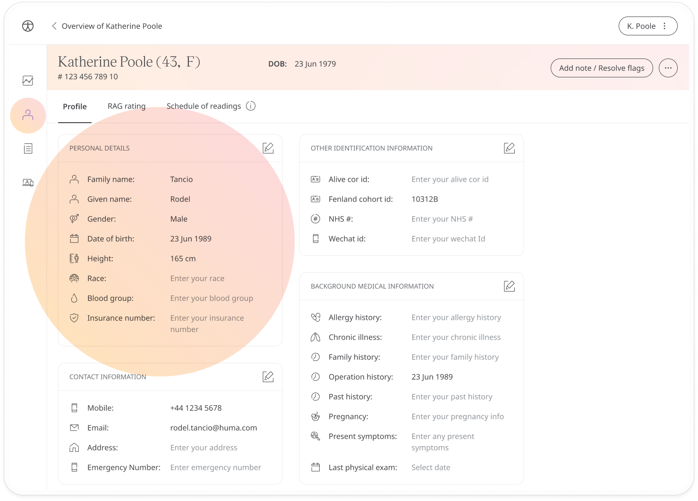

# Patient Profile
**User**: Admin; Deployment Staff

Users with permissions can view Patient Profile information and may also be able to edit that information.
## How it works​
On the **Patient Overview**, select the Profile  tab.

The Patient Profile can be [configured from the Admin Portal](../../admin-portal/managing-deployments/configuring-the-user-profile/user-profile-details.md) and this will determine what fields are available. Some of the default information includes personal and account details and identification information. Other fields, such as medical history, surgeries or medication can be included as needed and managed here.

If your role allows it, click the Edit button to edit the patient details. When you have made changes, click the  icon to save or the  to revert back.

## RAG rating
If **Personalise RAG** has been enabled in the deployment configuration, you will see the **RAG rating** tab in the patient profile.  From here, you can configure the RAG limits for that patient’s modules independently from how they are set up for the overall deployment. This helps you customise and prioritise care for each patient’s specific profile and needs.

You will see each of the patient modules listed along with their current RAG limits. Click the **Customise** button to edit the module and set personalised RAG limits. Any readings recorded before the change will use the old RAG limits. 

**Related articles**: [Inviting patients](../roles-and-permissions/inviting-patients.md); [App Features](../../admin-portal/managing-deployments/general-settings/app-features.md);
