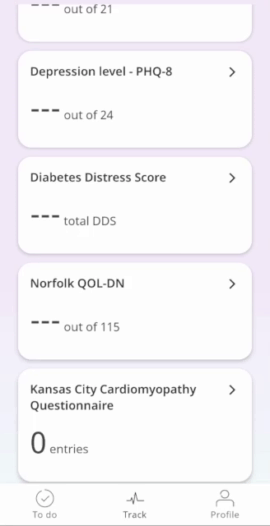
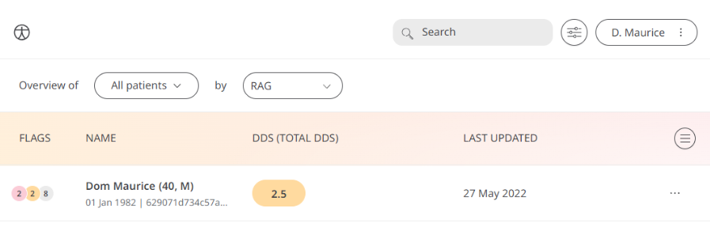

Living with diabetes comes with challenges, so keeping track of how Patients feel while managing their condition is an important step to take. Therefore, Huma provides the Diabetes Distress Score Questionnaire so Patients can report their well-being to Care Teams in order to help manage their diabetes.

## How it works

The Diabetes Distress Score Questionnaire gives Patients with diabetes a way to reflect on their well-being through a series of subjective questions, such as “Do you feel overwhelmed by the demands of living with diabetes”. They are answered with pre-determined options:
- Not a problem
- A slight problem
- A moderate problem
- Somewhat serious problem
- A serious problem
- A very serious problem 

## Patients

In the Huma App, Patients can select the Diabetes Distress Score from the “track” screen. From there, pressing “Add” takes them into the questionnaire where they can reflect on how they feel.

From within the module, Patients can view their progress in a graph and press “Show all data” to view previous results in a table. Patients can also set a daily, weekly, or monthly reminder to help keep on track.

## Clinician

In the Clinician Portal, on the [Patient List](./navigation/portal/patient-list) Clinicians can view a table of Patients, from which the Diabetes Distress Score column will display the last recorded reading indicated as a [Red Amber Green](./flags-rag) indicator to inform severity. 

Clicking on the Patient row takes the Clinician to the Patient Summary where all vitals can be viewed, by selecting Diabetes Distress Scoreall historical data can be displayed as a graph or a table of results.