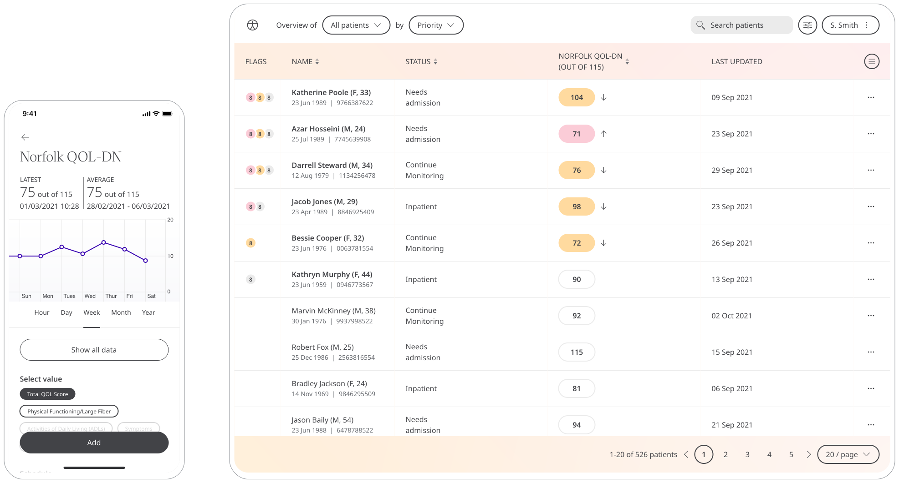

Diabetic neuropathy is a type of nerve damage that can occur if you have diabetes, and Huma provides the Norfolk Quality of Life-Diabetic Neuropathy (QOL-DN) Questionnaire so patients can capture the spectrum of Diabetic Neuropathy and how it affects daily activities. Care teams can view the results to gain insight and provide care to Patients.

## How it works

The Norfolk Quality of Life-Diabetic Neuropathy Questionnaire allows Patients to reflect on their quality of life through 47 questions. Those can be accessed by the Care Team in the Clinician Portal.  

## Patients

In the Huma App, from the “Track” screen, Patients can select the Norfolk Quality of Life-Diabetic Neuropathy Questionnaire and can answer questions on how they feel by pressing “Add”. 

From within the module, Patients can view their progress in a graph and press “Show all data” to view previous results in a table. Patients can also set a daily, weekly, or monthly reminder to help keep on track.

## Clinician

In the Clinician Portal, on the Patient List, Clinicians can view a table of Patients, from which the QOL-DN column will display the last recorded reading indicated as a Red Amber Green indicator to inform severity.

Clicking on the Patient row takes the Clinician to the Patient Summary where all vitals can be viewed, by selecting QOL-DN all historical data can be displayed as a graph or a table of results.