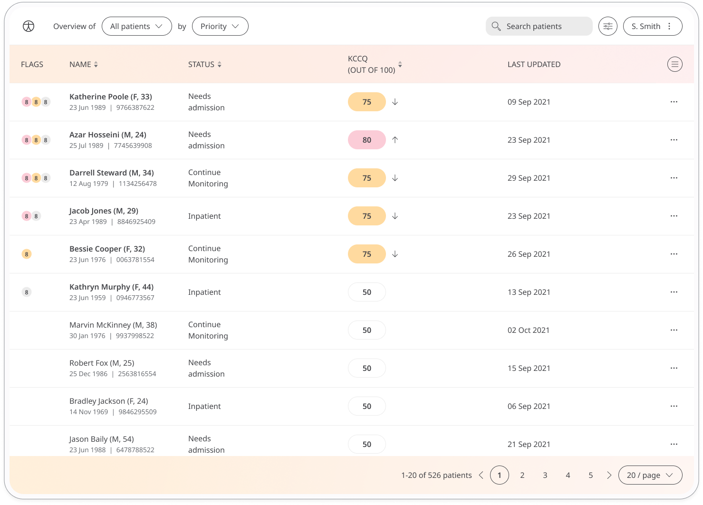
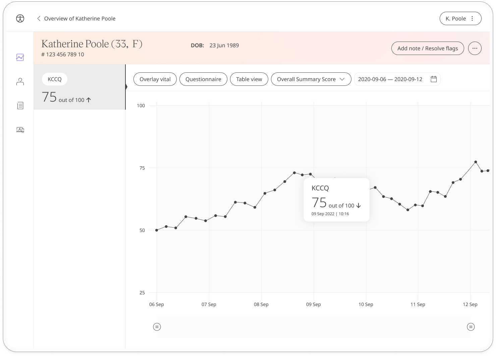

Huma provides the KCCQ questionnaire which assesses a patient's impression of their health state, including symptoms of heart failure, their impact on physical and social function, and how heart failure affects their quality of life. Care Teams can access the Patients’ data through the Clinician portal to help them deliver the health care needed.

## How it works

In the Huma App, Patients can submit answers to the Kansas City Cardiomyopathy Questionnaire, there are no right or wrong answers and takes 4-6 minutes to complete. Those can be accessed by the Care Team in the Clinician Portal.  

## Patients

In the Huma App, from the “Track” screen, Patients can select Kansas City Cardiomyopathy Questionnaire and by pressing “Add” can answer the questions to reflect how they feel.

From within the module, Patients can view their progress in a graph and press “Show all data” to view previous results in a table. Patients can also set a daily, weekly, or monthly reminder to help keep on track.

## Clinicians

In the Clinician Portal, on the Patient List, Clinicians can view a table of Patients, from which the KCCQ column will display the last recorded reading indicated as a Red Amber Green indicator to inform severity. 

Clicking on the Patient row takes the Clinician to the Patient Summary where all vitals can be viewed, by selecting KCCQ all historical data can be displayed as a graph or a table of results.

