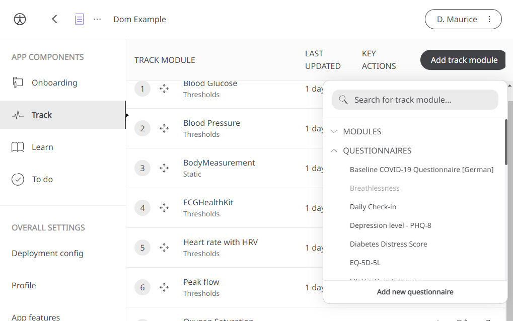

** Informing Care Teams with Patient feedback **

Feedback from Patients is a key part of being able to offer the healthcare needed by a Clinician. Huma, therefore, provides a feature to hold electronic and written questionnaires to deliver efficiently to the Healthcare Professionals to make informed decisions.

## How it works

Patient Reported Outcome Measures (PROs/PROMs) are licensed and validated questionnaires that patients fill out to evaluate how they feel. Usually scored, they provide a measure of success in the treatment provided by the care team. Feedback from Patients is a key part of being able to improve the care provided by the Care team. Huma, therefore, provides a feature to build and collect ePROs/ePROM answers from patients, score them and present them efficiently to the Healthcare Professionals to make better informed decisions.

The licensed questionnaires that Huma pushes out in-app, are formed in a UX that will make the feedback easy to give, but extend the reach of people which can aid with the perspective of treatment overall. Clinicians can review the data submitted by patients on the portal following the patient's submission.

