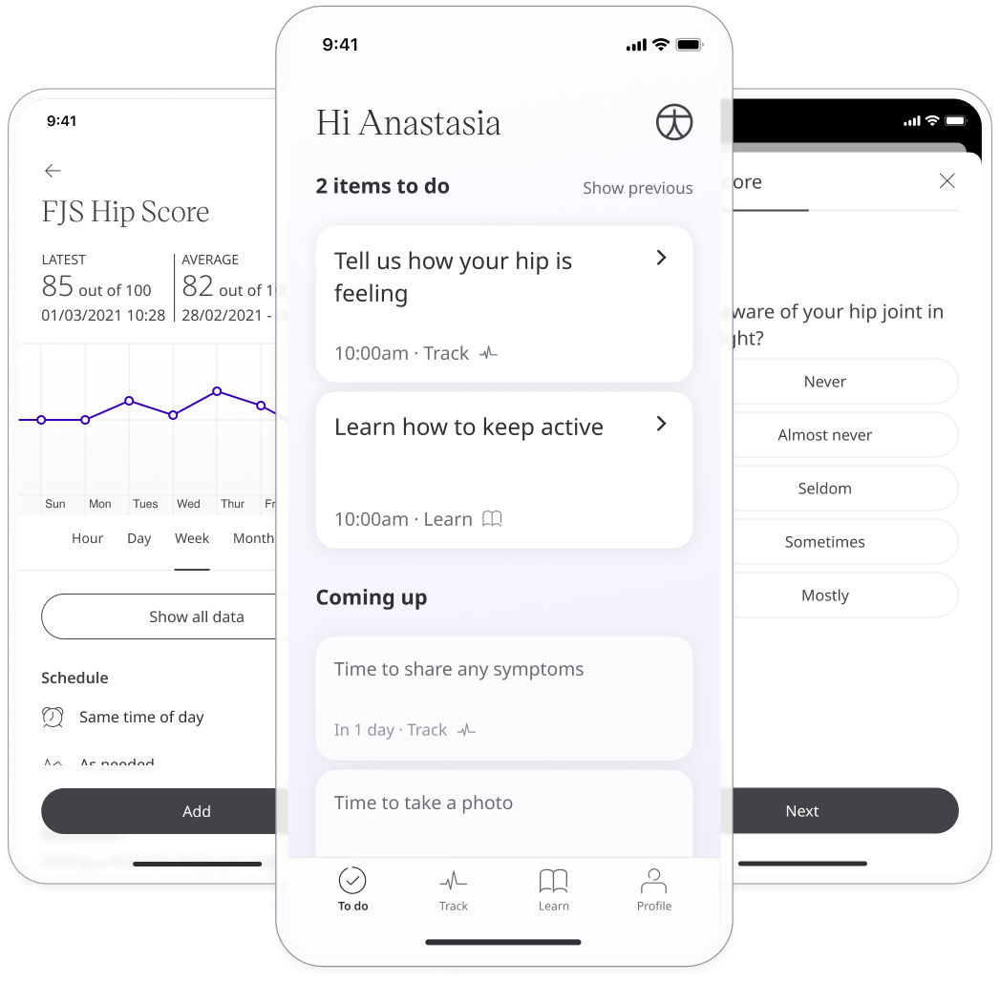

With normal daily function, individuals are not conscious of their joints, but when an issue arises then individuals can then be made aware of that joint. This is an indicator of care that is needed and therefore Huma provides the Forgotten Joint Score Hip questionnaire. By completing the questionnaire Patients can express how aware they are of their hip joint and provide that report to their Care Team to be assessed.

## How it works

The questions include how often you are aware of your affected hip joint in everyday life. Patients choose the most appropriate answer for each question from a set of descriptive options that represent 1-5. Upon completion of the questionnaire, a score is calculated and given out of 100.

## Patients

In the Huma App, from the “Track” screen, Patients can select FJS Hip Score and answer the questions to reflect how they feel.

From within the module, Patients can view their progress in a graph and press “Show all data” to view previous results in a table. Patients can also set a daily, weekly, or monthly reminder to help keep on track.

## Clinicians

In the Clinician Portal, on the Patient Summary, Clinicians can view all data submitted, from which FJS Hip will show the historic entries from the Patient, where the last recorded reading is indicated as a Red Amber Green indicator to inform severity. 

