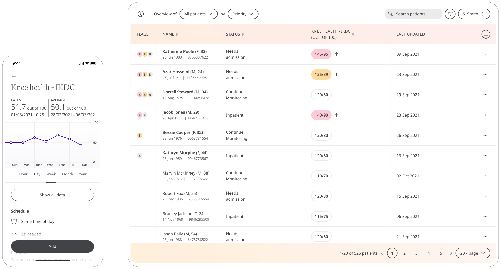

Huma provides the International Knee Documentation Committee (IKDC) Questionnaire, a knee-specific questionnaire that assesses the function of the knee. Patients can respond to questions that provide insight into their knee joint and are provided to their Care Team in order to assess what actions need to be taken.

## How it works

The IKDC Questionnaire is a subjective scale that provides patients with an overall function score. The questionnaire looks at 3 categories: symptoms, sports activity, and knee function. The symptoms subscale helps to evaluate things such as pain, stiffness, swelling, and giving-way of the knee. A score is given out of 100, calculated by the answers given.

## Patients

In the Huma App, on the “Track” screen patients can select the Knee Health IKDC and by selecting “Add” can enter the Questionnaire and answer the question as best reflects themselves.

From within the module, Patients can view their progress in a graph and press “Show all data” to view previous results in a table. Patients can also set a daily, weekly, or monthly reminder to help keep on track.

## Clinicians

In the Clinician Portal, on the Patient List, Clinicians can view a table of Patients, from which the Knee Health IKDC column will display the last recorded reading indicated as a Red Amber Green indicator to inform severity. 

