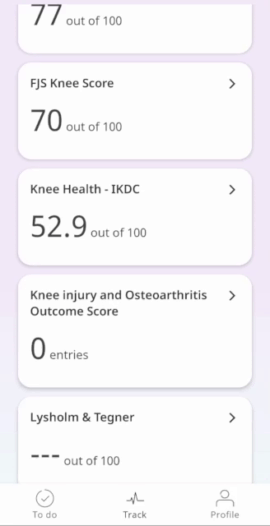
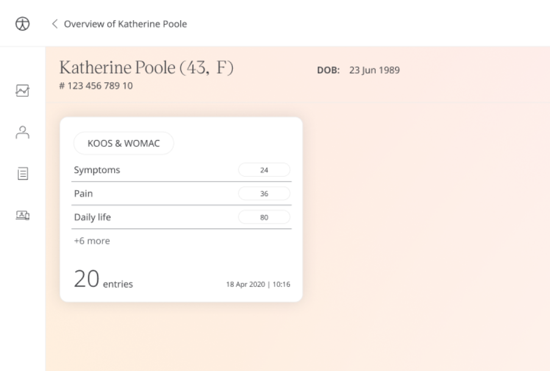

Mobility in the Knee is important to performing daily activities, standing, and walking. Huma provides the Knee injury and Osteoarthritis Outcome Score (KOOS) questionnaire which is intended for younger and more active patients, as well as the Western Ontario and McMaster Universities Osteoarthritis Index (WOMAC) question which is for total knee replacement. In both, Patients can record how they feel about their knees and deliver that information to their Care Team to gather insights.

## How it works

The KOOS/WOMAC Questionnaire allows Patients to express the functionality of their knee through a subjective scale. The questions are placed in 5 categories Pain, Symptoms, Activities of Daily Living, Sports and Recreation, and Quality of Life. A score is given out of 100, calculated by the answers given.

## Patients

In the Huma App, Patients can select the Knee injury and Osteoarthritis Outcome Score from the “Track” screen. From here pressing “Add” will take them into the questionnaire where they can respond with how they feel.

From within the module, Patients can view their progress in a graph and press “Show all data” to view previous results in a table. Patients can also set a daily, weekly, or monthly reminder to help keep on track.

## Clinicians

In the Clinician Portal, on the Patient List, Clinicians can view a table of Patients, from which the KOOS/WOMAC column will display the last recorded reading indicated as a Red Amber Green indicator to inform severity. 

Clicking on the Patient row takes the Clinician to the Patient Summary where all vitals can be viewed, by selecting KOOS/WOMAC all historical data can be displayed as a graph or a table of results.

