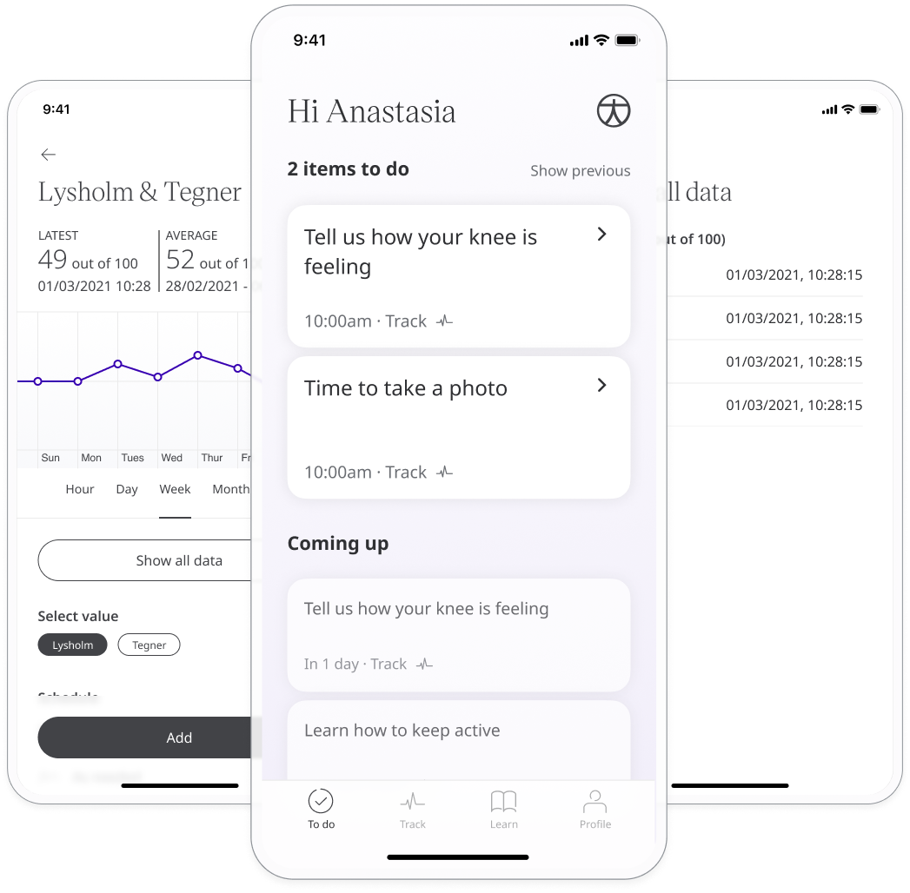
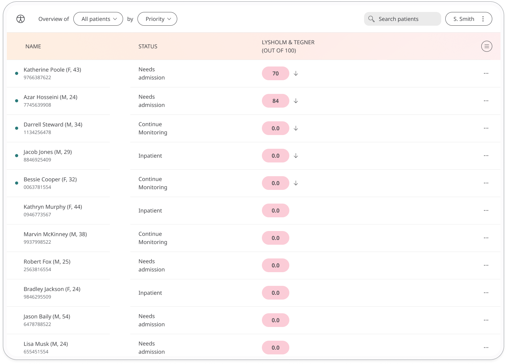
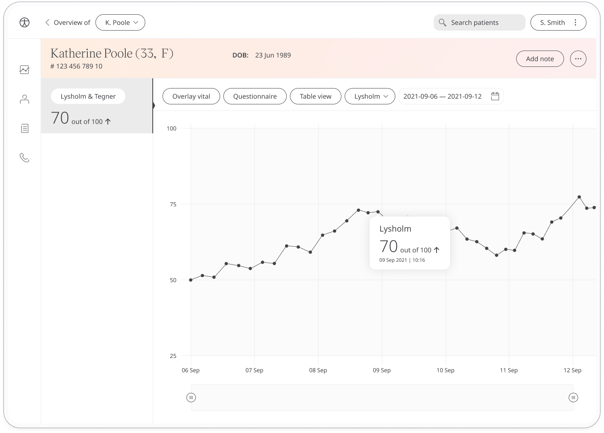

Mobility in the Knee is important for the ability to manage everyday life. Huma provides the Lysholm & Tegner Questionnaire for Patients to report on the functionality of their knees by answering questions about any impediment they experience. Care Teams can work with Patients with this reporting in order to deliver the needed care. 

## How it works

The Patient responds to questions from pre-determined descriptive answers that are categorised as limp, support, locking, instability, pain, swelling, stair climbing, or squatting. Scores in Huma are calculated in a range from 0 (worse disability) to 100 (less disability). This questionnaire is also available in German.

## Patients

In the Huma App, from the “Track” screen, Patients can select Lysholm & Tegner and answer the questions to reflect how they feel.

From within the module, Patients can view their progress in a graph and press “Show all data” to view previous results in a table. Patients can also set a daily, weekly, or monthly reminder to help keep on track.

## Clinicians

In the Clinician Portal, on the Patient List, Clinicians can view a table of Patients, from which the Lysholm & Tegner column will display the last recorded reading indicated as a Red Amber Green indicator to inform severity. 

Clicking on the Patient row takes the Clinician to the Patient Summary where all vitals can be viewed, by selecting Lysholm & Tegner all historical data can be displayed as a graph or a table of results.

